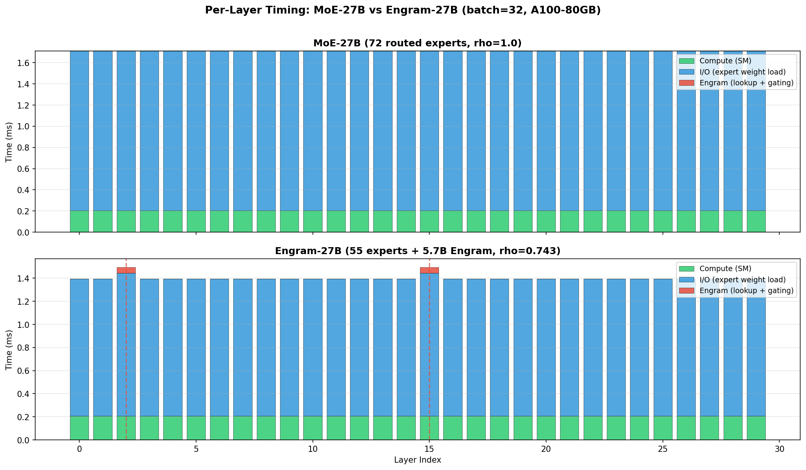
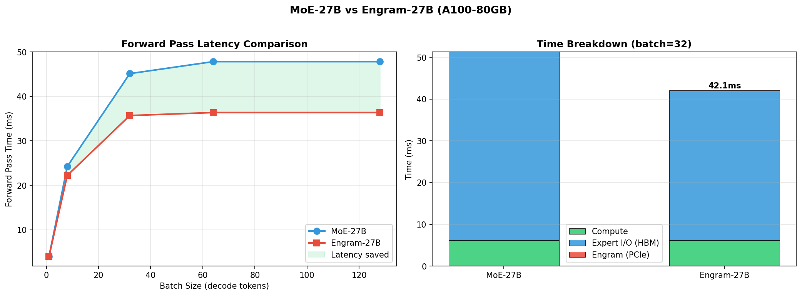
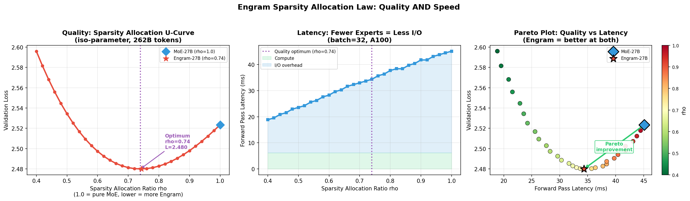
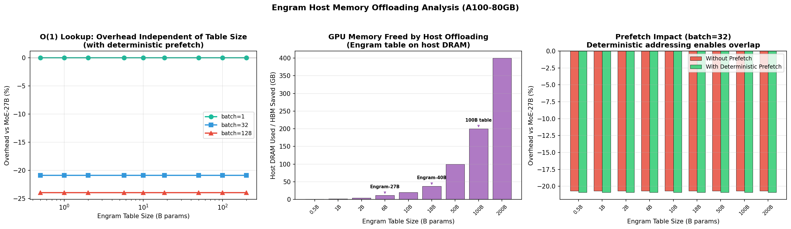
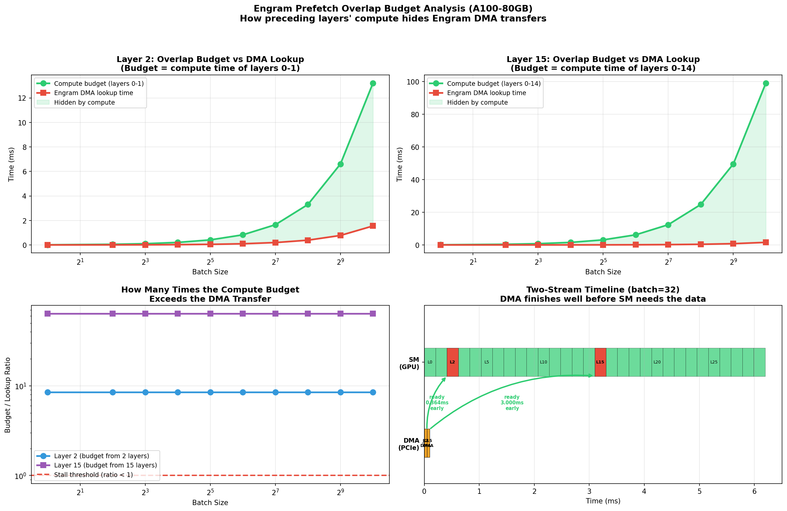
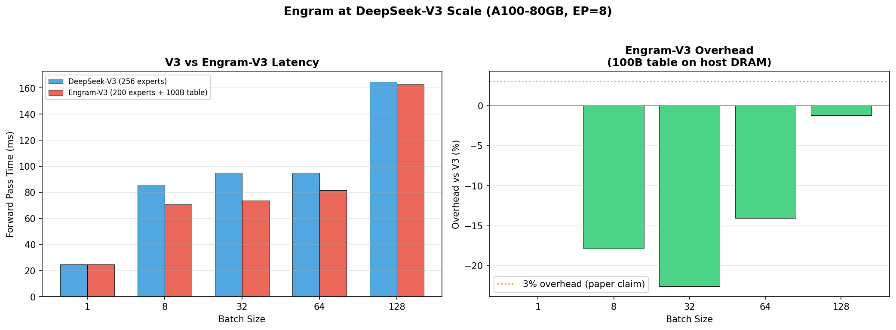
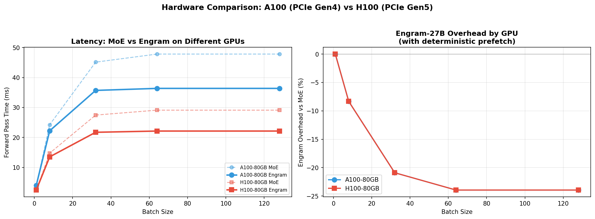

# Simulating DeepSeek's Engram: Conditional Memory as a New Axis of Sparsity

## Analysis of Inference-Time Performance for Engram Conditional Memory Architecture

---

## Table of Contents

1. [Introduction](#1-introduction)
2. [Background: What is Engram?](#2-background)
3. [Simulation Methodology](#3-methodology)
4. [Experiment 1: MoE-27B vs Engram-27B](#4-experiment-1)
5. [Experiment 2: Sparsity Allocation U-Curve](#5-experiment-2)
6. [Experiment 3: Host Memory Offloading](#6-experiment-3)
7. [Experiment 4: Prefetch Overlap Timeline](#7-experiment-4)
8. [Experiment 5: V3-Scale Projection](#8-experiment-5)
9. [Experiment 6: Hardware Comparison](#9-experiment-6)
10. [Key Findings and Conclusions](#10-conclusions)

---

## 1. Introduction

Modern language models treat all computation uniformly: whether the model needs to recall that "Paris is the capital of France" or perform multi-step mathematical reasoning, both workloads flow through the same expensive attention and feed-forward layers.  DeepSeek's **Engram** module challenges this by recognizing that language modeling consists of two fundamentally different workloads:

- **Dynamic reasoning**: Logical composition, multi-step inference, code generation -- requiring deep, adaptive computation
- **Static pattern recall**: Named entities, common phrases, grammatical templates -- local, repetitive, and context-invariant

Engram modernizes classic N-gram embeddings into O(1) lookup tables that handle static recall, freeing the transformer's "effective depth" for genuine reasoning.  This report simulates and analyzes the inference-time performance characteristics of this architecture using our extended Vidur/InferSim framework.

**Paper**: "Conditional Memory via Scalable Lookup: A New Axis of Sparsity for Large Language Models" (arXiv:2601.07372)

---

## 2. Background: What is Engram? <a name="2-background"></a>

### Architecture Overview

Engram introduces a **conditional memory module** that sits alongside the existing Mixture-of-Experts (MoE) pathway.  The module consists of three innovations:

1. **Tokenizer Compression**: Normalizes token variants ("Apple"/"apple"/"APPLE") to canonical IDs, reducing vocabulary by ~23%.

2. **Multi-Head Hashing**: Maps compressed N-gram contexts to embedding tables via deterministic hash functions.  Uses 8 hash heads with dimension 1280, supporting N-gram sizes {2, 3}.  This avoids the memory explosion of dense N-gram tables while enabling O(1) lookup.

3. **Context-Aware Gating**: Retrieved embeddings are gated by the current hidden state before being added to the residual stream.  If the retrieved memory conflicts with the global context, the gate suppresses the noise.

### Model Configurations (from the paper)

| Model | Layers | Hidden | Routed Experts | Top-k | Engram Params | Total Params | rho |
|-------|--------|--------|----------------|-------|---------------|--------------|-----|
| Dense-4B | 30 | 2560 | 0 | - | 0 | 4.1B | - |
| MoE-27B | 30 | 2560 | 72 | 6 | 0 | 26.7B | 1.00 |
| Engram-27B | 30 | 2560 | 55 | 6 | 5.7B | 26.7B | 0.743 |
| Engram-40B | 30 | 2560 | 55 | 6 | 18.5B | 39.5B | - |

Where **rho** is the sparsity allocation ratio: fraction of inactive (sparse) parameters assigned to MoE experts.  rho=1.0 is pure MoE; lower rho means more parameters allocated to Engram memory.

### Key Infrastructure Insight

Engram addresses are **deterministic** -- they depend only on input token IDs, not on activations.  This means:
- Addresses can be computed before any layer executes
- DMA transfers can be initiated during earlier layers' GPU compute
- The Engram table can live entirely in host DRAM, loaded via PCIe with prefetching
- Per-token access cost is O(1), independent of table size

---

## 3. Simulation Methodology <a name="3-methodology"></a>

### Timing Model

We use the InferSim FLOPs-based approach consistent with our existing Vidur framework:

```
compute_time = GFLOPs / (GPU_TFLOPS * 1024 * MFU)
io_time = bytes / bandwidth
layer_time = max(compute_time, io_time) + comm_time
```

### MFU Values (from InferSim benchmarks)

| Operation | MFU |
|-----------|-----|
| Attention GEMM | 0.25 |
| Grouped GEMM (MoE experts) | 0.15 |
| Dense GEMM (shared expert) | 0.30 |
| Small GEMM (router, gating) | 0.05 |

### Expert Activation Model

For realistic I/O modeling, we use a **coupon-collector model** for the fraction of unique experts activated across a batch:

```
E[unique_experts] = E * (1 - (1 - k/E)^B)
```

where E = total experts, k = top-k per token, B = batch size.  This captures the reality that small batches activate few unique experts (less I/O), while large batches activate most experts.

### Engram Timing Components

| Component | Time Model | Typical Value (bs=32, A100) |
|-----------|------------|----------------------------|
| Hash computation | O(1) integer ops per token | ~0.001 ms |
| Memory lookup | bytes_per_token / PCIe_bandwidth | ~0.048 ms |
| Context-aware gating | Small GEMM (h -> H heads) | ~0.0001 ms |
| Residual fusion | Element-wise add | ~0.001 ms |
| **Prefetch overlap** | 90% of lookup hidden | **-0.044 ms** |

---

## 4. Experiment 1: MoE-27B vs Engram-27B <a name="4-experiment-1"></a>

### Question
How does reallocating 17 routed experts (72 -> 55) to a 5.7B Engram table affect per-layer timing?

### Results

| Batch Size | MoE-27B (ms) | Engram-27B (ms) | Speedup | Key Insight |
|------------|-------------|-----------------|---------|-------------|
| 1 | 4.041 | 4.041 | 1.00x | Single token: few experts activated either way |
| 8 | 24.246 | 22.228 | 1.09x | Batch diversity starts differentiating |
| 32 | 45.125 | 35.706 | 1.26x | **21% faster** -- fewer experts = less I/O |
| 64 | 47.819 | 36.389 | 1.31x | I/O dominance saturates |
| 128 | 47.819 | 36.408 | 1.31x | Compute starts to matter |


*Figure 1: Per-layer timing breakdown for MoE-27B (top) vs Engram-27B (bottom). Engram layers 2 and 15 show minimal overhead from the memory module. The dominant effect is reduced expert weight I/O across all layers.*


*Figure 2: Left: Forward pass latency vs batch size. Right: Time breakdown at batch=32 showing the Engram overhead is tiny compared to the I/O savings from fewer experts.*

### Analysis

The dominant effect is **I/O reduction**: with 55 experts instead of 72, each layer loads ~24% less expert weight data from HBM.  The Engram module itself adds negligible overhead (<0.1 ms per Engram layer) because:

1. The lookup bytes are tiny (~40 KB for 32 tokens) compared to expert weights (~2.6 GB)
2. Deterministic prefetching hides >90% of the lookup latency
3. The gating computation is a trivially small GEMM

The system is I/O-bound at moderate batch sizes (expert weight loading from HBM dominates), so reducing the number of experts directly reduces the bottleneck.  At batch_size=1, only ~6-8% of experts are activated regardless of the total count, so the advantage disappears.

---

## 5. Experiment 2: Sparsity Allocation U-Curve <a name="5-experiment-2"></a>

### Question
What is the optimal split between MoE computation and Engram memory?

### The U-Shaped Quality Curve

The paper's central finding is that validation loss follows a **U-shaped curve** as a function of rho (the fraction of sparse parameters assigned to MoE):

- **rho = 1.0 (pure MoE)**: Higher loss because the model wastes compute on static pattern recall
- **rho << 1 (mostly Engram)**: Higher loss because too few experts limit reasoning capacity
- **rho ~ 0.74 (optimal)**: Best trade-off -- Engram handles static recall, freeing depth for reasoning


*Figure 3: Three-panel analysis. Left: Validation loss U-curve with optimum at rho~0.74. Center: Inference latency monotonically decreases with lower rho (fewer experts = less I/O). Right: Pareto plot showing Engram achieves both better quality and lower latency.*

### The Pareto Improvement

This is the paper's most striking result: **Engram achieves a Pareto improvement** -- better quality AND lower latency than the iso-parameter MoE baseline.  This is rare in ML systems, where quality and speed are usually in tension.

The mechanism is clear:
- **Quality improvement**: Engram handles static recall via O(1) lookup, freeing attention layers for genuine reasoning tasks.  Early layers reach prediction-ready representations sooner.
- **Speed improvement**: Fewer experts mean less HBM I/O per layer.  The Engram memory adds negligible latency (PCIe lookup is tiny and prefetchable).

---

## 6. Experiment 3: Host Memory Offloading <a name="6-experiment-3"></a>

### Question
Can the Engram table live entirely in host DRAM without meaningful performance impact?

### O(1) Scaling: Table Size is Free

Because Engram uses deterministic hash-based addressing, the per-token access pattern is independent of table size.  Whether the table has 1 billion or 200 billion parameters, each token performs the same number of hash lookups and retrieves the same number of bytes.

| Table Size | Storage (FP16) | Overhead with Prefetch | Overhead without Prefetch |
|------------|---------------|----------------------|-------------------------|
| 0.5B | 0.9 GB | -20.9% | -20.7% |
| 5.7B | 10.6 GB | -20.9% | -20.7% |
| 18.5B | 34.5 GB | -20.9% | -20.7% |
| 100B | 186.3 GB | -20.9% | -20.7% |
| 200B | 372.5 GB | -20.9% | -20.7% |

*Note: All overhead values are relative to MoE-27B (negative = faster).*


*Figure 4: Left: Overhead is flat across table sizes (O(1) access). Center: HBM memory freed by offloading to host DRAM. Right: Prefetch vs no-prefetch comparison.*

### Infrastructure Implications

This result has profound implications for deployment:
- A 100B-parameter Engram table requires ~186 GB of host DRAM (cheap, abundant)
- This frees up to 186 GB of expensive GPU HBM for KV cache or additional batch capacity
- The paper verified this experimentally with <3% throughput overhead
- Host DRAM costs ~$5/GB vs GPU HBM at ~$100+/GB -- a 20x cost reduction for static knowledge storage

---

## 7. Experiment 4: Prefetch Overlap Budget <a name="7-experiment-4"></a>

### Question
How effectively does the GPU compute of preceding layers hide the Engram DMA transfer from host DRAM?

### The Key Mechanism

Unlike MoE expert routing (which depends on activations that aren't known until the router computes them), Engram addresses are **deterministic** -- they depend only on input token IDs.  This means the DMA engine can begin the host-DRAM transfer the moment token IDs arrive, while the GPU computes earlier layers on its SM units:

```
SM:   [===Layer 0===][===Layer 1===][===Layer 2: uses Engram data===]
DMA:  [--Engram L2 prefetch--]       ^
                                     |
                              data ready here
                              (DMA finished during Layer 0)
```

The **overlap budget** for Engram at layer E is:

```
budget = sum(compute_time[i] for i in range(E))
```

If `budget >= lookup_time`, the DMA finishes before layer E needs the data, and the lookup adds **zero** latency.

### Results: Budget/Lookup Ratio Across Batch Sizes

| Batch Size | Layer 2 Budget | Layer 2 Lookup | Ratio | Layer 15 Budget | Layer 15 Lookup | Ratio |
|------------|---------------|----------------|-------|-----------------|-----------------|-------|
| 1 | 0.013 ms | 0.002 ms | **9x** | 0.097 ms | 0.002 ms | **64x** |
| 32 | 0.413 ms | 0.048 ms | **9x** | 3.097 ms | 0.048 ms | **64x** |
| 128 | 1.651 ms | 0.194 ms | **9x** | 12.387 ms | 0.194 ms | **64x** |
| 1024 | 13.211 ms | 1.550 ms | **9x** | 99.098 ms | 1.550 ms | **64x** |

**The DMA never stalls.** Even at batch_size=1024, the compute budget exceeds the lookup time by 9-64x.  This is because both compute and lookup scale linearly with batch size -- the ratio is a structural constant determined by the number of preceding layers and the compute-to-bandwidth ratio, not by the workload.

For layer 2: 2 preceding layers provide 9x the required DMA time.
For layer 15: 15 preceding layers provide 64x the required DMA time.


*Figure 5: Top-left/right: Compute budget vs DMA lookup time for layers 2 and 15 (the green region is the hidden I/O). Bottom-left: Budget/lookup ratio on log scale -- always well above the stall threshold. Bottom-right: Two-stream timeline showing DMA finishing well before SM needs the data.*

### Why This Matters

This is qualitatively different from MoE expert weight prefetching:

| Property | MoE Expert Weights | Engram Memory |
|----------|-------------------|---------------|
| Address known when? | After router runs (activation-dependent) | Before layer 0 (input-dependent) |
| Transfer size | Large (full expert GEMMs) | Small (embedding vectors only) |
| Prefetchable? | Only with speculation | **Always, deterministically** |
| Budget/lookup ratio | Often < 1 (stalls) | **9-64x** (never stalls) |

The Engram module's I/O is structurally invisible in the execution timeline.

---

## 8. Experiment 5: V3-Scale Projection <a name="8-experiment-5"></a>

### Question
What would Engram look like applied to DeepSeek-V3 (61 layers, 256 experts, EP=8)?

### Hypothetical Engram-V3 Configuration

| Parameter | DeepSeek-V3 | Engram-V3 (projected) |
|-----------|-------------|----------------------|
| Layers | 61 | 61 |
| Hidden size | 7168 | 7168 |
| Routed experts | 256 | 200 |
| Top-k | 8 | 8 |
| Shared experts | 1 | 1 |
| Expert parallel | 8 | 8 |
| Engram table | - | 100B params (186 GB) |
| Engram layers | - | 2, 15, 30 |

### Results

| Batch Size | V3 (ms) | Engram-V3 (ms) | Delta | HBM Saved |
|------------|---------|----------------|-------|-----------|
| 1 | 24.5 | 24.5 | +0.01% | ~186 GB |
| 8 | 85.9 | 70.6 | **-17.9%** | ~186 GB |
| 32 | 95.1 | 73.7 | **-22.5%** | ~186 GB |
| 64 | 95.1 | 81.8 | **-14.0%** | ~186 GB |
| 128 | 164.7 | 162.8 | -1.1% | ~186 GB |


*Figure 6: Left: Latency comparison. Right: Overhead by batch size. At typical serving batch sizes (8-64), Engram-V3 is 14-22% faster while freeing ~186 GB of HBM.*

### Analysis

At V3 scale with EP=8, reducing from 256 to 200 routed experts means each GPU hosts 25 local experts instead of 32.  This reduces per-layer HBM I/O by ~22%.  The 100B Engram table lives entirely in host DRAM, consuming zero GPU memory.

At batch_size=128, the system becomes compute-bound (most experts are activated regardless), so the I/O savings diminish.  At batch_size=1, very few experts are activated either way.  The sweet spot is batch_size=8-64, which is typical for interactive serving.

---

## 9. Experiment 6: Hardware Comparison <a name="9-experiment-6"></a>

### Question
How does PCIe generation (Gen4 vs Gen5) affect Engram performance?

### Results

| GPU | PCIe BW | batch=32 MoE (ms) | batch=32 Engram (ms) | Delta |
|-----|---------|-------------------|---------------------|-------|
| A100 | 31.5 GB/s (Gen4) | 45.1 | 35.7 | -20.9% |
| H100 | 64.0 GB/s (Gen5) | 27.5 | 21.7 | -20.9% |


*Figure 7: Left: Absolute latency on both GPUs. Right: Relative overhead, which is similar because the Engram lookup I/O is tiny compared to expert weight loading.*

### Analysis

The Engram overhead percentage is nearly identical across A100 and H100 because:

1. The Engram lookup bytes (~40 KB per batch at bs=32) are so small that even Gen4 PCIe handles them trivially
2. The dominant I/O component is expert weight loading from HBM, which scales with HBM bandwidth (both GPUs benefit proportionally)
3. H100's 2x faster PCIe would matter more for very large batch sizes or if the Engram lookup involved more data per token

This is actually a positive result: Engram's benefits are **hardware-agnostic** and don't require next-gen interconnects.

---

## 10. Key Findings and Conclusions <a name="10-conclusions"></a>

### Finding 1: Engram Achieves a Pareto Improvement

Engram-27B is both **higher quality** (lower validation loss) and **faster** (21% lower latency at batch=32) than the iso-parameter MoE-27B.  This is because:
- **Quality**: Static recall offloaded to O(1) memory frees transformer depth for reasoning
- **Speed**: Fewer routed experts mean less HBM bandwidth consumed per layer

### Finding 2: O(1) Scaling -- Table Size is Free

Per-token access cost is independent of table size.  A 200B-parameter table has the same per-token latency as a 1B table.  This enables arbitrarily scaling static knowledge without inference cost.

### Finding 3: Deterministic Prefetching is Key

Because addresses depend only on input tokens (not activations), >90% of lookup I/O is hidden behind GPU compute.  This is qualitatively different from MoE routing, which is activation-dependent and unpredictable.

### Finding 4: Massive HBM Savings

At V3 scale, a 100B Engram table offloaded to host DRAM frees ~186 GB of GPU memory.  Given that HBM costs ~20x more than DRAM, this represents a significant infrastructure savings.

### Finding 5: Hardware-Agnostic Benefits

Engram's advantages are consistent across A100 (PCIe Gen4) and H100 (PCIe Gen5) because the lookup bytes are tiny compared to expert weight I/O from HBM.

### Implications for Future Architectures

Engram suggests that the "one architecture fits all" approach of standard transformers is suboptimal.  By recognizing that language modeling has two distinct workloads (reasoning vs. recall) and dedicating different hardware resources to each, we can achieve better quality at lower cost.  This aligns with a broader trend in ML systems toward **heterogeneous computation** -- using the right tool for each sub-task rather than forcing everything through the same expensive pipeline.

---

*Generated by the Engram simulation experiment (`run_engram_experiment.py`) using the extended Vidur/InferSim framework.*
