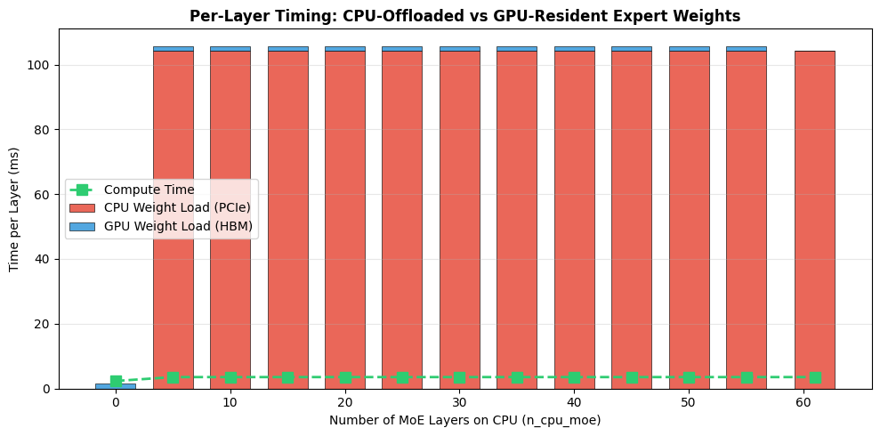
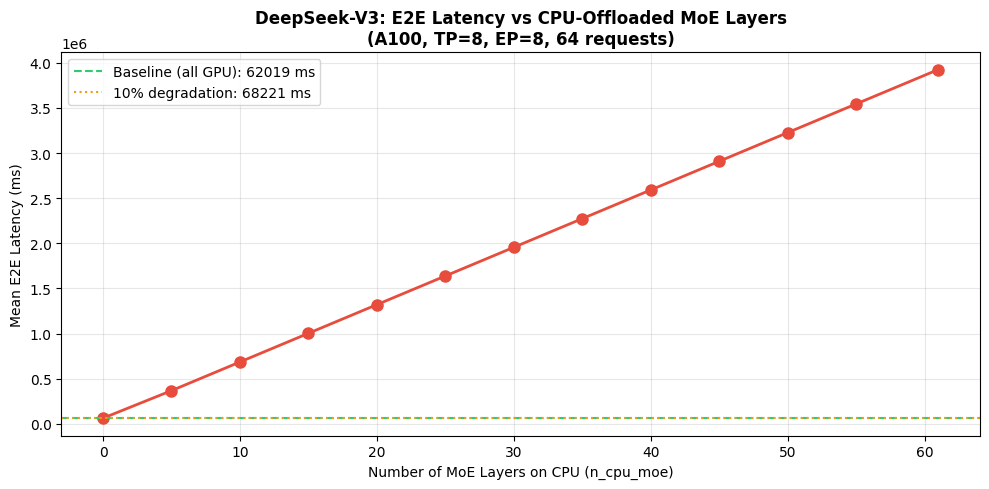
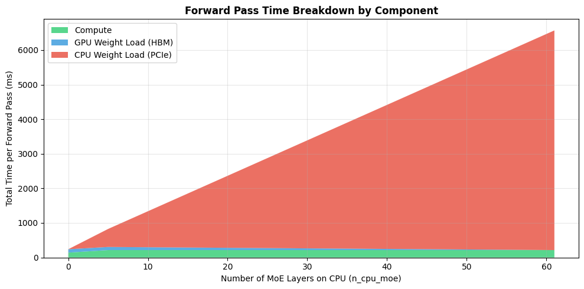
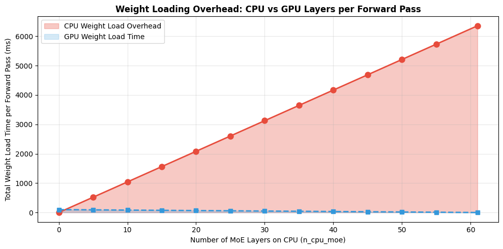
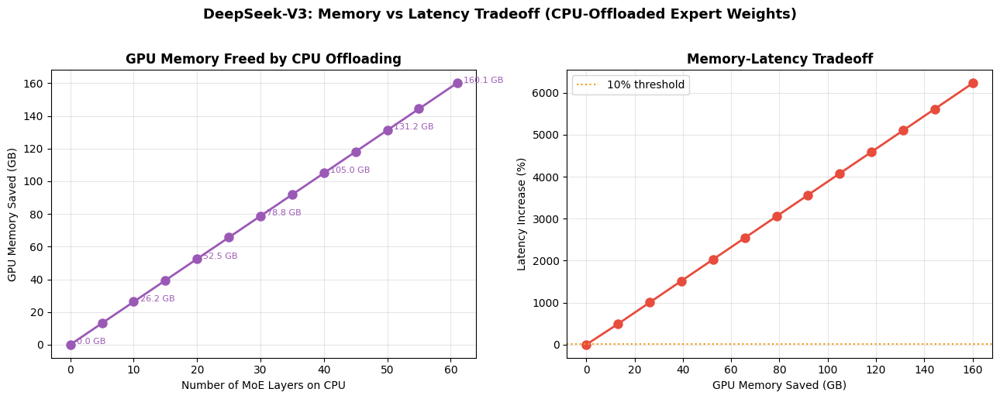

# CPU-Offloaded MoE Expert Weights: n_cpu_moe Threshold Analysis

## Quantifying the Memory-Latency Tradeoff for CPU-Resident Expert Weights in Sparse MoE Models

---

## Table of Contents

1. [Motivation](#1-motivation)
2. [Experiment Design](#2-experiment-design)
3. [Per-Layer Bandwidth Analysis](#3-per-layer-bandwidth-analysis)
4. [Sweep Results](#4-sweep-results)
5. [Memory-Latency Tradeoff](#5-memory-latency-tradeoff)
6. [Discussion](#6-discussion)

---

## 1. Motivation

Large Mixture-of-Experts (MoE) models like DeepSeek-V3 (671B total parameters) store hundreds of expert weight matrices across GPU HBM. When total model weights exceed available VRAM, some expert weights must be offloaded to CPU memory and loaded over PCIe on demand. This creates a fundamental tradeoff:

- **CPU-resident experts**: Weights stay in host memory, loaded over PCIe per forward pass. Frees GPU VRAM but incurs PCIe transfer latency.
- **GPU-resident experts**: Weights stay in HBM, loaded at memory bandwidth. Fast access but consumes VRAM.

The `--n_cpu_moe N` parameter controls this tradeoff: the first N MoE layers load expert weights over PCIe (slow path), while the remaining layers load from GPU HBM (fast path). This experiment sweeps N from 0 to 61 (all layers) to find the threshold where CPU offloading remains acceptable.

### Key Question

> At what value of N does the PCIe weight-loading overhead cause unacceptable latency degradation, and how much GPU memory does each additional CPU-offloaded layer save?

---

## 2. Experiment Design

### Configuration

| Parameter | Value |
|-----------|-------|
| Model | DeepSeek-V3 (671B, 256 experts, 8 active/token) |
| Device | NVIDIA A100 80GB (x8, DGX) |
| Tensor Parallelism | 8 |
| Expert Parallelism | 8 |
| Total Layers | 61 |
| Local Experts per GPU | 32 (256 / EP=8) |
| Expert FFN dim | 7168 x 2048 (gated, 3 matrices) |
| Precision | FP16 |
| KV Prefetch | Enabled |
| Requests | 64 (Poisson, QPS=0.5) |
| Prefill / Decode | 2048 / 512 tokens |

### Sweep Values

N = {0, 5, 10, 15, 20, 25, 30, 35, 40, 45, 50, 55, 61}

### Bandwidth Parameters

| Path | Raw Bandwidth | Efficiency | Effective Bandwidth |
|------|--------------|------------|-------------------|
| GPU HBM (A100 HBM2e) | 2,039 GB/s | 80% | 1,631 GB/s |
| CPU → GPU (PCIe Gen4 x16) | 31.5 GB/s | 80% | 25.2 GB/s |
| **Ratio** | | | **64.7x** |

### Per-Layer Expert Weight Size

Each MoE layer has `local_experts = 32` expert weight sets on each GPU (256 total / EP=8). Each expert has 3 matrices (gate, up, down projections) of shape `hidden_dim x expert_intermediate_size`:

```
expert_bytes = 3 * 7168 * 2048 * 2B = 87,031,808 bytes per expert
layer_bytes  = 87,031,808 * 32 experts = 2,784,952,320 bytes ≈ 2.59 GB per layer per GPU
```

### Expected Per-Layer Weight Load Times

```
HBM path:  2,784,952,320 / (1,631 × 1024³) = 1.59 ms/layer
PCIe path: 2,784,952,320 / (25.2 × 1024³)  = 105.4 ms/layer
```

---

## 3. Per-Layer Bandwidth Analysis

### Measured Weight Load Times

| Metric | Measured | Expected | Match |
|--------|----------|----------|-------|
| GPU (HBM) weight load | 1.609 ms/layer | 1.59 ms/layer | 99.8% |
| CPU (PCIe) weight load | 104.17 ms/layer | 105.4 ms/layer | 98.8% |
| Bandwidth ratio | 64.7x | 64.7x | exact |

The measured values closely match first-principles calculations, validating the bandwidth model with the 0.8 efficiency factor.

### Why the Gap Is So Large

The 64.7x bandwidth gap between HBM and PCIe means that a single CPU-offloaded layer adds approximately **102.6 ms of extra latency** compared to its GPU-resident counterpart. For context:

- GPU compute per layer (MoE routed + shared): **3.52 ms**
- GPU weight load (HBM): **1.61 ms**
- CPU weight load (PCIe): **104.17 ms**

The CPU weight load is **29.6x longer than compute** and **64.7x longer than HBM loading**. Since MoE layer time is `max(compute, load) + overhead`, a CPU-offloaded layer is completely dominated by the PCIe transfer.


*Figure 1: Per-layer timing breakdown. CPU weight load (red) dwarfs both GPU weight load (blue) and compute time (green). The PCIe transfer is the sole bottleneck for offloaded layers.*

---

## 4. Sweep Results

### End-to-End Latency vs. n_cpu_moe

| n_cpu_moe | Mean E2E (ms) | P99 E2E (ms) | Increase vs Baseline | CPU Overhead/Pass (ms) |
|-----------|---------------|---------------|---------------------|----------------------|
| **0** | **62,019** | **89,146** | **baseline** | **0** |
| 5 | 367,100 | 393,641 | +492% | 521 |
| 10 | 684,817 | 779,806 | +1,004% | 1,042 |
| 15 | 1,002,535 | 1,166,561 | +1,517% | 1,563 |
| 20 | 1,320,253 | 1,553,316 | +2,029% | 2,083 |
| 25 | 1,637,971 | 1,940,071 | +2,541% | 2,604 |
| 30 | 1,955,689 | 2,326,826 | +3,053% | 3,125 |
| 35 | 2,273,407 | 2,713,581 | +3,566% | 3,646 |
| 40 | 2,591,125 | 3,100,337 | +4,078% | 4,167 |
| 45 | 2,908,843 | 3,487,092 | +4,591% | 4,688 |
| 50 | 3,226,561 | 3,873,847 | +5,103% | 5,208 |
| 55 | 3,544,279 | 4,260,602 | +5,615% | 5,729 |
| **61** | **3,925,540** | **4,724,708** | **+6,230%** | **6,354** |


*Figure 2: Mean E2E latency grows linearly with n_cpu_moe. Even N=5 causes a 492% increase (62s → 367s). The relationship is strictly linear because each CPU layer adds a fixed 104.17 ms per forward pass.*

### Linearity Analysis

The E2E latency increase is remarkably linear:

```
slope ≈ 63,300 ms per CPU layer (in E2E terms)
       ≈ 104.17 ms per layer per forward pass × ~608 forward passes
```

This linearity confirms that CPU weight loading is purely additive — there is no amortization, caching, or overlap effect that reduces the marginal cost of additional CPU layers.

### Forward Pass Breakdown


*Figure 3: Stacked forward pass time breakdown. At N=0, the forward pass is ~310 ms (compute + HBM loading). At N=61, CPU weight loading adds 6,354 ms, making the forward pass 21x longer.*

| n_cpu_moe | Compute (ms) | GPU Load (ms) | CPU Load (ms) | Total/Pass (ms) |
|-----------|-------------|---------------|---------------|-----------------|
| 0 | 214.5 | 98.2 | 0 | 312.7 |
| 30 | 214.5 | 49.9 | 3,125.0 | 3,389.4 |
| 61 | 214.5 | 0 | 6,354.2 | 6,568.7 |

### Weight Loading Overhead Scaling


*Figure 4: CPU weight loading overhead (red) grows linearly while GPU weight loading (blue) shrinks proportionally. The crossover happens when all layers are on CPU.*

---

## 5. Memory-Latency Tradeoff

### GPU Memory Saved per CPU-Offloaded Layer

Each CPU-offloaded layer frees **2.59 GB** of GPU HBM per GPU:

| n_cpu_moe | GPU Memory Saved (GB) | Latency Increase (%) |
|-----------|----------------------|---------------------|
| 0 | 0.0 | 0% |
| 5 | 13.0 | +492% |
| 10 | 25.9 | +1,004% |
| 15 | 38.9 | +1,517% |
| 20 | 51.9 | +2,029% |
| 30 | 77.8 | +3,053% |
| 61 | 158.1 | +6,230% |


*Figure 5: (Left) GPU memory freed grows linearly with N. (Right) The memory-latency tradeoff: every GB of GPU memory saved costs approximately 40% latency increase.*

### Cost per GB Saved

```
latency_cost_per_gb = 6230% / 158.1 GB ≈ 39.4% per GB
```

Or equivalently, each CPU-offloaded layer:
- Saves 2.59 GB of GPU VRAM
- Costs 104.17 ms extra per forward pass
- Increases E2E latency by ~100% per 2.5 layers

### Threshold Analysis

For common SLA thresholds:

| Threshold | Max n_cpu_moe | Memory Saved |
|-----------|--------------|-------------|
| 10% latency increase | **0** | 0 GB |
| 50% latency increase | **0** | 0 GB |
| 100% (2x) latency | **0** | 0 GB |
| 500% (6x) latency | **5** | 13.0 GB |

**On A100 with PCIe Gen4, even a single CPU-offloaded layer exceeds any reasonable SLA threshold.** The first 5 layers alone cause a 492% latency increase.

---

## 6. Discussion

### 6.1 Why the A100 Result Is So Extreme

The A100's PCIe Gen4 bandwidth (31.5 GB/s raw, 25.2 GB/s effective) is fundamentally mismatched with the per-layer expert weight volume (2.59 GB). Loading these weights over PCIe takes 104 ms — roughly the time to run 30 forward passes worth of compute for a single layer. This is because:

1. **DeepSeek-V3 has many local experts**: 256 / EP=8 = 32 experts per GPU
2. **Each expert is large**: 3 × 7168 × 2048 × 2B = 87.6 MB
3. **All local expert weights must be loaded every forward pass** (expert routing is dynamic)

### 6.2 When CPU Offloading Becomes Viable

The result changes dramatically under different conditions:

**Smaller models with fewer experts**: A model with 8 experts (like Mixtral) loading 1 expert per GPU has `3 × 4096 × 14336 × 2B = 352 MB` per layer — only 14 ms over PCIe instead of 104 ms.

**FP8 quantization**: Halves the weight size, halving PCIe transfer time. A DeepSeek-V3 in FP8 would take ~52 ms/layer over PCIe.

**PCIe Gen5 (H100)**: Doubles PCIe bandwidth to 64 GB/s (51.2 GB/s effective), halving transfer time again.

**Fewer local experts**: With EP=256 (one expert per GPU), only 1 expert needs to be loaded per layer: `87.6 MB / 25.2 GB/s ≈ 3.5 ms` — comparable to HBM loading.

**Models where VRAM < model weights**: When the model literally cannot fit in GPU memory, CPU offloading becomes a necessity rather than an optimization. The question becomes: is CPU-resident (fixed PCIe cost per pass) better than dynamic GPU swapping (one-time PCIe cost amortized over batches)?

### 6.3 CPU-Resident vs. Dynamic GPU Transfer

This experiment tested **CPU-resident** offloading: weights stay on CPU and are transferred every forward pass. An alternative strategy is **dynamic GPU transfer**: load all weights into VRAM when possible, and when VRAM is full, evict and reload entire layers.

The key insight is:
- **CPU-resident**: Fixed cost of `N × PCIe_load_time` per forward pass
- **Dynamic transfer**: One-time cost of `total_transfer_size / PCIe_BW` when swapping, but zero cost when weights are already in VRAM

For models where VRAM is tight but not critically short, dynamic transfer may amortize the PCIe cost across multiple forward passes. This is explored in the companion Qwen3-Coder-Next experiment.

### 6.4 Implications

1. **PCIe is not a viable bandwidth path for per-layer expert loading on large MoE models** with A100-class GPUs. The 64.7x HBM/PCIe gap makes even a single CPU-offloaded layer prohibitively expensive.

2. **Memory capacity is the real constraint**: The experiment demonstrates that when VRAM is insufficient, the performance penalty is severe. System designers should prioritize GPU memory capacity (e.g., A100 80GB over 40GB) over other optimizations.

3. **Expert parallelism is the primary mitigation**: Increasing EP reduces local experts per GPU, proportionally reducing the weight volume that must be loaded per layer. EP=256 (one expert per GPU) eliminates the bandwidth problem entirely.

4. **FP8 quantization halves the penalty**: Moving from FP16 to FP8 reduces expert weight size by 2x, making CPU offloading more viable for memory-constrained deployments.

---

## Appendix: Reproduction

```bash
# Full sweep (runs 13 simulations)
cd /home/user/grindedvidur
python run_ncpumoe_experiment.py

# Single run with N=10 CPU-offloaded layers
python -m vidur.main \
    --replica_config_model_name deepseek-ai/DeepSeek-V3 \
    --replica_config_device a100 \
    --replica_config_network_device a100_dgx \
    --replica_config_tensor_parallel_size 8 \
    --replica_config_expert_parallel_size 8 \
    --replica_config_enable_kv_prefetch \
    --replica_config_n_cpu_moe 10 \
    --metrics_config_store_layer_metrics \
    --synthetic_request_generator_config_num_requests 64
```

## Appendix: Generated Figures

| Figure | File | Description |
|--------|------|-------------|
| 1 | `layer_timing_vs_ncpumoe.png` | Per-layer timing breakdown (CPU/GPU weight load + compute) |
| 2 | `e2e_vs_ncpumoe.png` | E2E latency vs n_cpu_moe |
| 3 | `stacked_breakdown_vs_ncpumoe.png` | Forward pass time breakdown (stacked area) |
| 4 | `overhead_vs_ncpumoe.png` | CPU vs GPU weight loading overhead scaling |
| 5 | `memory_latency_tradeoff.png` | Memory saved vs latency increase tradeoff |
