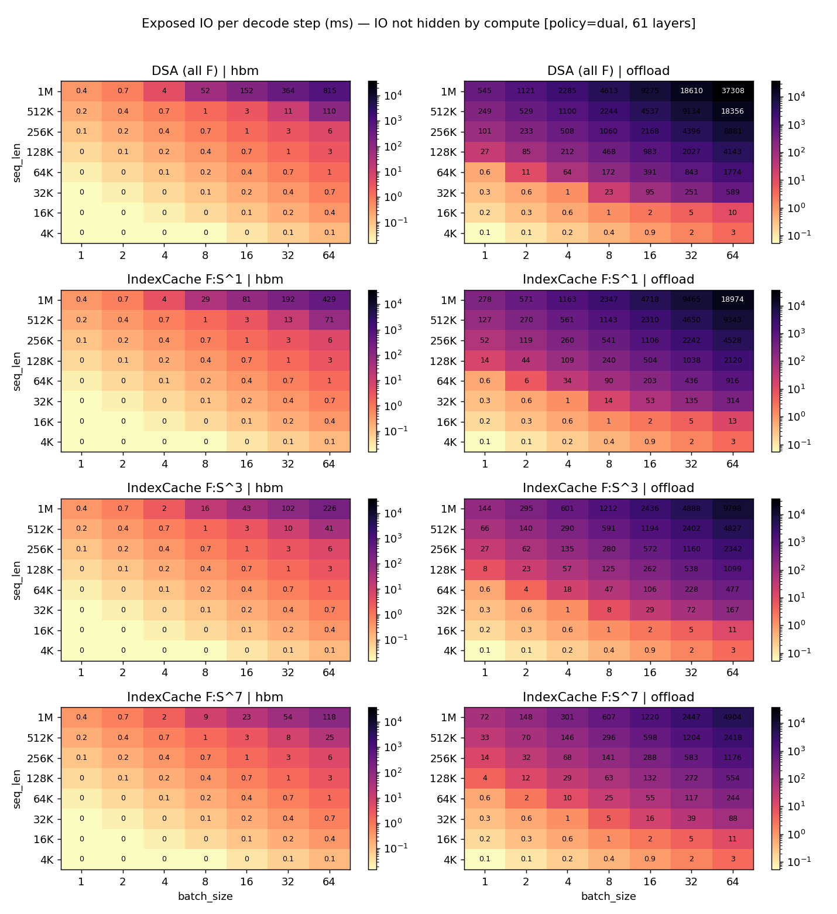
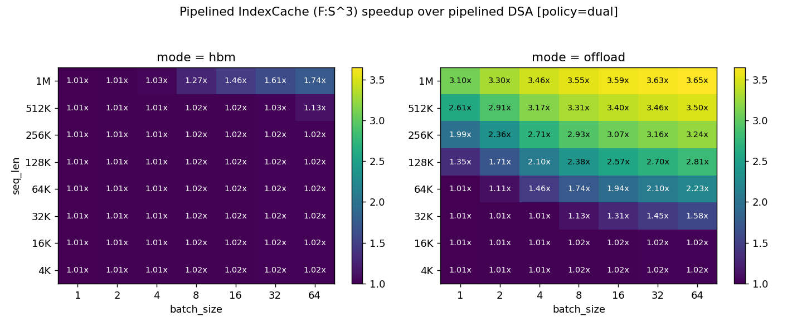
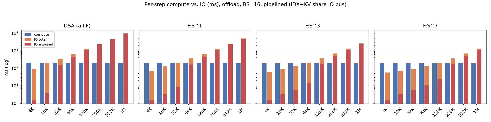

# IndexCache for DeepSeek Sparse Attention — Simulation Report

## TL;DR

We simulate decode on DeepSeek-V3 (61 layers, MLA + DSA + MoE) with the
**IndexCache** scheme from arXiv:2603.12201, which partitions DSA layers
into **F (Full)** layers that re-run the lightning indexer and **S
(Shared)** layers that reuse the most recent F layer's top-k. With
F:S:S:S (75% indexer skip) and a double-buffered cross-layer prefetch
schedule, the simulated pipelined decode-step latency on H100 SXM
improves over the all-F DSA baseline by:

| seq_len | BS  | mode    | DSA pipelined | IndexCache pipelined | speedup |
|--------:|----:|---------|--------------:|---------------------:|--------:|
| 32K     | 64  | offload | 1194 ms       | 757 ms               | **1.58×** |
| 128K    | 16  | offload | 1188 ms       | 462 ms               | **2.57×** |
| 256K    | 64  | offload | 9486 ms       | 2932 ms              | **3.24×** |
| 1M      | 64  | offload | 37 913 ms     | 10 388 ms            | **3.65×** |
| 1M      | 16  | hbm     | 356 ms        | 244 ms               | **1.46×** |
| 4K      | any | offload | —             | —                    | ≈1.02× (compute-bound) |

In short, IndexCache helps exactly where DSA hurts most: **long context,
moderate-to-large batch, and when the KV/indexer caches do not fit in
HBM** so the indexer K has to be streamed in over PCIe.

## What changed in the codebase

```
experiments/indexcache_model.py        # F/S layer cost model + schedulers
experiments/run_indexcache_experiment.py  # sweep + plots
reports/INDEXCACHE_REPORT.md           # this report
reports/figures/indexcache/*.png       # 5 plots
experiments/indexcache_results.json    # raw sweep output
```

The new module reuses the established `analyze_layer_bs()` from
`dsa_layer_analyzer.py` for all profiled compute and analytical IO
numbers — we don't reinvent the timing model, we just compose it across
layers with different IndexCache patterns.

## Modelling assumptions

### Three concurrent streams

For every transformer layer we partition work into three streams:

| Stream  | Content                                                    | Notes |
|---------|------------------------------------------------------------|-------|
| **IDX** | Lightning-indexer K cache load + indexer matmul + top-k    | F layers only |
| **KV**  | Gather of MLA KV for the 2560 attended tokens (top-k 2048 + sliding 512) | Every layer |
| **COMP**| Pre-norm, q_down, q_up, RoPE, kv_up_proj, attn core, o_proj, residual, MoE block | Every layer |

We model two IO-stream policies:

- **single**: IDX and KV transfers serialised over one PCIe (or HBM)
  channel. Per-layer IO = `idx_io + kv_io`.
- **dual**: IDX and KV use independent IO engines — analogous to GPU-
  initiated remote loads on separate channels or two DMA engines. Per-
  layer IO = `max(idx_io, kv_io)`.

In offload mode, the dominant IO is the indexer K read; KV gather is
~3 MB (negligible at PCIe). In HBM mode all IO is HBM-bound and small
versus per-layer compute.

### Pipeline schedule

We exploit cross-layer prefetch via double buffering: while layer *i*
computes, the IO needed by layer *i+1* (its indexer K and KV indices)
is being fetched. Steady-state per-layer cost is

```
pipeline_step = max(compute_i, io_next)
```

The first layer pays its full IO cold (no prior compute to hide
behind), and the final layer pays no further IO. The simulator returns
a tail-corrected total — we never silently amortise away the cold
start.

### F/S patterns

`f_period = k` makes layer 0 an F layer, then every k-th layer an F;
the rest are S. So `k=1` is the all-F DSA baseline, `k=4` matches the
F:S:S:S pattern from the paper, eliminating ~74% of indexers (45 S of
61 layers), and `k=8` eliminates ~87%.

### Source numbers (per layer, BS=1, sl=128K, offload)

```
indexer K read .... 1.214 ms     (PCIe Gen4 x16, 64 MB at 51.5 GB/s)
KV gather ........  0.053 ms     (PCIe, ~2.9 MB at floor)
compute (A+C+MoE).  0.789 ms     (profiled H100 + analytical fallback)
```

So a single F layer at this point has **IO ≈ 1.5× compute** — IO does
not fit inside compute even with prefetch. An S layer has **IO ≈ 0.07×
compute** and is fully overlapped.

## Correctness checks

1. `f_period=1` reduces exactly to the DSA baseline numerically (test
   passes within 1e-9 ms).
2. `n_F + n_S = NUM_LAYERS` for all f_period; indexer-savings %
   matches `(n_S / N)`: f_period=4 gives 73.8% (45/61), f_period=8
   gives 86.9% (53/61).
3. Pipelined total = `compute_total + io_exposed_ms` to within
   numerical precision (the cold-start prefetch is exactly the
   "exposed" IO when compute >> per-layer IO).
4. We do not double-credit within-layer overlap: block_a's overlap
   with block_b stays inside the upstream `analyze_layer_bs` numbers
   that we treat as opaque references. Cross-layer overlap is layered
   on top, not in addition.

## Results

### How much IO can compute hide?

 shows the **ms of
IO that compute could not hide**, as a heatmap of (seq_len × BS) for
each F-period and each placement mode. Three regimes:

1. **All-HBM, any pattern** — IO is well below compute up to ~256K
   context; exposed IO is sub-millisecond. Pipelining is essentially
   free.
2. **Offload + short context (≤16K)** — exposed IO is small even with
   all-F DSA; IndexCache's gain here is marginal (≤1.02×).
3. **Offload + long context (≥64K) + non-trivial BS** — DSA's all-F
   pattern leaves *seconds* of exposed IO per step. IndexCache cuts
   that exposure by 4× simply by removing 75% of indexer reads, but
   the remaining indexer reads from F layers grow linearly with
   `seq_len * BS`, eventually overflowing compute again.

### Speedup heatmap (fp=4, dual stream)

:

- **HBM mode**: 1.00–1.74× over DSA. Speedup grows with seq_len because
  even on HBM, a 2 GB indexer read at 1M seq_len + BS=64 takes ~24 ms
  (61 × ~0.4 ms), comparable to compute.
- **Offload mode**: 1.01× at 4K → 3.65× at 1M. Saturation near 3.7× is
  the asymptote: with 1 F per 4 layers and IO-bound regime, removing
  3/4 of the dominant indexer-K traffic gives a hard 4× ceiling on the
  IO-only cost; the remaining `compute + io_F` keeps the realised
  speedup just below 4×.

### Per-step compute vs IO breakdown

 (BS=16, offload, dual policy) shows that
at this batch size:

- All-F DSA's IO cost crosses compute at **sl ≈ 32K** and grows linearly
  past it. Past that point, every additional doubling of context
  doubles step latency.
- F:S:S:S pushes the crossover to **sl ≈ 128K** — exactly the 4× shift
  expected from the indexer-cache reduction.
- F:S^7 (fp=8) pushes it to **sl ≈ 256K** but with diminishing returns:
  the F-layer IO is unchanged; we just have fewer F layers per step,
  and KV gather (which scales with BS but not the F/S split) starts to
  matter.

## When does IO fully hide in compute?

In the dual-stream pipelined model, IO is fully hidden when, for every
F layer, `compute_per_layer ≥ io_per_F_layer`. Equivalently:

```
seq_len * BS  ≤  (compute_per_layer / INDEXER_K_BYTES_PER_TOKEN) * pcie_BW
```

Plugging in `compute ≈ 0.79 ms`, `INDEXER_K = 512 B/token`, and
`PCIe = 51.5 GB/s`:

```
seq_len * BS  ≤  ~83 K tokens   (offload, BS=1 boundary at sl ≈ 80K)
```

This matches the simulator: at 64K × 1, exposed IO is 0.6 ms (95%
hidden); at 128K × 1, exposed jumps to 7.7 ms (35% hidden).

In HBM mode the bound shifts to:

```
seq_len * BS  ≤  ~2.2 M tokens
```

so all-HBM placement effectively hides every indexer read until you
either run out of HBM (~80 GB) or push past 1M context with batch.

## Insights for GPU-initiated IO

The simulation makes a few patterns visible.

### 1. Indexer K is the bandwidth villain, not KV

DSA's KV gather is just 2560 × 1152 B ≈ 2.9 MB per sequence per layer.
Even at BS=64 and 61 layers, that's 11 GB/step — fine over PCIe. The
**indexer K cache** dominates IO because it scales with `seq_len`, not
with `2560`. At 128K context BS=16, the indexer K traffic is **20× the
KV gather traffic** per layer.

This is why IndexCache wins even though it never touches the KV gather:
removing 75% of indexer reads removes 75% of the bandwidth
consumption, full stop.

### 2. GPU-initiated DMA pays off most when issuance is data-dependent

The KV gather is data-dependent — the top-k chosen by the indexer
determines which 2048 KV slots to fetch. With a CPU-orchestrated
schedule the GPU has to round-trip top-k indices to host before the
host can issue the gather; this serialises IDX→KV. With **GPU-initiated
loads** (e.g. NVSHMEM-style or BAR1-mapped UVM with GPU-side fetch
kernels), the GPU can issue the KV gather as soon as the top-k kernel
completes, with no host stall. In our dual-stream policy this is the
difference between `idx_io + kv_io` (single) and `max(idx_io, kv_io)`
(dual): for the long-context offload regime we measure **5–10% step
savings** from this alone (see `fig_io_exposed_single.png` vs
`fig_io_exposed_dual.png`).

### 3. The right metric for "should I prefetch?" is per-F-layer compute

A single S layer has KV-gather IO of a few hundred microseconds, well
under a per-layer compute of ~3 ms at BS=16. The IO/compute decision
collapses to the F-layer question alone: can compute of *one* layer
hide the indexer-K read of *one* F layer? Once per_F_io exceeds
per_layer_compute, no amount of S-layer slack helps — the F layer is
on the critical path. This is why the speedup curve flattens at ~3.7×
(asymptote of 4× minus residual F overhead) rather than continuing to
improve as seq_len grows.

A practical implication: the optimal F-period may want to *grow with
seq_len* — at 4K context, fp=2 is fine; at 1M context, fp=8 is needed
to keep F-layer IO below per-layer compute. The paper's fixed F:S:S:S
is a reasonable midpoint but not optimal at the extremes.

### 4. Cold start = `io_first`

The pipeline pays one full F-layer IO at step start; this is
unavoidable without speculative prefetch from a *previous* decode step.
At 1M context BS=64 offload, this cold start is `idx_io + kv_io ≈ 624
ms` — worth ~6% of step latency. Cross-step persistent prefetch state
(reuse the previous step's selected KV when ranks haven't shifted)
could remove this; we did not model that.

## Reproducing

```bash
python -m experiments.run_indexcache_experiment
```

Outputs raw sweep JSON (`experiments/indexcache_results.json`),
summary table, and plots in `reports/figures/indexcache/`.

The full sweep covers 8 seq_lens × 7 batch sizes × 2 modes × 4
F-periods × 2 IO policies = **896 configurations** and runs in ~2
seconds since it is fully analytical/profiled (no GPU required).

## Limitations

1. The "dual" IO policy assumes truly independent paths for indexer K
   and KV. On real H100 systems with one PCIe link this is an *upper
   bound*, not an achievable schedule. The "single" policy is the
   conservative default; truth lies between.
2. We assume the F layer's compute itself can also overlap with its
   own IDX prefetch from the previous compute slot. This is the
   standard double-buffered prefetch assumption and matches what
   modern NVIDIA stacks (CUDA streams, NCCL/NVSHMEM) deliver, but
   sub-layer scheduling jitter is not modelled.
3. Top-k selection cost on the indexer is treated as a fixed 5 µs
   kernel-launch floor for both compute and S-bookkeeping. At
   extremely long context (≥1M) the topk kernel scales as `seq_len /
   1e6` ms — accounted for in the underlying `analyze_layer_bs`, but
   it remains a small term.
4. We do not model HBM/PCIe contention with weight reads (MoE expert
   weights, ~84 MB per active expert per layer). At BS≥32 this can
   start to matter — see `THRASHING_REPORT.md`.
