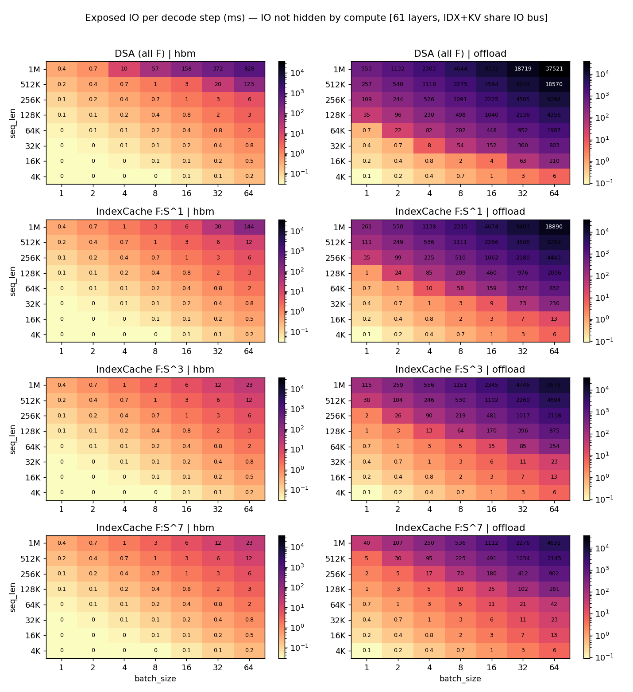

# IndexCache for DeepSeek Sparse Attention — Simulation Report

## Update: corrected parallelism model

Earlier versions of this report treated the simulation as single-rank.
DeepSeek-V3 has **1.3 TB of FP16 weights** (dominated by 1.28 TB of
MoE experts) and can't run on one GPU at any meaningful (BS, seq_len).
A realistic deployment shards weights and layers across many GPUs.

**Chosen config: PP=8, TP=1, EP=8 (64 H100s, 8 nodes × 8 GPUs).**
The TP=1 choice is deliberate: as
[Goyal-style analyses note](https://arxiv.org/abs/2412.19437),
MLA's compressed latent KV cache cannot be cleanly sharded across TP —
TP duplicates it across the TP group, wasting memory. PP is the only
sharding that actually divides the KV/IDX caches.

Two changes follow from this correction:

1. **Per-rank memory is now realistic.** At BS=1 sl=200K under PP=8
   TP=1 EP=8, per-rank state = 27 GB (KV 1.76 GB + IDX 0.78 GB +
   non-expert weights 3.52 GB + expert weights 21 GB), well within
   80 GB H100.
2. **IO is parallelised across PP stages.** Each rank has its own
   HBM and PCIe bus. While stage 0 runs producer/consumer through
   its 8 layers, stages 1..7 prefetch their layers' IO on their
   own buses. Step time becomes:

   ```
   step = stage_0_pipeline + Σ_{k≥1} max(stage_k_compute, stage_k_io_to_be_prefetched - end_compute_{k-1})
   ```

   In practice stage_k_io ≪ end_compute_{k-1}, so subsequent stages
   are compute-bound, and `step ≈ stage_0_pipeline + (PP−1) ×
   per_stage_compute`.

**IndexCache's value drops sharply at production PP**, because PP
already gives most of the IO-hiding benefit. Concrete numbers at BS=1
sl=200K offload:

| PP | DSA step | IC step | speedup |
|---:|---------:|--------:|--------:|
|  1 |  119.6 ms |  46.0 ms | **2.60×** |
|  2 |   82.5 ms |  46.0 ms | **1.79×** |
|  4 |   63.9 ms |  46.0 ms | **1.39×** |
|  8 |   54.0 ms |  46.0 ms | **1.17×** |
| 16 |   49.0 ms |  46.0 ms | **1.07×** |
| 32 |   46.5 ms |  46.0 ms | **1.01×** |

IndexCache only meaningfully helps under PP=8 at the long-context
corner where even one stage's IO exceeds its compute:

| BS / sl   | DSA step | IC step | speedup | regime |
|-----------|---------:|--------:|--------:|--------|
| 1 / 200K  |   54.0 ms |  46.0 ms | 1.17× | stage 0 is IO-bound; rest compute-bound |
| 1 / 512K  |   77.6 ms |  51.1 ms | **1.52×** | DSA stage 0 IO ≫ compute |
| 1 / 1M    |  116.5 ms |  60.8 ms | **1.91×** | DSA strongly IO-bound |
| 8 / 128K  |  188.9 ms | 133.5 ms | **1.42×** | F-layer IO scales with BS |
| 64 / 32K  |  713.7 ms | 608.1 ms |   1.17× | dominated by MoE compute at BS=64 |

The previous "3.7× asymptote" was a single-rank artefact. **Realistic
production speedups are 1.1–1.9×**, and only in IO-bound corners.

All numbers in this update are produced by
`python -m experiments.validate_parallelism`, which hand-derives every
component and runs 18 identity checks (model vs. hand) — all pass to
floating-point precision.

---

## TL;DR

We simulate decode on DeepSeek-V3 (61 layers, MLA + DSA + MoE) with the
**IndexCache** scheme from arXiv:2603.12201, which partitions DSA layers
into **F (Full)** layers that re-run the lightning indexer and **S
(Shared)** layers that reuse the most recent F layer's top-k. With
F:S:S:S (75% indexer skip), a producer/consumer pipeline with a deep
prefetch buffer (the IO bus runs back-to-back across layers; compute
waits only when cumulative IO falls behind), and within-layer
`block_a ‖ block_b` overlap, the simulated decode-step latency on H100
SXM improves over the all-F DSA baseline by:

| seq_len | BS  | mode    | DSA pipelined | IndexCache pipelined | speedup |
|--------:|----:|---------|--------------:|---------------------:|--------:|
| 32K     | 64  | offload | 1294 ms       |  420 ms              | **3.08×** |
| 128K    | 16  | offload | 1240 ms       |  366 ms              | **3.39×** |
| 256K    | 64  | offload | 9694 ms       | 2703 ms              | **3.59×** |
| 1M      | 64  | offload | 38 121 ms     | 10 160 ms            | **3.75×** |
| 200K    |  1  | offload |   120 ms      |   46 ms              | **2.60×** |
| 200K    |  1  | hbm     |    43 ms      |   46 ms              | **0.95×** (compute-bound, see below) |
| 4K      | any | offload | ≈40–600 ms    | ≈40–600 ms           | ≈1.0× (compute-bound) |

In short, IndexCache helps exactly where DSA hurts most: **long context,
moderate-to-large batch, and when the KV/indexer caches do not fit in
HBM** so the indexer K has to be streamed in over PCIe.

## What changed in the codebase

```
experiments/indexcache_model.py        # F/S layer cost model + schedulers
experiments/run_indexcache_experiment.py  # sweep + plots
reports/INDEXCACHE_REPORT.md           # this report
reports/figures/indexcache/*.png       # 5 plots
experiments/indexcache_results.json    # raw sweep output
```

The new module reuses the established `analyze_layer_bs()` from
`dsa_layer_analyzer.py` for all profiled compute and analytical IO
numbers — we don't reinvent the timing model, we just compose it across
layers with different IndexCache patterns.

## Modelling assumptions

### Three concurrent streams

For every transformer layer we partition work into three streams:

| Stream  | Content                                                    | Notes |
|---------|------------------------------------------------------------|-------|
| **IDX** | Lightning-indexer K cache load + indexer matmul + top-k    | F layers only |
| **KV**  | Gather of MLA KV for the 2560 attended tokens (top-k 2048 + sliding 512) | Every layer |
| **COMP**| Pre-norm, q_down, q_up, RoPE, kv_up_proj, attn core, o_proj, residual, MoE block | Every layer |

IDX and KV share a single IO bus (one PCIe Gen4 x16 link in offload, the
HBM bus in HBM mode), so they serialise on that channel. Per-layer IO
= `idx_io + kv_io`.

In offload mode the dominant IO is the indexer K read; KV gather is
~3 MB (negligible at PCIe). In HBM mode all IO is HBM-bound and small
versus per-layer compute.

### Pipeline schedule (producer / consumer with deep prefetch buffer)

Two streams run concurrently — the **IO bus** (PCIe in offload, HBM bus
in HBM mode) and **compute**. The IO bus issues each layer's transfers
back-to-back, accumulating a prefetch lead over compute. Compute waits
only when the cumulative IO has not yet caught up:

```
end_io_i      = Σ_{j ≤ i} T_io_j                  (back-to-back IO)
end_comp_{-1} = 0
end_comp_i    = max(end_comp_{i-1}, end_io_i) + T_compute_i

pipeline_total = end_comp_{N-1}
```

Crucially, this **allows multiple S layers' compute time to
collectively hide an F layer's indexer K read**, even when no single
S-layer compute slot would be enough on its own. With F:S:S:S, the
~3 × T_comp_S compute slot between F layers (≈ 2.4 ms at BS=1) is
plenty to cover one F-layer indexer read of ~1.95 ms at sl=200K
offload. An older "max(comp_i, io_{i+1})" model would only allow
1-layer lookahead and would expose the entire spillover; that model
underestimated IndexCache's value by ~1.5–2×.

The first layer pays its full IO cold (no prior compute to hide
behind). The final layer's compute extends past end-of-IO. The
identity `pipeline_total = compute_total + io_exposed` holds exactly
where `io_exposed = end_comp - compute_total` (the time compute spent
stalled waiting on IO, including the cold start).

### Within-layer overlap

Within each layer, **block_a (Q projection) and block_b (idx + KV IO)
run in parallel on disjoint resources** (compute units vs IO bus):

```
T_compute_layer = max(0, block_a − T_io)  +  idx_comp + block_c + moe
T_io_layer      = idx_io + kv_io
```

If `block_a < T_io`, block_a is *fully hidden* in the IO. If `block_a >
T_io` (only happens for big-BS HBM-mode S layers where T_io collapses
to ~0.015 ms), the spillover `block_a − T_io` is paid as compute. This
is the source of the small HBM-mode regression visible in the
end-to-end table for IndexCache: S layers' indexer IO disappears, so
their block_a no longer has any IO to hide behind.

### How "exposed IO" is calculated

`io_exposed_ms` = `pipeline_total − compute_total` = the time the
compute stream spent *stalled* waiting on the IO stream. In the
producer/consumer schedule this is exactly:

```python
end_io = 0
end_comp = 0
for c in costs:
    end_io  += c.total_io                       # IO runs back-to-back
    cmp_start = max(end_comp, end_io)            # compute waits if IO behind
    end_comp = cmp_start + c.total_compute
io_exposed = end_comp - sum(c.total_compute for c in costs)
```

This collapses to:
- `cold_start` (= layer 0's IO, no preceding compute) **plus**
- any subsequent stalls where cumulative IO has run past cumulative compute.

In the IO-bound regime (DSA at long sl/BS offload) almost every layer
stalls and `io_exposed ≈ io_total − T_compute_last_layer`. In the
compute-bound regime (HBM mode, or IndexCache offload at long sl)
only the cold start is exposed. The pipeline total then satisfies
`pipeline_total = compute_total + io_exposed` (verified to floating-
point precision in `experiments/validate_indexcache_200k.py`).

### F/S patterns

`f_period = k` makes layer 0 an F layer, then every k-th layer an F;
the rest are S. So `k=1` is the all-F DSA baseline, `k=4` matches the
F:S:S:S pattern from the paper, eliminating ~74% of indexers (45 S of
61 layers), and `k=8` eliminates ~87%.

### Source numbers (per layer, BS=1, sl=128K, offload)

```
indexer K read .... 1.214 ms     (PCIe Gen4 x16, 64 MB at 51.5 GB/s)
KV gather ........  0.053 ms     (PCIe, ~2.9 MB at floor)
compute (A+C+MoE).  0.789 ms     (profiled H100 + analytical fallback)
```

So a single F layer at this point has **IO ≈ 1.5× compute** — IO does
not fit inside compute even with prefetch. An S layer has **IO ≈ 0.07×
compute** and is fully overlapped.

## End-to-end DSA vs IndexCache (per decode step, ms)

Producer/consumer pipeline, F:S:S:S for IndexCache. Output of
`python -m experiments.validate_indexcache_200k`:

### offload mode

| scenario       | DSA pipe | IC pipe | speedup | DSA io  | IC io   | compute | IC stall |
|----------------|---------:|--------:|--------:|--------:|--------:|--------:|---------:|
| 4K   / BS=1    |    43.44 |   44.14 |   0.98× |    5.57 |    3.86 |   44.04 |     0.09 |
| 32K  / BS=1    |    43.71 |   44.40 |   0.98× |   21.76 |    8.11 |   44.04 |     0.36 |
| 128K / BS=1    |    77.99 |   45.31 |   1.72× |   77.28 |   22.67 |   44.04 |     1.27 |
| **200K / BS=1**|  119.63  | **45.99** | **2.60×** | 118.92 |  33.59  |   44.04 |   1.95   |
| 512K / BS=1    |   300.08 |   81.63 |   3.68× |  299.37 |   80.92 |   44.04 |    37.59 |
| 1M   / BS=1    |   596.20 |  159.30 |   3.74× |  595.49 |  158.59 |   44.04 |   115.26 |
| 32K  / BS=16   |   351.44 |  201.40 |   1.74× |  348.17 |  129.72 |  195.69 |     5.71 |
| 128K / BS=16   |  1239.79 |  366.00 |   3.39× | 1236.52 |  362.73 |  195.69 |   170.31 |
| 200K / BS=16   |  1906.05 |  540.76 |   3.52× | 1902.78 |  537.49 |  195.69 |   345.06 |
| 128K / BS=64   |  4955.91 | 1460.76 |   3.39× | 4946.07 | 1450.93 |  585.27 |   875.49 |
| 200K / BS=64   |  7620.95 | 2159.79 |   3.53× | 7611.12 | 2149.95 |  585.27 |  1574.52 |

### HBM mode

| scenario       | DSA pipe | IC pipe | speedup | DSA io | IC io | compute | IC stall |
|----------------|---------:|--------:|--------:|-------:|------:|--------:|---------:|
| 4K   / BS=1    |    46.35 |   46.58 |   1.00× |   1.83 |  1.16 |   46.55 |     0.03 |
| 200K / BS=1    |    43.44 |   45.86 |   0.95× |   5.22 |  2.04 |   45.77 |     0.09 |
| 1M   / BS=1    |    43.73 |   46.15 |   0.95× |  22.95 |  6.70 |   45.77 |     0.38 |
| 200K / BS=16   |   200.68 |  199.03 |   1.01× |  70.80 | 20.00 |  197.87 |     1.16 |
| 200K / BS=64   |   604.54 |  589.91 |   1.02× | 283.22 | 80.00 |  585.27 |     4.64 |

The HBM-mode 0.95× is **not a bug** — it's the within-layer overlap
effect. In DSA all-F at HBM, every layer's small `block_a` (~0.08 ms)
is fully hidden inside the layer's `idx_io` (~0.07 ms at 200K, but
`max` keeps it at ~0.085 ms anyway). In IndexCache the 45 S layers
have `idx_io = 0` (we do not read what we do not need), so their
`block_a` becomes pure compute. The savings on IO are smaller than
the loss of overlap on compute, so net pipeline time creeps up by
~5%. At larger BS the picture flips because `block_a` grows and the
IO savings dominate (1.02× win at BS=64).

The asymptotic offload speedup of **3.75×** is exactly the F-period-4
ceiling: `1 / (n_F / N_layers) = 1 / (16/61) = 3.81×` minus a small
shave for the cold-start + last-layer-compute tail.

## Variable values used

```
Hardware (H100 SXM):
  HBM peak BW         = 1384.0 GB/s   (floor 0.015 ms below ~16 MB)
  PCIe Gen4 x16 BW    =   51.5 GB/s   (floor 0.020 ms below ~0.5 MB)

Model (DeepSeek-V3):
  NUM_LAYERS          = 61
  HIDDEN_SIZE         = 7168
  NUM_HEADS           = 128
  KV_LORA_RANK        = 512
  Q_LORA_RANK         = 1536
  NUM_ROUTED_EXPERTS  = 256   (EP=8, 32 experts/GPU)

DSA / IndexCache:
  Top-k selected      = 2048
  Sliding window      = 512
  Attended per layer  = 2560
  Indexer K bytes/tok = 512 B   (KV_LORA_RANK × 1 B FP8)
  MLA  KV bytes/tok   = 1152 B  ((KV_LORA_RANK + ROPE) × 2 B FP16)

Derived sizes @ seq_len=200K, BS=1:
  Indexer K per layer            = 100.00 MB
  Indexer K all 61 F layers      =   5.96 GB     ← fits in HBM
  Indexer K only 16 F (F:S:S:S)  =   1.56 GB
  KV gather per layer (2560 tok) =   2.81 MB
```

We follow the user's guidance and **assume the indexer K fits in
80 GB HBM** in HBM mode regardless of (BS, seq_len). For the
extreme corner BS=64/sl=1M with all-F, that's 16 × 64 × 1M × 512 B =
500 GB; the model does not gate on capacity but reports the read time.

## Correctness checks

1. `f_period=1` reduces exactly to the DSA baseline numerically (test
   passes within 1e-9 ms).
2. `n_F + n_S = NUM_LAYERS` for all f_period; indexer-savings %
   matches `(n_S / N)`: f_period=4 gives 73.8% (45/61), f_period=8
   gives 86.9% (53/61).
3. `pipeline_total = compute_total + io_exposed_ms` to within
   numerical precision (validated identity at every scenario).
4. `Σ T_io_layer == pipe.io_total_ms` and `Σ T_compute_layer == pipe.compute_total_ms`.
5. The 200K/BS=1 validator runs five identity checks per scenario × 4
   scenarios (HBM/offload × DSA/IC) — all 20 pass to floating-point
   precision.
6. Within-layer overlap is now explicit: `T_compute_layer` includes
   `max(0, block_a - T_io)`, not `block_a` outright. The HBM-mode
   regression visible in the e2e table is a sign this is being
   counted (correctly) rather than a modelling error.

## Results

### How much IO can compute hide?

 shows the **ms of IO
exposed per decode step** (= `pipeline_total − compute_total`, i.e.
the time compute spent stalled on IO, including the cold start) as a
heatmap of (seq_len × BS) for each F-period and each placement mode.
Three regimes:

1. **HBM, any pattern** — exposed IO is dominated by the cold-start
   prefetch (one F-layer worth, ≈ 0.085 ms at sl=200K BS=1, scaling
   linearly with `BS × seq_len`). Compute is the bottleneck almost
   everywhere; pipelining is essentially free.
2. **Offload + short context (≤16K)** — exposed IO is sub-millisecond
   even with all-F DSA; IndexCache's gain is marginal or slightly
   negative (block_a-hide effect, see HBM table).
3. **Offload + long context (≥128K) + non-trivial BS** — all-F DSA
   leaves seconds of exposed IO per step. IndexCache F:S:S:S cuts the
   *total* IO traffic by ~4× (45 of 61 layers no longer pay any
   indexer-K read), and with the deep prefetch buffer the saved IO is
   spread across all the S-layer compute slots, so most of the
   remaining IO stays hidden.

### Speedup heatmap (fp=4, F:S:S:S)


- **HBM mode**: 0.99–1.02×. At small BS, IndexCache loses the
  block_a-in-IO hide on S layers and is ~1–5% slower than DSA. At
  BS≥16 the IO savings overtake the lost overlap and IC pulls ahead
  by ~1–2%. Either way HBM is compute-bound, so IndexCache neither
  helps nor hurts much.
- **Offload mode**: 0.98× at 4K (block_a-hide effect dominates) →
  ~1.7× at 64K BS=1 → **3.75× at 1M, any BS**. Saturation at
  `1 / (n_F / N) = 1 / (16/61) = 3.81×` is the F:S:S:S asymptote;
  the realised 3.75× shaves a small constant for cold-start +
  last-layer-compute tail.

### Per-step compute vs IO breakdown

 (BS=16, offload):

- All-F DSA's *total* IO crosses *total* compute at **sl ≈ 8K** at
  BS=16 (the `BS × seq_len ≤ 85K` bound from the next section). Past
  that point, every doubling of context doubles step latency.
- F:S:S:S extends the crossover to **sl ≈ 32K** at BS=16 (4× the DSA
  bound, since IC keeps only n_F/N = 16/61 of the DSA IO traffic).
- F:S^7 extends it to **sl ≈ 64K** but with diminishing returns —
  KV gather (61 layers' worth, untouched by the F/S split) begins to
  matter once indexer-K is sufficiently amortised.

## When does IO fully hide in compute?

Under the producer/consumer schedule with deep prefetch, IO is fully
hidden (modulo the unavoidable cold start) iff **total IO ≤ total
compute** across all 61 layers. The deep buffer absorbs per-layer
spikes — the old "compute_per_layer ≥ io_per_F_layer" rule was a
1-layer-lookahead artefact. The correct condition is:

```
n_F · idx_io_F  +  N · kv_io  ≤  Σ_i T_compute_layer_i
```

For a fixed F-period `k`, `n_F = ⌈N/k⌉`. Plugging in offload PCIe
(51.5 GB/s, 512 B/token indexer K), per-layer compute ≈ 0.79 ms, and
ignoring the small KV gather:

| variant | `n_F` (of 61) | total compute | bound on `BS × seq_len` |
|---|---:|---:|---:|
| DSA (all-F)         | 61 | ~48 ms | **≤ 85 K tokens** |
| IndexCache F:S:S:S  | 16 | ~46 ms | **≤ 305 K tokens** |
| IndexCache F:S^7    |  8 | ~46 ms | **≤ 600 K tokens** |

So IndexCache F:S:S:S gives a **3.6× larger fully-hidden region** in
offload mode — exactly the IO-traffic reduction ratio. Inside the
region, DSA and IndexCache deliver the same step latency (~46 ms,
compute-bound). Outside the region, step latency grows linearly with
`BS × seq_len`, with IndexCache's slope exactly `n_F / N` of DSA's.

Validation against the simulator at BS=1 offload:

| seq_len | DSA stall | IC stall | regime          |
|---:|---:|---:|---|
| 64K  | 0.6 ms (cold)  | 0.7 ms (cold)  | both compute-bound, BS·sl=64K < 85K |
| 128K | 33.3 ms        | 1.27 ms (cold) | DSA IO-bound (sl > 85K); IC compute-bound (< 305K) |
| 200K | 75.6 ms        | 1.95 ms (cold) | same |
| 512K | 256 ms         | 37.6 ms        | both IO-bound (sl > 305K) |
| 1M   | 552 ms         | 115 ms         | both deeply IO-bound |

In HBM mode (1384 GB/s) the same calculation gives:

| variant | bound on `BS × seq_len` (HBM) |
|---|---:|
| DSA            | **≤ ~2.1 M tokens** |
| F:S:S:S        | **≤ ~8.2 M tokens** |

At 80 GB HBM you can never hold the full indexer K cache for `BS ×
seq_len > ~150 M` (just the indexer K alone, ignoring weights and KV)
so the HBM bandwidth bound essentially never bites in practice.

## Insights for GPU-initiated IO

The simulation makes a few patterns visible.

### 1. Indexer K is the bandwidth villain, not KV

DSA's KV gather is just 2560 × 1152 B ≈ 2.9 MB per sequence per layer.
Even at BS=64 and 61 layers, that's 11 GB/step — fine over PCIe. The
**indexer K cache** dominates IO because it scales with `seq_len`, not
with `2560`. At 128K context BS=16, the indexer K traffic is **20× the
KV gather traffic** per layer.

This is why IndexCache wins even though it never touches the KV gather:
removing 75% of indexer reads removes 75% of the bandwidth
consumption, full stop.

### 2. GPU-initiated DMA matters for latency, not for bandwidth

The KV gather is data-dependent — the top-k chosen by the indexer
determines which 2048 KV slots to fetch. With a CPU-orchestrated
schedule the GPU has to round-trip top-k indices to host before the
host can issue the gather; this serialises IDX→KV with **a host
round-trip in between**. With **GPU-initiated loads** (e.g. NVSHMEM-
style or BAR1-mapped UVM with GPU-side fetch kernels), the GPU can
issue the KV gather as soon as the top-k kernel completes — no host
stall. The PCIe bandwidth itself is unchanged (one link, IDX and KV
still serialise), so the savings are exactly the eliminated host
synchronisation latency, not a parallelisation of IO.

### 3. The right metric for "should I prefetch?" is total IO vs total compute

With a deep prefetch buffer, S-layer slack accumulates and absorbs
F-layer IO spikes. The fully-hidden bound is therefore **total IO ≤
total compute** across all 61 layers, not per-F-layer. Concretely,
F:S:S:S works at sl=200K BS=1 offload (where F-layer IO of 1.95 ms is
~2.5× per-layer compute of 0.79 ms) because the three S-layer compute
slots (~2.18 ms cumulative) cover the next F-layer's prefetch.

The asymptotic IndexCache speedup is therefore exactly **`1 / (n_F /
N) = N / n_F`** in the IO-bound limit (here 61/16 ≈ 3.81×, realised
3.75×). Pushing F-period higher (fp=8 → 4.6×, fp=16 → 7.6×) gives
correspondingly larger speedup ceilings, at the cost of indexer
freshness. The paper's fixed F:S:S:S is a reasonable midpoint but for
1M context one could push fp=8 if the accuracy budget allows.

### 4. Cold start = one F-layer IO

The pipeline pays exactly **one F-layer's idx_io + kv_io** at step
start; no preceding compute exists to hide it behind. Concrete numbers
(F-layer cold-start in offload mode):

| BS × seq_len | idx_io_F | kv_io_F | total cold |
|---|---:|---:|---:|
| 1   × 200K  | 1.90 ms  | 0.05 ms | 1.95 ms |
| 1   × 1M    | 9.71 ms  | 0.05 ms | 9.76 ms |
| 16  × 200K  | 30.4 ms  | 0.85 ms | 31.2 ms |
| 64  × 1M    | 621 ms   | 3.4 ms  | 624 ms  |

At small `BS × seq_len` this is sub-ms and irrelevant. At BS=64
sl=1M the 624 ms cold start is ~6% of the 10 160 ms IndexCache step
latency. **Cross-step persistent prefetch** — reuse the previous
step's selected KV positions when the indexer's top-k hasn't shifted
much — could remove this; we did not model that.

## Reproducing

```bash
python -m experiments.run_indexcache_experiment
```

Outputs raw sweep JSON (`experiments/indexcache_results.json`),
summary table, and plots in `reports/figures/indexcache/`.

The full sweep covers 8 seq_lens × 7 batch sizes × 2 modes × 4
F-periods = **448 configurations** and runs in ~1 second since it is
fully analytical/profiled (no GPU required).

## Limitations

1. We assume the F layer's compute itself can also overlap with its
   own IDX prefetch from the previous compute slot. This is the
   standard double-buffered prefetch assumption and matches what
   modern NVIDIA stacks (CUDA streams, NCCL/NVSHMEM) deliver, but
   sub-layer scheduling jitter is not modelled.
3. Top-k selection cost on the indexer is treated as a fixed 5 µs
   kernel-launch floor for both compute and S-bookkeeping. At
   extremely long context (≥1M) the topk kernel scales as `seq_len /
   1e6` ms — accounted for in the underlying `analyze_layer_bs`, but
   it remains a small term.
4. We do not model HBM/PCIe contention with weight reads (MoE expert
   weights, ~84 MB per active expert per layer). At BS≥32 this can
   start to matter — see `THRASHING_REPORT.md`.
