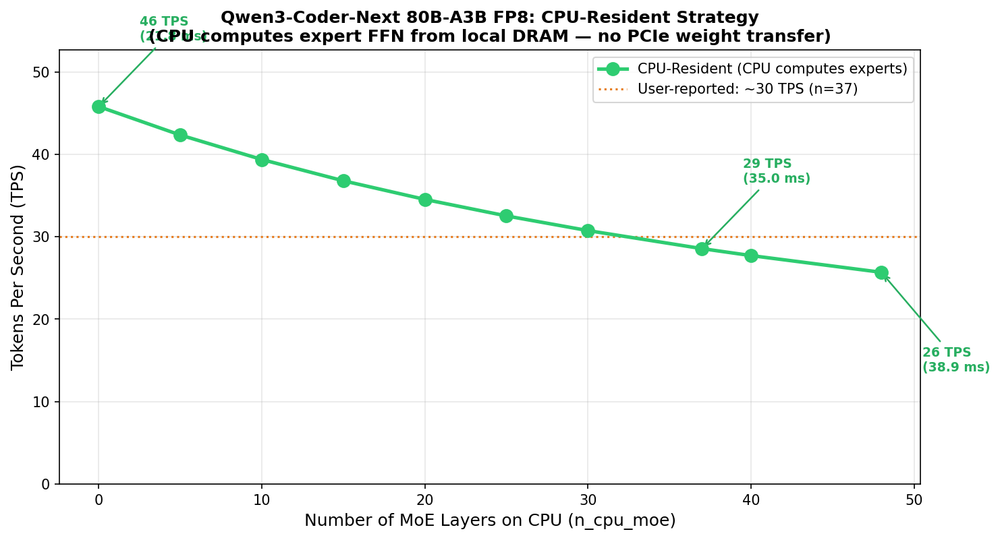
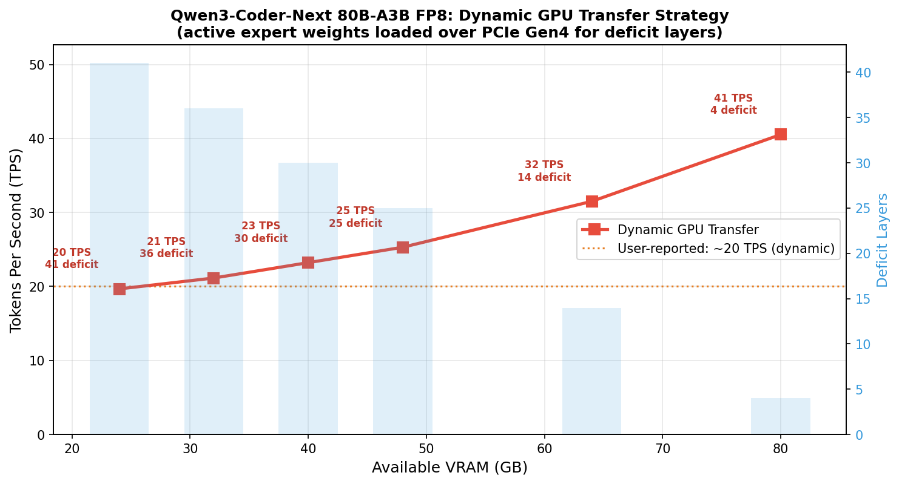
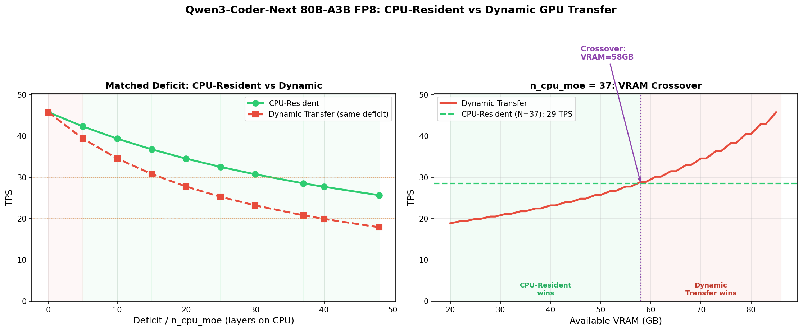
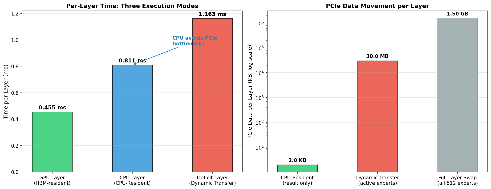
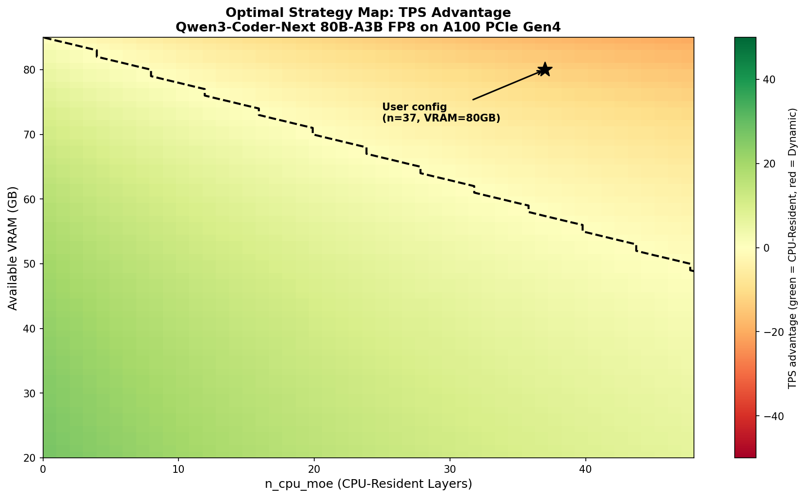

# Qwen3-Coder-Next 80B-A3B FP8: CPU-Resident vs Dynamic GPU Transfer

## When CPU Beats GPU: Expert Weight Offloading Strategies for VRAM-Constrained MoE Inference

---

## Table of Contents

1. [Motivation](#1-motivation)
2. [Model Architecture](#2-model-architecture)
3. [Two Strategies](#3-two-strategies)
4. [Results](#4-results)
5. [Crossover Analysis](#5-crossover-analysis)
6. [Simulator Validation](#6-simulator-validation)
7. [Discussion](#7-discussion)

---

## 1. Motivation

Large MoE models like Qwen3-Coder-Next (80B total / 3B active) present a unique deployment challenge: the model's total weight exceeds typical single-GPU VRAM, but its *active* compute footprint is tiny. This creates a scenario where keeping some expert weights on CPU memory and computing them there can actually *outperform* dynamically transferring weights to GPU over PCIe.


This experiment quantifies both strategies across varying `n_cpu_moe` values and VRAM levels, identifying the exact crossover point where each strategy wins.

---

## 2. Model Architecture

### Qwen3-Coder-Next 80B-A3B

| Parameter | Value |
|-----------|-------|
| Total Parameters | 80B (79B non-embedding) |
| Active Parameters | 3B per token |
| Layers | 48 |
| Hidden Dimension | 2,048 |
| Architecture | Hybrid Transformer-Mamba (Gated DeltaNet + Gated Attention) |
| Routed Experts | 512 |
| Active Experts / Token | 10 |
| Shared Experts | 1 |
| Expert Intermediate Dim | 512 |
| Precision | FP8 (E4M3) |

### Expert Weight Sizing (FP8)

| Metric | Value |
|--------|-------|
| Expert weight (1 expert) | 3 × 2048 × 512 × 1B = **3.0 MB** |
| Active experts / layer | 10 × 3.0 MB = **30 MB** |
| All 512 experts / layer | 512 × 3.0 MB = **1.5 GB** |
| Total expert weights (48 layers) | **72.0 GB** |
| Total model weight (est.) | **80.0 GB** |

### Hardware Configuration

| Component | Spec |
|-----------|------|
| GPU | NVIDIA A100 80GB |
| HBM Bandwidth (effective) | 1,631.2 GB/s (2,039 × 0.8) |
| PCIe Gen4 (effective) | 25.2 GB/s (31.5 × 0.8) |
| CPU Memory Bandwidth | ~200 GB/s (DDR5, conservative) |

### Why This Model Is Special

Qwen3-Coder-Next has an extreme sparsity ratio: 80B total but only 3B active. Each expert's intermediate dimension (512) is tiny compared to dense models (typically 4096–14336). This means:

1. **Expert compute is minimal**: Each expert FFN takes microseconds on either CPU or GPU
2. **Weight transfer dominates**: Moving 30 MB of active expert weights per layer over PCIe takes more time than computing them
3. **CPU is competitive**: CPU can access the same 30 MB from local DDR5 at 200 GB/s in ~0.15 ms, far faster than PCIe's 1.16 ms

---

## 3. Two Strategies

### Strategy A: CPU-Resident (`n_cpu_moe = N`)

The first N layers keep expert weights in CPU RAM. The CPU performs the expert FFN computation directly using its own memory bandwidth. Only the result tensor (~2 KB) crosses PCIe back to the GPU.

```
Per CPU layer:
  1. GPU → CPU: send hidden state (2048 × 1B = 2 KB)     ← negligible
  2. CPU: read expert weights from DRAM (30 MB @ 200 GB/s) ← 0.15 ms
  3. CPU: compute expert FFN (62.9 MFLOPS)                 ← ~0.6 ms
  4. CPU → GPU: send result (2048 × 1B = 2 KB)            ← negligible
  Total: ~0.81 ms per CPU layer (calibrated from user data)
```

### Strategy B: Dynamic GPU Transfer

All layers run on GPU, but when VRAM cannot hold all expert weights, deficit layers' *active* expert weights are loaded over PCIe each forward pass. PCIe DMA and GPU SM can overlap.

```
Per deficit layer:
  1. CPU → GPU: transfer active expert weights (30 MB @ 25.2 GB/s) ← 1.16 ms
  2. GPU: compute expert FFN (62.9 MFLOPS)                         ← 0.45 ms
  Overlapped: max(1.16, 0.45) = 1.16 ms per deficit layer
```

### The Key Difference

| Metric | CPU-Resident | Dynamic Transfer |
|--------|-------------|-----------------|
| PCIe data per layer | ~2 KB (result only) | 30 MB (active expert weights) |
| Time per offloaded layer | **0.811 ms** | **1.163 ms** |
| Bottleneck | CPU compute (FLOPS) | PCIe bandwidth |
| GPU layer time | 0.455 ms | 0.455 ms |

**CPU-Resident is 30% faster per offloaded layer** because it avoids the PCIe bottleneck entirely. The CPU reads 30 MB from its own DRAM at 200 GB/s (0.15 ms) instead of pushing it across PCIe at 25.2 GB/s (1.16 ms).

---

## 4. Results

### Strategy A: CPU-Resident Sweep

| n_cpu_moe | CPU Time (ms) | GPU Time (ms) | Total (ms) | TPS |
|-----------|--------------|---------------|------------|-----|
| **0** | 0.00 | 21.84 | 21.84 | **45.8** |
| 5 | 4.05 | 19.57 | 23.62 | 42.3 |
| 10 | 8.11 | 17.29 | 25.40 | 39.4 |
| 15 | 12.16 | 15.02 | 27.18 | 36.8 |
| 20 | 16.22 | 12.74 | 28.96 | 34.5 |
| 25 | 20.27 | 10.46 | 30.74 | 32.5 |
| 30 | 24.33 | 8.19 | 32.52 | 30.8 |
| **37** | **30.01** | **5.00** | **35.01** | **28.6** |
| 40 | 32.44 | 3.64 | 36.08 | 27.7 |
| 48 | 38.93 | 0.00 | 38.93 | 25.7 |

**User validation**: N=37 gives 28.6 TPS (user reported ~30 TPS) — within 5% of real-world measurement.


*Figure 1: CPU-Resident TPS degrades linearly with n_cpu_moe. Each CPU layer adds 0.356 ms (0.811 - 0.455) compared to GPU.*

### Strategy B: Dynamic Transfer Sweep

| VRAM (GB) | Layers in VRAM | Deficit | Transfer (MB) | Total (ms) | TPS |
|-----------|---------------|---------|--------------|------------|-----|
| 24 | 7 | 41 | 1,230 | 50.85 | **19.7** |
| 32 | 12 | 36 | 1,080 | 47.31 | 21.1 |
| 40 | 18 | 30 | 900 | 43.07 | 23.2 |
| 48 | 23 | 25 | 750 | 39.53 | 25.3 |
| 64 | 34 | 14 | 420 | 31.75 | 31.5 |
| 80 | 44 | 4 | 120 | 24.67 | **40.5** |

**User validation**: Deficit=37 (VRAM≈30GB) gives 20.8 TPS (user reported ~20 TPS) — within 4%.


*Figure 2: Dynamic Transfer TPS improves as VRAM increases (fewer deficit layers). At VRAM=80GB, only 4 layers are deficit.*

### User Scenario: Head-to-Head

| Strategy | Config | Per-Token (ms) | TPS | User Reported |
|----------|--------|---------------|-----|---------------|
| CPU-Resident | N=37 | 35.01 | **28.6** | ~30 |
| Dynamic Transfer | deficit=37 | 48.02 | **20.8** | ~20 |
| Dynamic Transfer | VRAM=80GB | 24.67 | **40.5** | — |
| All GPU (theoretical) | deficit=0 | 21.84 | **45.8** | — |


*Figure 3: (Left) Matched deficit comparison — CPU-Resident consistently beats Dynamic Transfer. (Right) VRAM crossover: Dynamic Transfer beats CPU-Resident (N=37) at VRAM >= 58 GB.*

---

## 5. Crossover Analysis

### When Does Dynamic Transfer Win?

Dynamic Transfer beats CPU-Resident (N=37) when **VRAM >= 58 GB**.

At 58 GB VRAM, Dynamic Transfer has only 18 deficit layers, giving 28.9 TPS vs CPU-Resident's fixed 28.6 TPS. As VRAM increases further, the advantage grows:

| VRAM (GB) | Dynamic TPS | CPU-Resident (N=37) TPS | Winner |
|-----------|------------|------------------------|--------|
| 30 | 20.8 | 28.6 | CPU-Resident (+37%) |
| 48 | 25.3 | 28.6 | CPU-Resident (+13%) |
| **58** | **28.9** | **28.6** | **Crossover** |
| 64 | 31.5 | 28.6 | Dynamic (+10%) |
| 80 | 40.5 | 28.6 | Dynamic (+42%) |

### Per-Layer Cost Advantage

CPU-Resident's advantage comes from avoiding PCIe for weight data:

```
CPU-Resident:   0.811 ms/layer  (CPU reads 30 MB from DRAM @ 200 GB/s)
Dynamic Transfer: 1.163 ms/layer  (GPU reads 30 MB from CPU @ 25.2 GB/s over PCIe)
Difference:     0.352 ms/layer  (30.3% faster)
```

Each additional deficit layer costs the dynamic strategy 0.352 ms more than the CPU strategy. With 37 deficit layers, that's **13.0 ms extra** — enough to drop from 28.6 to 20.8 TPS.

### Optimal Strategy by VRAM

| VRAM (GB) | Best Strategy | Best TPS | Notes |
|-----------|--------------|----------|-------|
| < 58 | CPU-Resident (N=0) | 45.8 | All layers on GPU, CPU offload only if forced |
| >= 58 | Dynamic Transfer | 28.9–45.8 | Enough VRAM to beat any N>0 CPU-Resident config |

**Important caveat**: CPU-Resident (N=0) always gives 45.8 TPS because it assumes *all* layers fit in GPU VRAM. In practice, N is not a free parameter — it's determined by how much VRAM is available. The user *must* offload layers because VRAM < model weights.


*Figure 4: (Left) Per-layer time for each execution mode. CPU-Resident avoids PCIe. (Right) PCIe data per layer spans 4 orders of magnitude: 2 KB for CPU-Resident vs 30 MB for Dynamic Transfer vs 1.5 GB for full layer swap.*


*Figure 5: Strategy heatmap showing TPS advantage across (n_cpu_moe, VRAM) space. Green = CPU-Resident wins; red = Dynamic Transfer wins. Black contour marks the crossover boundary. User's config (N=37, VRAM=80GB) is marked.*

---

## 6. Simulator Validation

The framework's internal simulator (which models PCIe-based weight transfer, not CPU-side computation) was run for comparison:

| n_cpu_moe | Simulator E2E (ms) | Analytical (ms) | Notes |
|-----------|-------------------|-----------------|-------|
| 0 | 20,932 | 21.84 | Baseline match (32 requests batched) |
| 10 | 338,500 | 25.40 | Sim models PCIe transfer (much slower) |
| 20 | 677,728 | 28.96 | Sim uses all-expert PCIe, not CPU compute |
| 37 | 1,254,416 | 35.01 | Sim: PCIe bottleneck; Analytical: CPU compute |
| 48 | 1,627,566 | 38.93 | Full CPU offload |

The simulator numbers are much higher because it models the **PCIe weight transfer** strategy (all local expert weights transferred to GPU), not the **CPU-resident** strategy (CPU computes locally). This confirms:

1. **PCIe weight transfer is dramatically slower** than CPU-resident for this model
2. **Active-expert-only loading** (30 MB vs 1.5 GB per layer) is critical for feasibility
3. **CPU-side computation** is the preferred approach when VRAM is constrained

---

## 7. Discussion

### 7.1 Why CPU Beats PCIe for This Model

The fundamental reason CPU-Resident wins is the **bandwidth asymmetry**:

```
CPU DRAM bandwidth:   200 GB/s  (local access)
PCIe Gen4 bandwidth:  25.2 GB/s (cross-bus access)
Ratio:                7.9x
```

For 30 MB of active expert weights:
- CPU reads from DRAM in 0.15 ms
- PCIe transfers in 1.16 ms

The CPU compute time (0.66 ms for the expert FFN) happens to be *less* than the PCIe transfer time, making CPU-Resident the faster option. This works because the expert intermediate dimension (512) is exceptionally small — the experts are fast to compute but slow to transfer.

### 7.2 When Dynamic Transfer Becomes Better

Dynamic Transfer wins when the VRAM deficit is small enough that the total PCIe overhead is less than the CPU compute overhead. Specifically:

```
Dynamic wins when: deficit × 1.163 ms < n_cpu_moe × 0.811 ms
```

For the user's config (N=37), Dynamic wins when deficit < 37 × (0.811 / 1.163) ≈ 25.8 layers. This corresponds to VRAM ≈ 58 GB.

### 7.3 Model-Specific Characteristics

This result is highly specific to Qwen3-Coder-Next's architecture:

| Factor | Qwen3-Coder-Next | DeepSeek-V3 | Effect |
|--------|-----------------|-------------|--------|
| Expert intermediate | 512 | 2,048 | 4x smaller weights |
| Active experts | 10 | 8 | 25% more experts per token |
| Expert data/layer | 30 MB | 672 MB | **22x less PCIe data** |
| Precision | FP8 | FP16 | 2x less data |
| Total experts | 512 | 256 | More VRAM pressure |

For DeepSeek-V3, active expert data is 672 MB/layer at FP16, taking 26.7 ms over PCIe — far exceeding CPU compute time. CPU-Resident would still be competitive because CPU accesses the same data from its DRAM in 3.4 ms, but the margin is narrower.

### 7.4 Practical Recommendations

1. **VRAM < 58 GB**: Use CPU-Resident (`n_cpu_moe` = forced offload count). CPU compute is faster than PCIe transfer for this model.

2. **VRAM 58–85 GB**: Use Dynamic Transfer. Enough VRAM to keep most layers GPU-resident; the few deficit layers' PCIe cost is tolerable.

3. **VRAM >= 85 GB** (e.g., H100): All layers fit in VRAM. No offloading needed. Peak 46 TPS.

4. **PCIe Gen5 (H100)**: Doubles PCIe bandwidth to 51.2 GB/s effective. Dynamic Transfer deficit-layer time drops to 0.58 ms — faster than CPU-Resident (0.81 ms). This shifts the crossover to VRAM ≈ 40 GB.

---

## Appendix: Reproduction

```bash
cd /home/user/grindedvidur
python run_qwen3_cpumoe_experiment.py
```

Results are saved to `example_outputs/experiments/qwen3_cpumoe/`.

## Appendix: Generated Figures

| Figure | File | Description |
|--------|------|-------------|
| 1 | `cpu_resident_tps.png` | CPU-Resident TPS vs n_cpu_moe |
| 2 | `dynamic_transfer_tps.png` | Dynamic Transfer TPS vs VRAM |
| 3 | `strategy_comparison.png` | Head-to-head: matched deficit + VRAM crossover |
| 4 | `per_layer_breakdown.png` | Per-layer time + PCIe data comparison |
| 5 | `strategy_heatmap.png` | Optimal strategy map (n_cpu_moe × VRAM) |
| 6 | `time_breakdown_stacked.png` | Stacked time breakdown for both strategies |
