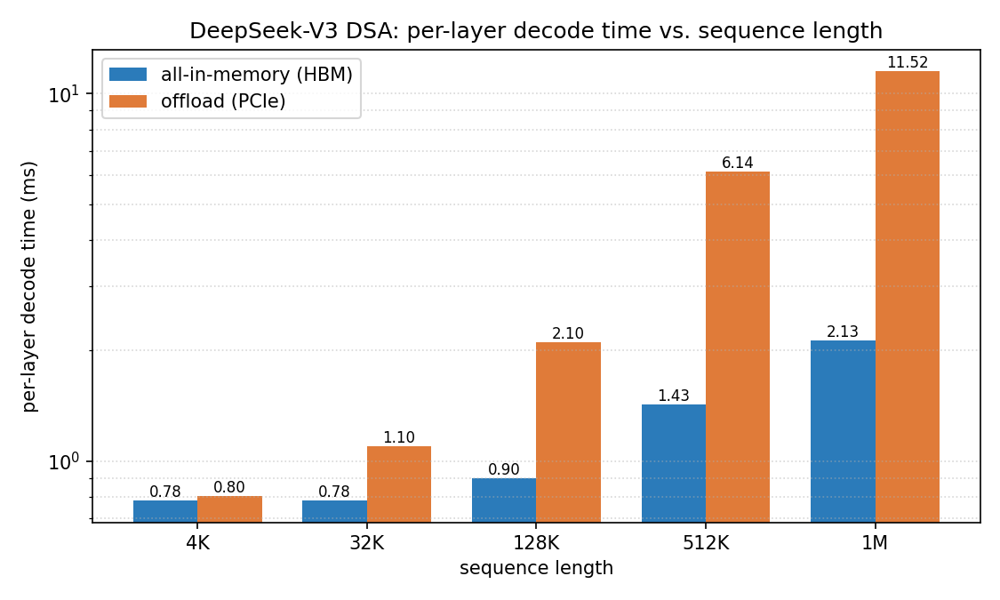
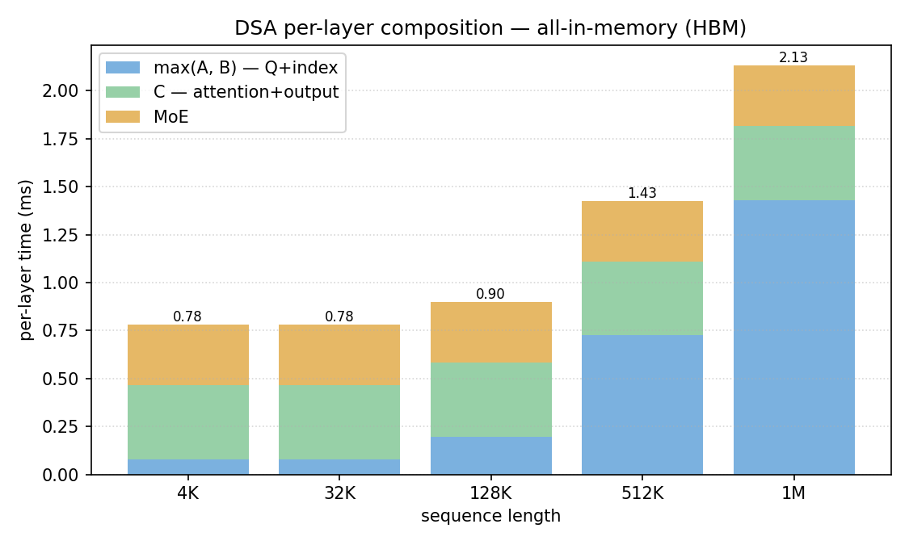
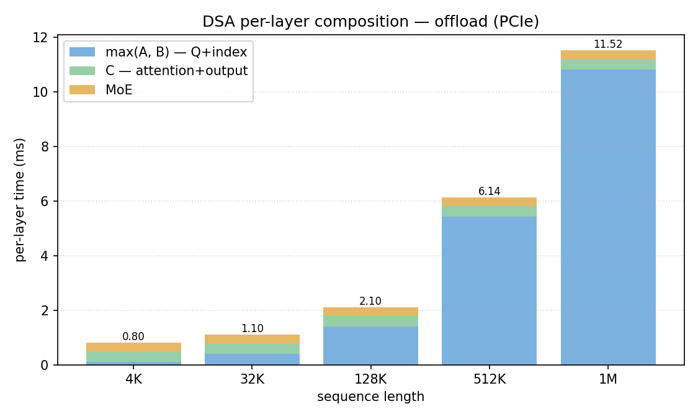
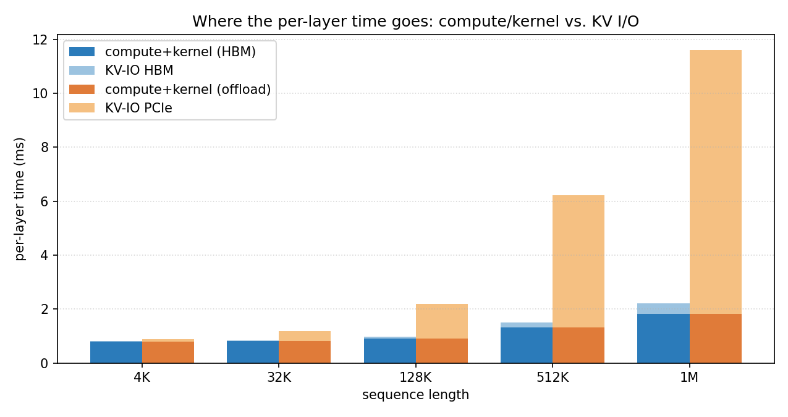
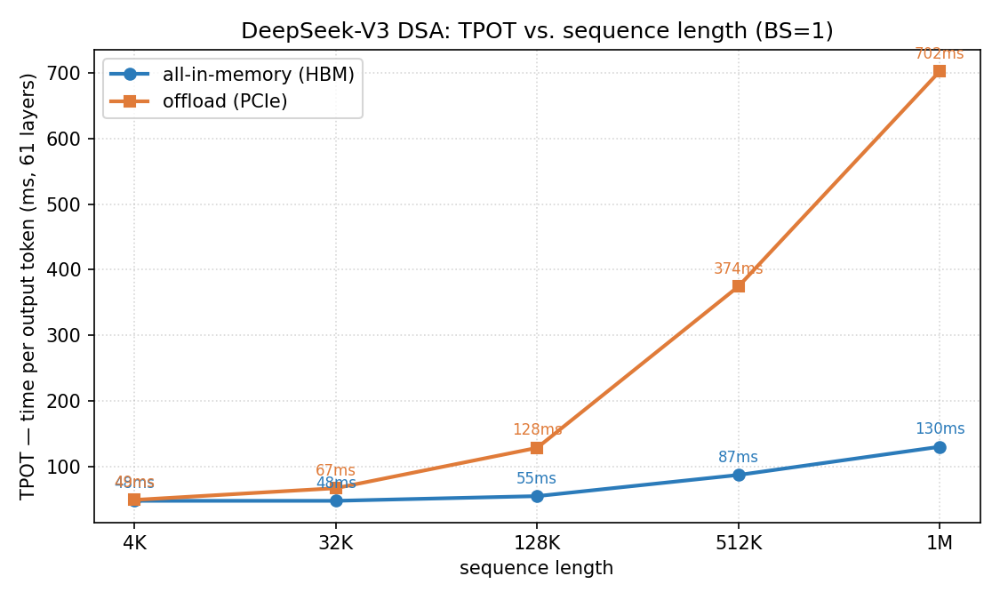
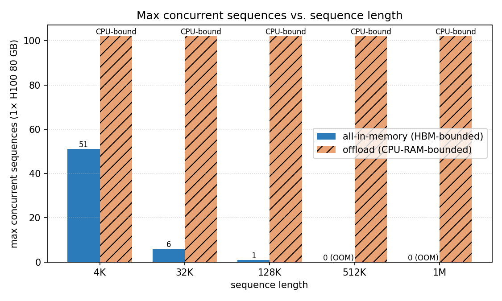

# DeepSeek-V3 DSA Decode Timing on H100 — BS=1 Across 4K…1M Context

> **Goal.** Build a per-layer timing model for DeepSeek-V3 DSA decode on a
> single H100 at batch size 1, over context lengths from 4K to 1M tokens,
> and compare **offloading** (full KV on CPU, fetched per-layer over PCIe)
> against **all-in-memory** (KV resident in HBM).

---

## 1 — Modeling Approach

The model is **hybrid**:

| surface | source |
|---|---|
| per-op **compute** (Q/KV projections, router, shared expert, …) | profiled H100 medians from `data/profiling/compute/h100/deepseek_DeepSeek-V3/{attention,mlp}.csv`, looked up by `num_tokens` (`1` for BS=1 ops, `2560` for `kv_up_proj` on the DSA-attended window) |
| **I/O** (indexer-K read, MLA-KV gather) | purely analytical — HBM peak **1384 GB/s** with a **0.015 ms** floor, PCIe Gen4 x16 at **51.5 GB/s** with a **0.020 ms** floor, NVLink **5 µs/msg** |
| `moe_expert_gemm` | **analytical override**: 84 MB HBM read / 1384 GB/s ≈ **0.059 ms**. The profiled value (2.38 ms) is known-inflated by a per-expert Python loop in the profiler and not representative of a production grouped-GEMM kernel. |
| `attn_core` (Q × K over 2560 attended entries) | analytical — memory-bound on the decompressed KV (160 MB) |

The IO bandwidth/floor constants are calibrated against the profiled `io.csv`
bandwidth sweep: HBM hits 1383.6 GB/s at 512 MB transfers and plateaus in the
0.009–0.015 ms range for ≤ 1 MB; PCIe hits 51.5 GB/s at ≥ 256 MB and ≈ 0.018 ms
for 0.5 MB transfers. A `profiled_or_analytical()` wrapper guards every compute
lookup — missing keys or values exceeding `inflation_guard × analytical` fall
back to the analytical estimate.

### Per-layer pipeline

```
  Block A (Q compute)  ─┐
                        ├─ parallel ─→ Block C (attention on 2560 selected)
  Block B (KV index)   ─┘
                                   then → MoE Block (sequential)
```

- **Block A** — pre-norm, `q_down_proj [1,7168]×[7168,1536]`, `q_up_proj [1,1536]×[1536,24576]`, RoPE.
- **Block B** — indexer-K cache read (FP8, `512 B × seq_len`), indexer matmul (memory-bound, folded into the read), top-k select (2048), gather full MLA KV for 2048 + 512 sliding = 2560 tokens (`1152 B × 2560 ≈ 2.88 MB`).
- **Block C** — `kv_up_proj [2560,512]×[512,32768]` (compute-bound, profiled at `num_tokens=2560`), attention core (160 MB HBM read), `o_proj [1,16384]×[16384,7168]`, residual.
- **MoE** — LN, router gate `[1,7168]×[7168,256]`, softmax, top-8, EP dispatch (8 NVLink msgs), **expert GEMM (analytical, 1 expert × 84 MB / HBM)**, EP combine, shared expert (84 MB / HBM), residual.

---

## 2 — Per-Layer Breakdown Across Sequence Lengths

`ms` per layer, BS=1, H100 SXM. Block C and MoE are constant in `seq_len`
(they operate on fixed-size tensors after DSA selection); only Block B scales.

| seq_len | mode | A (Q) | B (KV index) | max(A,B) | C (attn+out) | MoE | **layer** | **61L TPOT** |
|---:|:--|--:|--:|--:|--:|--:|--:|--:|
| 4K | hbm | 0.0787 | 0.0400 | 0.0787 | 0.3862 | 0.3145 | **0.7794** | **47.5 ms** |
| 4K | offload | 0.0787 | 0.1013 | 0.1013 | 0.3862 | 0.3145 | **0.8020** | **48.9 ms** |
| 32K | hbm | 0.0787 | 0.0678 | 0.0787 | 0.3862 | 0.3145 | **0.7794** | **47.5 ms** |
| 32K | offload | 0.0787 | 0.3945 | 0.3945 | 0.3862 | 0.3145 | **1.0952** | **66.8 ms** |
| 128K | hbm | 0.0787 | 0.1962 | 0.1962 | 0.3862 | 0.3145 | **0.8969** | **54.7 ms** |
| 128K | offload | 0.0787 | 1.4030 | 1.4030 | 0.3862 | 0.3145 | **2.1037** | **128.3 ms** |
| 512K | hbm | 0.0787 | 0.7249 | 0.7249 | 0.3862 | 0.3145 | **1.4256** | **87.0 ms** |
| 512K | offload | 0.0787 | 5.4370 | 5.4370 | 0.3862 | 0.3145 | **6.1377** | **374.4 ms** |
| 1M | hbm | 0.0787 | 1.4298 | 1.4298 | 0.3862 | 0.3145 | **2.1305** | **130.0 ms** |
| 1M | offload | 0.0787 | 10.8156 | 10.8156 | 0.3862 | 0.3145 | **11.5163** | **702.5 ms** |

**Block B scaling behavior** (`indexer_read` dominates, topk is linear):

| seq_len | indexer MB | HBM read | PCIe read | top-k |
|---:|---:|---:|---:|---:|
| 4K | 2 MB | 0.015 ms (floor) | 0.038 ms | 0.005 ms |
| 128K | 64 MB | 0.045 ms | 1.214 ms | 0.131 ms |
| 1M | 512 MB | 0.361 ms | 9.709 ms | 1.049 ms |

Full detailed breakdowns (every operation, every source tag `P`/`A`/`K`) are
emitted by `python -m experiments.run_deepseek_dsa_analytical` without
`--summary-only`.

---

## 3 — Mode Comparison






The composition plots show the same qualitative story from two angles:

- Under **128 K context**, DSA is **compute/kernel-bound** on both modes — Block C (attn+output) and MoE dominate, giving a ~0.78 ms floor.
- **Above 128 K context**, the indexer-K read (linear in `seq_len`) takes over. HBM finishes it in ≤ 1.5 ms even at 1 M tokens; PCIe needs ≈ 10 ms for the same read.



---

## 4 — TPOT Comparison (61 layers)



| seq_len | TPOT HBM | TPOT offload | Δ | slowdown |
|---:|---:|---:|---:|---:|
| 4K | 47.5 ms | 48.9 ms | +1.4 ms | **1.03×** |
| 32K | 47.5 ms | 66.8 ms | +19.3 ms | **1.41×** |
| 128K | 54.7 ms | 128.3 ms | +73.6 ms | **2.35×** |
| 512K | 87.0 ms | 374.4 ms | +287.4 ms | **4.31×** |
| 1M | 130.0 ms | 702.5 ms | +572.5 ms | **5.41×** |

**Takeaways.**
- At short context (≤ 32 K) offloading is essentially free — the per-layer PCIe cost is dominated by the ~0.02 ms floor.
- DSA's `O(seq_len)` work is the indexer-K scoring pass. That read is 9× faster on HBM than PCIe (1384 / 51.5 GB/s), and the whole difference between modes is that 9× multiplier on the indexer-K bytes.
- The attended-window gather (2560 tokens × 1152 B = 2.88 MB) is constant in seq_len and doesn't move the needle in either mode.

---

## 5 — Max Concurrent Sequences (1× H100 80 GB)

Budget: **20 GB** free HBM after ~60 GB for the per-GPU MoE weight subset (32 resident experts × 84 MB + MLA/dense weights + router/activation scratch).

| seq_len | mode | MLA KV / seq | indexer K / seq | HBM / seq | **max seqs** |
|---:|:--|---:|---:|---:|---:|
| 4K | hbm | 274 MB | 122 MB | 397 MB | **51** |
| 4K | offload | 274 MB | 122 MB | 0 MB | CPU-bound |
| 32K | hbm | 2196 MB | 976 MB | 3172 MB | **6** |
| 32K | offload | 2196 MB | 976 MB | 0 MB | CPU-bound |
| 128K | hbm | 8784 MB | 3904 MB | 12688 MB | **1** |
| 128K | offload | 8784 MB | 3904 MB | 0 MB | CPU-bound |
| 512K | hbm | 35 GB | 15 GB | **50 GB** | **0 (OOM)** |
| 512K | offload | 35 GB | 15 GB | 0 MB | CPU-bound |
| 1M | hbm | 69 GB | 31 GB | **99 GB** | **0 (OOM)** |
| 1M | offload | 69 GB | 31 GB | 0 MB | CPU-bound |



**Interpretation.** On a single H100 the **break-even for all-in-memory sits between 128 K and 512 K** — beyond that, KV simply doesn't fit. Offloading serves any context length; its ceiling is CPU RAM (e.g. a 512 GB host trivially holds a 99 GB single-sequence KV at 1 M tokens). The trade-off is visible in §4: offloading is 2.3–5.4× slower per token at long context because of the indexer-K PCIe read.

---

## 6 — Discussion

**Why is DSA tolerant of offloading compared to vanilla MLA?** DSA gathers
only 2560 tokens for the full attention, so the *compute* side (kv_up_proj,
attn core, o_proj) is fixed-cost and unaffected by context length. The only
growing term is the **indexer-K scoring read**, and that's exactly 1 byte (FP8)
per lora dimension × `seq_len` — the smallest possible prefix scan you could
hope to do. At 1 M tokens it's 512 MB of indexer K. On PCIe that costs
~9.7 ms/layer; over 61 layers → 593 ms, which is the bulk of the 572 ms
absolute gap in TPOT at 1 M.

**Why does HBM mode flatline below 128 K?** Block B's indexer read hits the
0.015 ms HBM latency floor until the payload exceeds ~20 MB (i.e. seq_len ≈ 40 K).
Block A and Block C are decoupled (parallelized as `max(A, B)`), so until B
grows past A's 0.079 ms the whole attention path is bounded by Block C + MoE.

**MoE expert GEMM.** The profiled value is **2.38 ms** — the analytical
bandwidth limit for a single prefetched 84 MB expert is **0.059 ms**. We
deliberately override the profile here because the measurement is known to be
inflated by the profiler's Python per-expert loop, not by the actual kernel
cost. A production grouped-GEMM kernel coalesces all local active experts into
one launch; the 0.059 ms number reflects that. Leaving the profiled 2.38 ms in
would make the MoE block dominate TPOT (≈ 3 s / token at 1 M) and hide the
actual IO story.

**What the model does not capture (intentionally).**
- Kernel fusion across the attention path (we sum block components).
- Contention between simultaneous streams feeding Blocks A and B.
- ECC retry, thermal throttling, PCIe variance.
- Variance at tiny kernel sizes (~5 µs launch overhead is treated as a floor).

---

## 7 — Reproduction

```bash
# Full detailed breakdown (every op, every seq_len, both modes)
python -m experiments.run_deepseek_dsa_analytical

# Just the summary/TPOT/max-batch tables
python -m experiments.run_deepseek_dsa_analytical --summary-only \
    --json-out reports/figures/dsa_timing.json

# Regenerate plots
python -m experiments.plot_dsa_timing
```

Source layout:

- `experiments/dsa_timing_model.py` — profile loader, IO analytics, model constants.
- `experiments/dsa_layer_analyzer.py` — per-layer breakdown + max-batch calc.
- `experiments/run_deepseek_dsa_analytical.py` — text-mode runner.
- `experiments/plot_dsa_timing.py` — figure generation.
- `reports/figures/` — output PNGs and JSON dump.
