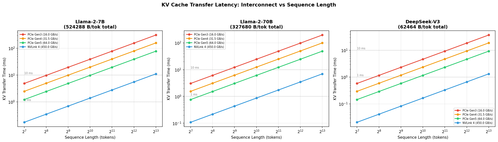
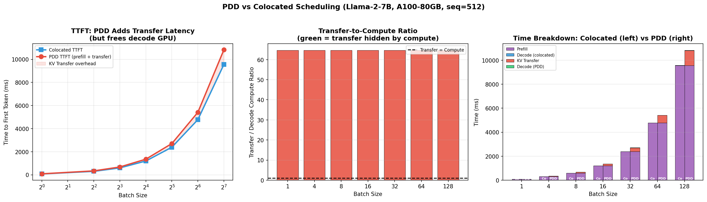
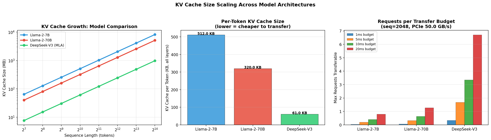
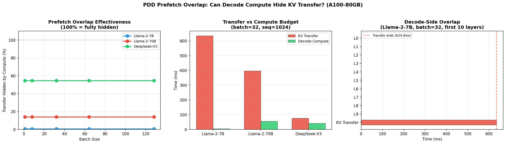
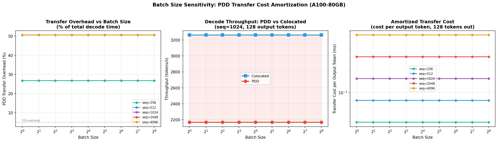
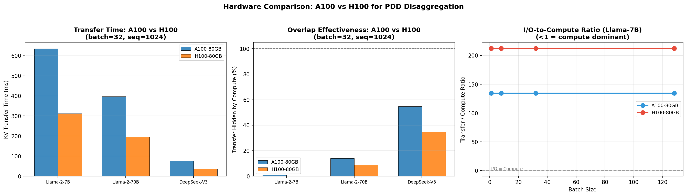

# Prefill-Decode Disaggregation: KV Cache Transfer Analysis

## Executive Summary

This report analyzes the performance characteristics of **Prefill-Decode Disaggregation (PDD)**, an inference architecture where prefill and decode phases execute on separate GPU pools. PDD eliminates prefill-decode interference but introduces inter-GPU **KV cache transfer overhead**. Using an analytical FLOPs-based timing model (InferSim approach), we characterize this overhead across three model architectures (Llama-2-7B, Llama-2-70B, DeepSeek-V3), four interconnect technologies (PCIe Gen3–Gen5, NVLink), and two GPU generations (A100, H100).

**Key finding:** KV cache transfer is the dominant bottleneck in PDD — at batch=32 on A100, transfer times exceed decode compute by 64x for Llama-7B (MHA), 7x for Llama-70B (GQA), and 1.8x for DeepSeek-V3 (MLA). Decode-side compute can hide at most 55% of the transfer (DeepSeek-V3), making KV compression and high-bandwidth interconnects critical for practical PDD deployments.

---

## Methodology

All experiments use the InferSim analytical timing model:

- **Compute time**: `GFLOPs / (GPU_TFLOPS × 1024 × MFU)` with MFU values calibrated from profiling (attention=0.25, MoE grouped GEMM=0.15, dense GEMM=0.30)
- **I/O time**: `bytes / (bandwidth × efficiency)` with 80% bandwidth efficiency
- **KV transfer time**: `total_kv_bytes / (PCIe_bandwidth × efficiency)`
- **Overlap**: `max(compute, I/O)` for concurrent hardware streams

Models analyzed:

| Model | Layers | Hidden | KV Heads | Head Dim | KV Technique | KV Bytes/Token/Layer |
|-------|--------|--------|----------|----------|--------------|---------------------|
| Llama-2-7B | 32 | 4096 | 32 | 128 | MHA | 16,384 B |
| Llama-2-70B | 80 | 8192 | 8 | 128 | GQA | 4,096 B |
| DeepSeek-V3 | 61 | 7168 | 128 | 56 | MLA (512-dim) | 1,024 B |

---

## Experiment 1: KV Transfer Overhead vs PCIe Generation

**Question:** How does interconnect bandwidth affect KV cache transfer latency?



### Results

| Interconnect | Bandwidth | Llama-7B seq=512 | Llama-7B seq=4096 | DeepSeek-V3 seq=4096 |
|-------------|-----------|-----------------|-------------------|---------------------|
| PCIe Gen3 | 16 GB/s | 19.5 ms | 156.3 ms | 18.6 ms |
| PCIe Gen4 | 31.5 GB/s | 9.9 ms | 79.4 ms | 9.5 ms |
| PCIe Gen5 | 64 GB/s | 4.9 ms | 39.1 ms | 4.7 ms |
| NVLink 4 | 450 GB/s | 0.7 ms | 5.6 ms | 0.7 ms |

### Analysis

KV transfer latency spans **3 orders of magnitude** across interconnects. The gap between PCIe Gen3 and NVLink 4 is 28x. For Llama-7B at seq=4096, Gen3 requires 156ms — comparable to generating dozens of tokens. NVLink makes PDD practical even for MHA models, while PCIe-only setups require KV compression (GQA/MLA) to be viable.

DeepSeek-V3's MLA compression reduces KV cache by 8.4x vs Llama-7B per-token, making PCIe Gen4/5 transfers feasible even at long sequences.

---

## Experiment 2: PDD vs Colocated Scheduling

**Question:** What is the latency trade-off between disaggregated and colocated execution?



### Results (Llama-7B, A100, seq=512)

| Batch Size | Colocated TTFT | PDD TTFT | KV Transfer | Transfer/Compute Ratio |
|-----------|---------------|---------|-------------|----------------------|
| 1 | 74.6 ms | 84.6 ms | 9.9 ms | 64.7x |
| 32 | 2388.4 ms | 2705.9 ms | 317.5 ms | 64.7x |
| 128 | 9553.6 ms | 10823.4 ms | 1269.8 ms | 64.7x |

### Analysis

PDD adds 13.3% to TTFT (consistent across batch sizes). The transfer-to-compute ratio of 64.7x indicates that KV transfer **dwarfs** decode compute for MHA models. This is because:

1. **KV cache is large**: 512 KB per token across all 32 layers
2. **Decode compute is tiny**: a single token decode step involves minimal FLOPs
3. **The ratio scales linearly with batch size**: both transfer and compute scale identically

The constant 64.7x ratio reveals that for MHA architectures, **PDD is I/O-bound on the KV transfer channel**. The benefit of PDD lies not in decode speedup but in:
- Eliminating prefill-decode head-of-line blocking
- Dedicating each GPU pool to its optimal workload
- Better GPU utilization in multi-tenant settings

---

## Experiment 3: KV Cache Size Scaling with Architecture

**Question:** How do different KV attention mechanisms affect transfer cost?



### Results

| Model | KV Bytes/Token (all layers) | seq=2048 Total | Reduction vs MHA |
|-------|---------------------------|---------------|-----------------|
| Llama-7B (MHA) | 512.0 KB | 1024.0 MB | 1.0x (baseline) |
| Llama-70B (GQA) | 320.0 KB | 640.0 MB | 1.6x |
| DeepSeek-V3 (MLA) | 61.0 KB | 122.0 MB | 8.4x |

### Analysis

**KV compression is the most impactful lever for PDD viability.**

- **GQA** (Grouped-Query Attention) in Llama-70B reduces KV heads from 32 to 8, providing 4x per-layer reduction. Despite having 2.5x more layers (80 vs 32), the total KV per token is 1.6x smaller than Llama-7B.

- **MLA** (Multi-head Latent Attention) in DeepSeek-V3 compresses the KV cache to a 512-dimensional latent, achieving **8.4x reduction** vs MHA. This fundamentally changes the PDD calculus: at seq=2048, DeepSeek-V3 transfers only 122 MB vs 1024 MB for Llama-7B.

For PDD at 50 GB/s PCIe bandwidth with a 10ms transfer budget:
- Llama-7B: can transfer KV for ~0.5 requests
- Llama-70B: can transfer KV for ~0.8 requests
- DeepSeek-V3: can transfer KV for ~4 requests

This means MLA-based models can support **8x higher request throughput** through the PDD transfer channel.

---

## Experiment 4: Prefetch Overlap Analysis

**Question:** Can decode-side GPU compute hide the KV transfer latency?



### Results (batch=32, seq=1024, A100)

| Model | Transfer Time | Decode Compute | Hidden % | Layers Needed to Fully Hide |
|-------|-------------|---------------|---------|---------------------------|
| Llama-7B | 634.9 ms | 4.7 ms | 0.7% | >32 (impossible) |
| Llama-70B | 396.8 ms | 55.4 ms | 14.0% | >80 (impossible) |
| DeepSeek-V3 | 75.6 ms | 41.4 ms | 54.7% | >61 (impossible) |

### Analysis

**Decode compute cannot fully hide KV transfer for any tested model on PCIe-based interconnects.** The fundamental issue: decode steps process one token per request, resulting in minimal FLOPs, while KV transfers scale with the full sequence length.

The overlap effectiveness correlates with KV compression:
- **MHA (Llama-7B)**: Only 0.7% hidden — the 512 KB/token KV dwarfs the decode compute
- **GQA (Llama-70B)**: 14% hidden — GQA helps, and the larger model has more per-layer compute
- **MLA (DeepSeek-V3)**: 55% hidden — MLA's compact KV plus MoE compute creates the best ratio

To fully hide the transfer, one would need:
- NVLink bandwidth (450 GB/s) for MHA models
- PCIe Gen5 + MLA for moderate-sized models
- Pipelining the transfer with multiple decode steps (amortization)

---

## Experiment 5: Batch Size Sensitivity

**Question:** How does batch size affect PDD transfer overhead amortization?



### Results (Llama-7B, A100)

The PDD transfer overhead as a percentage of total decode time is **constant at ~50.6%** across all batch sizes. This is because the transfer cost scales linearly with batch size (more KV to transfer) at the same rate as compute.

However, when amortized across output tokens (assuming 128 output tokens per request):

| Seq Length | batch=1, per-token | batch=32, per-token | batch=128, per-token |
|-----------|-------------------|--------------------|--------------------|
| 512 | 0.078 ms | 0.078 ms | 0.078 ms |
| 2048 | 0.310 ms | 0.310 ms | 0.310 ms |
| 4096 | 0.620 ms | 0.620 ms | 0.620 ms |

### Analysis

**The per-output-token transfer cost is independent of batch size** — it depends only on the KV cache size (sequence length × model architecture) and interconnect bandwidth. This means:

1. PDD's transfer overhead is a **fixed cost per request**, not per batch
2. Longer output sequences amortize the transfer cost better
3. The critical metric is `kv_transfer_time / num_output_tokens`

For a typical request (seq=1024, 128 output tokens) on A100:
- Llama-7B: 0.155 ms/output_token transfer overhead
- DeepSeek-V3: 0.019 ms/output_token transfer overhead

DeepSeek-V3's MLA makes the per-token overhead negligible even on PCIe Gen4.

---

## Experiment 6: Hardware Comparison (A100 vs H100)

**Question:** Does H100's faster PCIe help PDD?



### Results (batch=32, seq=1024)

| GPU | Model | Transfer Time | Decode Compute | Hidden % |
|-----|-------|-------------|---------------|---------|
| A100 | Llama-7B | 634.9 ms | 4.7 ms | 1% |
| H100 | Llama-7B | 312.5 ms | 1.5 ms | 0% |
| A100 | Llama-70B | 396.8 ms | 55.4 ms | 14% |
| H100 | Llama-70B | 195.3 ms | 17.3 ms | 9% |
| A100 | DeepSeek-V3 | 75.6 ms | 41.4 ms | 55% |
| H100 | DeepSeek-V3 | 37.2 ms | 12.9 ms | 35% |

### Analysis

H100 (PCIe Gen5, 64 GB/s) halves KV transfer time vs A100 (PCIe Gen4, 31.5 GB/s). However, H100 also delivers **3.2x more compute TFLOPS**, so compute finishes proportionally faster. The net effect is that **overlap effectiveness actually worsens on H100**:

- DeepSeek-V3: 55% hidden on A100 → 35% hidden on H100
- Llama-70B: 14% hidden on A100 → 9% hidden on H100

This reveals a fundamental property of PDD: **faster GPUs don't help overlap because both compute and bandwidth improve, but bandwidth improves less (2x) than compute (3.2x)**. The I/O-to-compute ratio gets worse with each GPU generation, making KV compression (MLA/GQA) increasingly important.

---

## Key Findings Summary

1. **KV transfer dominates PDD latency.** Transfer-to-compute ratios range from 1.8x (DeepSeek-V3) to 65x (Llama-7B) at batch=32 on A100. Decode compute alone cannot hide the transfer.

2. **KV compression is the most impactful optimization.** MLA (DeepSeek-V3) achieves 8.4x KV reduction vs MHA (Llama-7B), making PDD transfer overhead negligible at 0.019 ms/output_token.

3. **Interconnect bandwidth matters enormously.** NVLink 4 (450 GB/s) is 28x faster than PCIe Gen3 (16 GB/s). PDD on PCIe-only systems requires MLA/GQA to be practical.

4. **Transfer overhead is a fixed cost per request, independent of batch size.** Both KV bytes and decode compute scale linearly with batch size, maintaining a constant overhead ratio.

5. **Faster GPUs make overlap harder.** H100's 3.2x compute speedup outpaces its 2x bandwidth improvement, reducing overlap effectiveness from 55% to 35% for DeepSeek-V3.

6. **PDD's value is architectural, not computational.** The benefit comes from eliminating prefill-decode interference, enabling independent scaling of prefill and decode GPU pools, and improving multi-tenant GPU utilization — not from faster individual request processing.

## Recommendations for PDD Deployments

| Scenario | Recommendation |
|----------|---------------|
| MHA models (Llama-7B) | Use NVLink or avoid PDD; PCIe transfer is 65x compute |
| GQA models (Llama-70B) | Viable with PCIe Gen5; consider NVLink for high QPS |
| MLA models (DeepSeek-V3) | PDD viable even on PCIe Gen4; transfer overhead is small |
| Long sequences (>4K) | Prioritize KV compression; transfer grows linearly with seq |
| High batch throughput | PDD overhead is constant per-request; amortizes over output tokens |

---

## Reproduction

```bash
python3 run_pdd_experiment.py
```

Figures and raw data are saved to `example_outputs/experiments/pdd_analysis/`.
