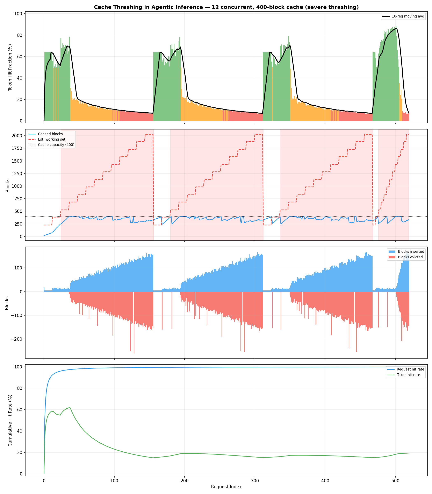
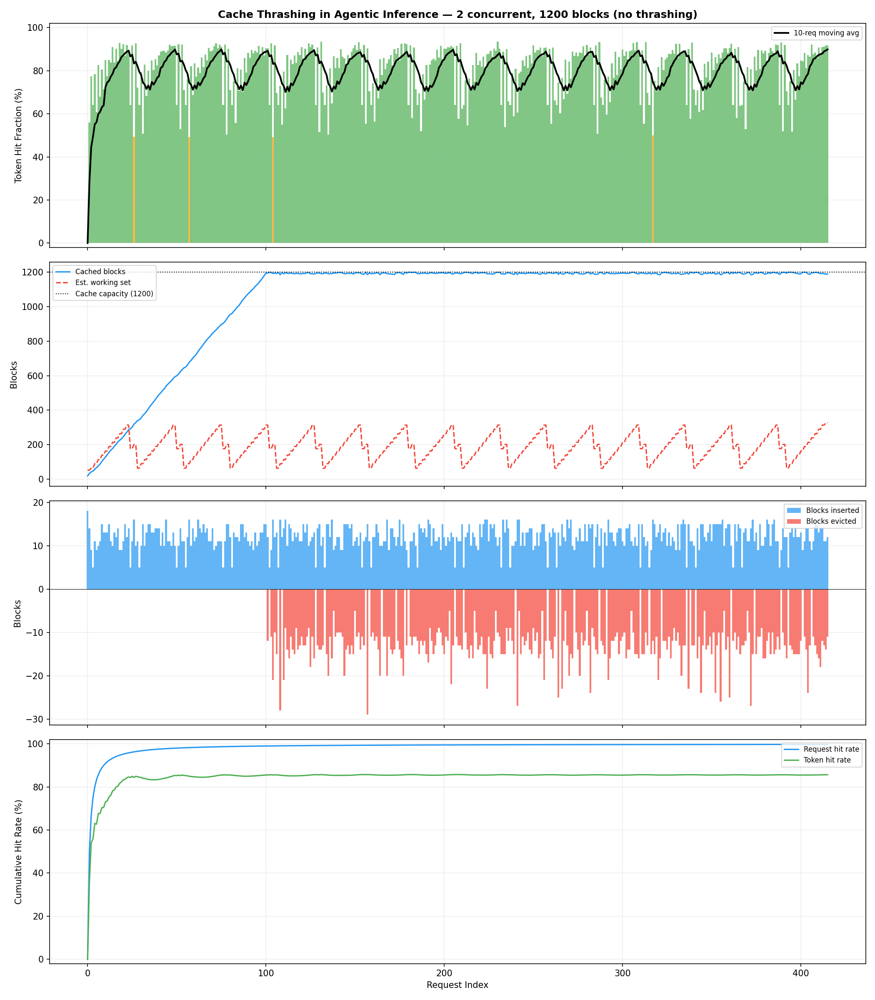
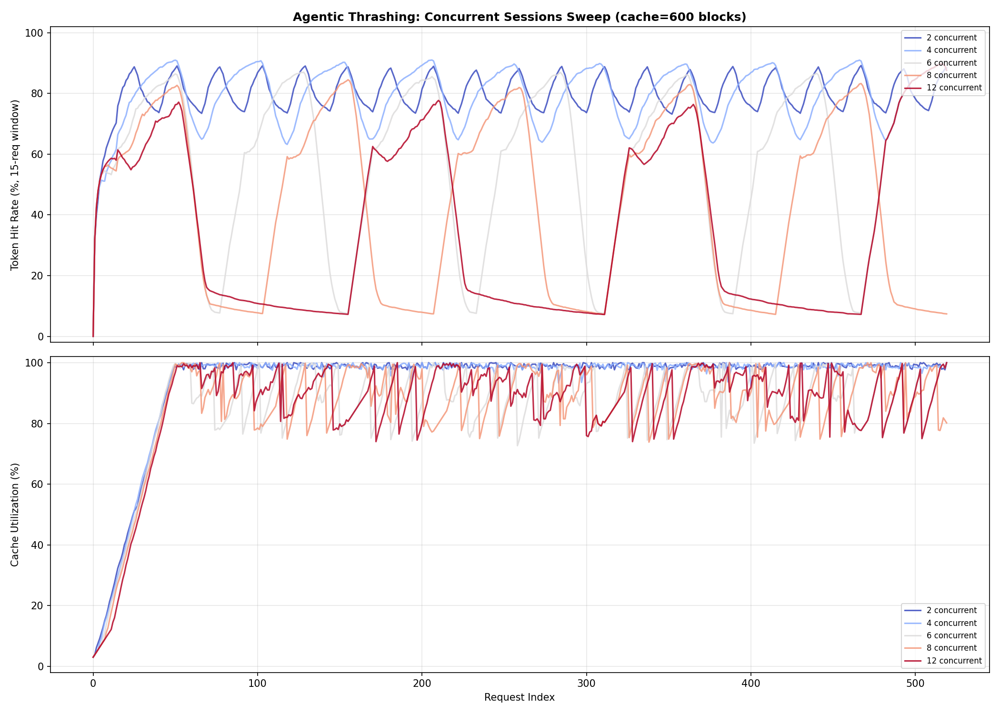
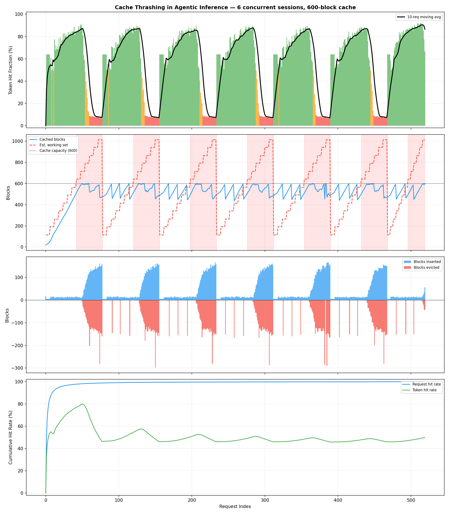
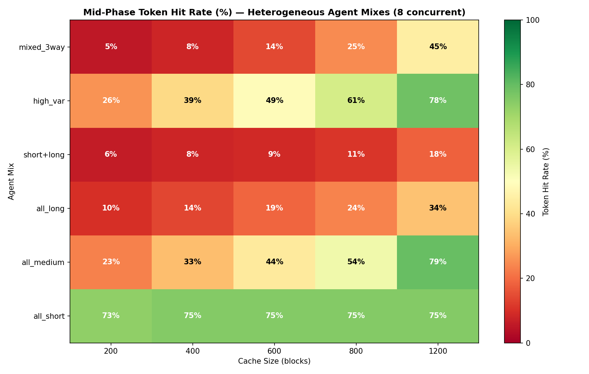
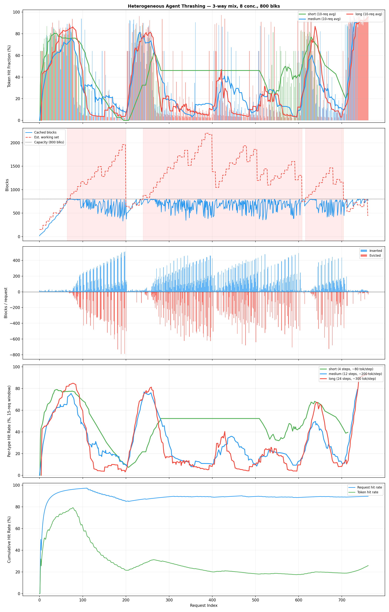

# KV Cache Thrashing in Agentic Inference — Experiment Report

**Date:** 2026-03-25
**Experiment:** `experiments/experiment_thrashing.py`
**Component:** `vidur.entities.prefix_cache_manager`

---

## 1. Motivation

In agentic inference (tool-use loops, chain-of-thought, multi-step planning), each agent step appends tokens to a growing context window:

```
Step 0: [system_prompt | user_task]                                          →  300 tokens
Step 1: [system_prompt | user_task | thought₁ | tool_call₁ | result₁]       →  500 tokens
Step 2: [... | thought₂ | tool_call₂ | result₂]                             →  700 tokens
  ⋮
Step 12: [...]                                                               → 2700 tokens
```

Each step shares the full prefix of all prior steps. With **N concurrent agent sessions**, the aggregate working set grows until it exceeds cache capacity. At that point, inserting new blocks for session A evicts blocks belonging to session B — but session B needs exactly those blocks on its very next step. This creates a destructive cycle of **evict → insert → evict** that we call **mid-phase thrashing**.

The key insight is that **cache utilization stays high (~85-98%) while hit rate drops sharply** — the cache is full, but full of the wrong data. Standard utilization metrics mask the problem entirely.

---

## 2. Experiment Setup

### Agent Session Model

| Parameter | Value | Rationale |
|-----------|-------|-----------|
| System prompt | 200 tokens | Shared across all sessions |
| Task description | 100 tokens | Unique per session |
| Tokens per step | ~200 (thought: 60, tool call: 30, tool result: ~110) | Models typical tool-use output |
| Steps per session | 12 | Realistic agentic loop |
| Max context at completion | 2700 tokens = 169 blocks | Upper bound per session |
| Total sessions | 60 | Enough to observe all three phases |
| Block size | 16 tokens | |

### Three-Phase Lifecycle Model

The simulation models a realistic production traffic pattern with three distinct phases:

**Phase 1 — Ramp-Up:** Sessions arrive one at a time (one every 2 ticks) until the pool reaches N concurrent sessions. Each session starts at step 0 (cold start). The cache warms up gradually — hit rate rises as each new session benefits from the shared system prompt already cached by earlier sessions. Cache pressure builds steadily.

**Phase 2 — Sustained Load:** The pool stays full at N concurrent sessions. When a session completes, it is immediately replaced by a new session at step 0. This is controlled by a `sustained_replacements` budget (default: 30). If the working set exceeds cache capacity, this phase is sustained thrashing — the system never recovers because new sessions keep entering and maintaining pressure. Sessions at different lifecycle stages create a mixed working set that persists for the entire phase.

**Phase 3 — Drain:** No more replacement sessions arrive. Active sessions complete one by one. Cache pressure drops as the working set shrinks. Evictions slow, and hit rate may recover as the remaining sessions fit within cache capacity. The cache "cools down" as the pool empties.

This three-phase model is more realistic than either batch-synchronized arrivals (which produce repeating sawtooth patterns) or purely staggered arrivals (which skip warmup). In production, services ramp up, run under sustained load, and eventually drain during scale-down or deployment.

### Sweep Parameters

- **Concurrent sessions:** 2, 4, 6, 8, 12
- **Cache sizes:** 200, 400, 600, 800, 1200 blocks

The critical ratio is **working set / cache capacity**. A single session at max length requires 169 blocks, so 8 concurrent sessions need ~1352 blocks. When the cache holds fewer blocks than the working set demands, thrashing begins — and with sustained replacement of completed sessions, it persists for the entire sustained-load phase.

---

## 3. Results

### 3.1 Sustained Thrashing (Phase 2)

During the sustained-load phase, overcommitted configurations thrash continuously with no recovery. The 12-concurrent / 400-block case (5.1x overcommit) shows the pattern clearly:



| Config | Phase | Token Hit Rate | Cache Util | Evictions/req |
|--------|-------|:---:|:---:|:---:|
| 12 conc, 400 blk | Sustained thrashing | **~18%** | **~83%** | ~84 |
| 8 conc, 400 blk | Sustained thrashing | **~19%** | **~85%** | ~82 |
| 6 conc, 400 blk | Sustained thrashing | **~26%** | **~87%** | ~75 |
| 12 conc, 800 blk | Sustained thrashing | **~24%** | **~93%** | ~76 |

In every case: high utilization, high eviction rate, low hit rate. The warmup phase is visible at the start (hit rate initially higher as sessions are still loading), followed by sustained thrashing that persists until the drain phase.

### 3.2 No Thrashing (Working Set Fits)

When the working set fits in the cache, the three-phase pattern shows healthy behavior throughout:



| Config | Token Hit Rate | Cache Util | Evictions/req |
|--------|:---:|:---:|:---:|
| 2 conc, 400 blk | ~80% | ~96% | ~11 |
| 2 conc, 800 blk | ~80% | ~94% | ~11 |
| 4 conc, 800 blk | ~80% | ~95% | ~11 |

Hit rate is stable at ~80% across all three phases, evictions are low and steady (just LRU turnover of completed sessions), and there are no phase transitions in cache behavior.

### 3.3 Thrashing Boundary Heatmap


The heatmap maps mid-phase token hit rate across all (concurrent sessions x cache size) configurations. The boundary is sharp and binary: configurations where the working set fits achieve ~80% hit rate, those that don't drop to 17-25%.

| Concurrent Sessions | Working Set (blocks) | Min Cache to Avoid Thrashing |
|:---:|:---:|:---:|
| 2 | 338 | ~400 |
| 4 | 676 | ~800 |
| 6 | 1014 | ~1200 |
| 8 | 1352 | ~1400+ |
| 12 | 2028 | ~2100+ |

### 3.4 Concurrent Sessions Sweep (Fixed Cache = 600 Blocks)



At a fixed 600-block cache:
- **2-4 concurrent:** Stable 80%+ hit rate — working set fits comfortably
- **8 concurrent:** Sustained thrashing at ~20-30%, with brief spikes when sessions complete during the drain phase
- **12 concurrent:** Pinned at ~15-20% for the entire sustained-load phase — unrecoverable thrashing until drain

The bottom panel shows **near-100% cache utilization across all configurations** — confirming that utilization is completely uninformative about whether the cache is actually helping.

### 3.5 The Detailed View

The 6-concurrent / 600-block case (1.7x overcommit) shows the borderline behavior with all three phases visible:



- **Warmup (early requests):** Sessions arrive one by one. Cache fills gradually. Hit rate starts high as early sessions benefit from the shared system prompt.
- **Sustained load (middle):** Pool is full with sessions at different lifecycle stages. Working set exceeds capacity. Hit rate drops and stays low as sessions continuously evict each other's blocks.
- **Drain (late requests):** No replacements. As sessions complete and leave, the working set shrinks below capacity. Evictions slow and hit rate may recover for the final sessions.

---

## 4. Key Findings

### Finding 1: Cache utilization masks thrashing

During severe thrashing (12 concurrent, 400 blocks), cache utilization is **~83%** while token hit rate is **~18%**. A monitoring system that only tracks utilization would report the cache as healthy. The diagnostic triad is: **high utilization + high eviction rate + low hit rate = thrashing**.

### Finding 2: The thrashing boundary is a cliff, not a slope

There is no graceful degradation. Hit rate is either ~80% (working set fits) or ~20% (it doesn't). The transition is nearly binary — a 30% increase in concurrent sessions can cause a 60-point drop in hit rate. This is because LRU eviction under round-robin access is adversarial: the least-recently-used entry is always the one that will be needed next.

### Finding 3: The three-phase lifecycle makes thrashing visible

The warmup-sustained-drain lifecycle creates a clear narrative:
- **Warmup** establishes the baseline — high hit rates as sessions load and the cache fills.
- **Sustained load** reveals the steady-state behavior — if the working set exceeds capacity, thrashing persists indefinitely because completed sessions are immediately replaced.
- **Drain** shows recovery potential — as sessions leave without replacement, the working set shrinks and hit rate can recover.

This is more realistic than purely staggered arrivals (which skip warmup) or synchronized batches (which produce artificial sawtooth recovery patterns).

### Finding 4: Agentic workloads are uniquely vulnerable

Unlike multi-turn chat (short contexts, few concurrent users sharing a conversation), agentic workloads have:
- **Long, growing contexts** (2000+ tokens after 10 steps)
- **High temporal correlation** (each step depends on the previous — no reordering possible)
- **Multiple concurrent sessions** competing for the same cache
- **No natural sharing** between sessions (each task is unique)

This combination creates the worst case for LRU caching: every entry is needed exactly once more, but evicted just before that access.

---

## 5. Implications for System Design

| Strategy | Effect | Tradeoff |
|----------|--------|----------|
| **Increase cache size** | Directly raises thrashing boundary | Memory cost scales linearly with concurrent sessions |
| **Limit concurrent sessions** | Keeps working set within cache | Reduces throughput; may increase queuing latency |
| **Session-aware eviction** | Protect active sessions' blocks from eviction | More complex eviction policy; may starve new sessions |
| **Prefix deduplication** | Share system prompt blocks across sessions | Only helps if sessions share a common prefix (~200/2700 = 7% here) |
| **Context compression** | Reduce per-step token growth | Lossy; may degrade agent accuracy |
| **Priority scheduling** | Complete one session before starting the next | Eliminates inter-session thrashing but serializes execution |

The most actionable finding: for agentic workloads, **cache capacity should be provisioned as `N x max_context_length / block_size`** where N is the target concurrent session count. Under-provisioning by even 30% triggers sharp, sustained performance degradation with no self-recovery.

---

## 6. Heterogeneous Agent Types

Real deployments don't run identical agents. A production inference server might simultaneously host quick lookup agents (3-4 tool calls), standard reasoning agents (10-12 steps), and deep-research agents (20+ steps with large tool outputs). When these agent types share the same KV cache, their working sets differ in size, growth rate, and lifetime — changing the thrashing dynamics in ways that homogeneous experiments cannot capture.

### 6.1 Agent Archetypes

We define four canonical agent types that model the spectrum of production agentic workloads:

| Archetype | Steps | Tokens/step (mean) | CV | Max context | Max blocks |
|-----------|:-----:|:---:|:---:|:---:|:---:|
| **short** — quick lookup (API call, RAG retrieval) | 4 | 80 | 0.2 | 620 | 39 |
| **medium** — standard reasoning (code gen, analysis) | 12 | 200 | 0.3 | 2700 | 169 |
| **long** — deep research (multi-tool chains, iterative code) | 24 | 300 | 0.35 | 7500 | 469 |
| **high_var** — unpredictable outputs (web search, code exec) | 10 | 200 | 0.9 | 2300 | 144 |

The coefficient of variation (CV) controls per-step token variance — a `high_var` agent's tool result might return 50 tokens (short API response) or 500 tokens (full web page), modelling the bursty insertion patterns of real tool use.

Each agent type has its own system prompt (different agent roles), so there is **intra-type prefix sharing but no cross-type sharing**. This is realistic: a coding agent and a search agent have different base contexts.

### 6.2 Simulation Model

The heterogeneous simulation uses a **cold-start pool** model: all `concurrent_sessions` agents begin simultaneously at step 0. As sessions complete, they are replaced from a pool of 120 total sessions (50 replacements during the sustained phase). Agent types are assigned to sessions according to configurable mix fractions.

Six mix configurations are swept across five cache sizes (200, 400, 600, 800, 1200 blocks) with 8 concurrent sessions:

| Mix name | Composition |
|----------|-------------|
| `all_short` | 100% short |
| `all_medium` | 100% medium |
| `all_long` | 100% long |
| `short+long` | 50% short + 50% long |
| `high_var` | 100% high-variance |
| `mixed_3way` | ⅓ short + ⅓ medium + ⅓ long |

### 6.3 Results: Agent Mix × Cache Size Heatmap



The heatmap reveals how dramatically agent composition affects thrashing:

| Mix | 200 blks | 400 blks | 800 blks | 1200 blks |
|-----|:---:|:---:|:---:|:---:|
| all_short | 75% | 75% | 75% | 75% |
| all_medium | 21% | 33% | 56% | 74% |
| all_long | 10% | 14% | 24% | 28% |
| short+long | 9% | 13% | 21% | 26% |
| high_var | 24% | 37% | 62% | 72% |
| mixed_3way | 10% | 15% | 34% | 40% |

**Short agents are cache-friendly.** Their small working set (39 blocks each, 312 total for 8 concurrent) fits comfortably in even 400 blocks. Hit rate is flat at ~75% regardless of cache size.

**Long agents dominate cache pressure.** A single long agent at full context requires 469 blocks — more than the entire 400-block cache. Eight concurrent long agents need ~3752 blocks, creating 4.7x overcommit at 800 blocks and severe thrashing (~24% hit rate).

**Mixing short and long is worse than either alone.** The `short+long` mix achieves only 21% hit rate at 800 blocks — worse than `all_medium` (56%) despite having half the pool as small-footprint agents. Long agents' massive insertions evict short agents' cached prefixes, and short agents' fast turnover provides no stability benefit.

### 6.4 Cross-Type Eviction: The Fairness Problem


The 50% short / 50% long mix at 800 blocks (detailed 5-panel view above) exposes the cross-type eviction problem:

| Agent Type | Hit Rate (standalone) | Hit Rate (in mix) | Δ |
|------------|:---:|:---:|:---:|
| short | 75.2% | 40.4% | **−34.8 pp** |
| long | 23.6% | 16.6% | −7.0 pp |

Short agents suffer a **35 percentage-point hit rate drop** when sharing the cache with long agents. Long agents barely notice. The mechanism:

1. Long agents insert ~216 blocks per request (at later steps), evicting most of the cache each step
2. Short agents' cached prefixes (only 39 blocks) are collateral damage
3. Short agents' small insertions don't meaningfully evict long agents' entries

This is an **asymmetric fairness failure**: the resource-heavy agent type degrades the resource-light type disproportionately.

### 6.5 Three-Way Mix: Everyone Suffers




The mixed_3way configuration (⅓ short / ⅓ medium / ⅓ long) at 800 blocks:

| Agent Type | Standalone Hit Rate | In 3-Way Mix | Blocks Inserted/req |
|------------|:---:|:---:|:---:|
| short (4 steps) | 75.2% | 48.9% | 13.2 |
| medium (12 steps) | 55.6% | 32.6% | 65.2 |
| long (24 steps) | 23.6% | 31.0% | 179.5 |

The per-type breakdown (right panel: stacked bar of cache pressure) shows long agents dominating cache insertions throughout the simulation. The box plot (left panel) shows the hit-rate distribution: short agents have the widest spread (some requests hit well, others miss entirely due to eviction), while long agents cluster at low hit rates.

Notably, long agents actually *improve* slightly in the mix (31.0% vs 23.6% standalone) because short agents' fast turnover means less sustained competition for cache space.

### 6.6 High-Variance Token Sizes


Agents with unpredictable tool result sizes (CV=0.9) show distinctive behaviour at 800 blocks:

- **Overall hit rate: 61.8%** — moderate, comparable to `all_medium`
- **Bursty insertion pattern**: some requests insert 10 blocks (small tool result), others insert 100+ (large result), visible as spikes in the blocks-inserted panel
- **Eviction spikes**: large insertions trigger cascading evictions that temporarily hurt subsequent requests
- **Recovery between bursts**: after a large insertion, if the next few steps are small, the cache stabilises and hit rate recovers

The high variance doesn't cause sustained thrashing (the *mean* working set still fits), but it creates **intermittent thrashing episodes** — brief periods where a burst of large tool results temporarily overcommits the cache.

### 6.7 Step Count and Duration Sweep


The overlay of all six mixes at 800 blocks (windowed hit rate + utilisation) shows:

- **all_short** maintains 75% hit rate throughout with low utilisation (~74%) — the cache is undercommitted
- **all_medium** and **high_var** track together at 55-62%, approaching full utilisation
- **all_long**, **short+long**, and **mixed_3way** cluster at 14-34%, with full cache utilisation — confirming that long agents' working set (469 blocks × 8 concurrent ≈ 3752 blocks) overwhelms any reasonable cache size
- Utilisation converges to ~80-99% for all mixes — again showing that **utilisation alone cannot distinguish healthy caching from thrashing**

---

## 7. Combined Findings

### Finding 5: Agent heterogeneity creates asymmetric cache interference

When short and long agents share a cache, long agents' massive per-step insertions evict short agents' prefixes, causing a 35 percentage-point hit rate degradation for short agents. Long agents are barely affected. This suggests that **cache partitioning or per-type admission control** could significantly improve fairness.

### Finding 6: Mixed pools can be worse than the worst individual type

The `short+long` mix (21% hit at 800 blocks) performs worse than `all_medium` (56%) despite having half the pool as lightweight agents. The fast turnover of short agents doesn't offset the cache pollution from long agents — it makes it worse by increasing churn without reducing pressure.

### Finding 7: Working-set diversity demands per-type capacity planning

The homogeneous rule of thumb (`cache ≥ N × max_blocks_per_session`) is insufficient for heterogeneous pools. A mixed pool's effective cache requirement is dominated by its largest agent type:

| Mix | Naive capacity (avg) | Actual required (for >50% hit) |
|-----|:---:|:---:|
| all_short | 312 blocks | ~200 blocks |
| all_medium | 1352 blocks | ~800 blocks |
| all_long | 3752 blocks | ~3000+ blocks |
| short+long | 2032 blocks | ~3000+ blocks (dominated by long) |
| mixed_3way | 2256 blocks | ~2500+ blocks |

### Finding 8: High-variance step sizes cause intermittent, not sustained, thrashing

Unlike the steady-state thrashing from working-set overcommit, high CV agents create **bursty eviction episodes** — brief periods of cache churn when large tool results arrive, followed by recovery. This is a different failure mode that might benefit from **burst-aware eviction damping** rather than simple capacity increases.

---

## 8. Extended Implications for System Design

The heterogeneous findings extend the system design recommendations from Section 5:

| Strategy | Effect | When to use |
|----------|--------|-------------|
| **Cache partitioning by agent type** | Prevents cross-type eviction; protects short agents from long agents' cache pressure | Multi-type deployments with known agent profiles |
| **Weighted admission control** | Limit cache blocks per agent type proportional to their working-set contribution | Prevent a single long agent from monopolising cache |
| **Type-aware scheduling** | Batch similar agent types together to reduce working-set heterogeneity | When agent types are known at dispatch time |
| **Dynamic pool sizing** | Adjust concurrent session limits per agent type based on measured hit rates | Production systems with real-time monitoring |
| **Separate cache tiers** | Small fast cache for short agents, large slower cache for long agents | When latency requirements differ by agent type |
| **Burst-absorbing buffers** | Temporary over-provisioning to absorb high-variance insertion spikes without evicting stable entries | High-CV agent workloads |

The most critical finding for capacity planning: **provision cache for the largest agent type's full working set × its concurrent count**, not the average across types. A pool with even 25% long agents behaves as if it were 100% long agents from a cache-pressure perspective.

---

## 9. Reproducing

```bash
python experiments/experiment_thrashing.py
```

Output:
- Console characterisation for both homogeneous and heterogeneous experiments
- 5 homogeneous plots in `report_figures/kv_cache/thrashing_*.png`
- 7 heterogeneous plots in `report_figures/kv_cache/hetero_*.png`
