# KV Cache Thrashing in Agentic Inference — Experiment Report

**Date:** 2026-03-25 (updated 2026-03-28)
**Experiments:** `experiments/experiment_thrashing.py`, `experiments/experiment_unlimited_cache.py`
**Component:** `vidur.entities.prefix_cache_manager`

---

## 1. Motivation

In agentic inference (tool-use loops, chain-of-thought, multi-step planning), each agent step appends tokens to a growing context window:

```
Step 0: [system_prompt | user_task]                                          →  300 tokens
Step 1: [system_prompt | user_task | thought₁ | tool_call₁ | result₁]       →  500 tokens
Step 2: [... | thought₂ | tool_call₂ | result₂]                             →  700 tokens
  ⋮
Step 12: [...]                                                               → 2700 tokens
```

Each step shares the full prefix of all prior steps. With **N concurrent agent sessions**, the aggregate working set grows until it exceeds cache capacity. At that point, inserting new blocks for session A evicts blocks belonging to session B — but session B needs exactly those blocks on its very next step. This creates a destructive cycle of **evict → insert → evict** that we call **mid-phase thrashing**.

The key insight is that **cache utilization stays high (~85-98%) while hit rate drops sharply** — the cache is full, but full of the wrong data. Standard utilization metrics mask the problem entirely.

---

## 2. Experiment Setup

### Agent Session Model

| Parameter | Value | Rationale |
|-----------|-------|-----------|
| System prompt | 200 tokens | Shared across all sessions |
| Task description | 100 tokens | Unique per session |
| Tokens per step | ~200 (thought: 60, tool call: 30, tool result: ~110) | Models typical tool-use output |
| Steps per session | 12 | Realistic agentic loop |
| Max context at completion | 2700 tokens = 169 blocks | Upper bound per session |
| Total sessions | 60 | Enough to observe all three phases |
| Block size | 16 tokens | |

### Three-Phase Lifecycle Model

The simulation models a realistic production traffic pattern with three distinct phases:

**Phase 1 — Ramp-Up:** Sessions arrive one at a time (one every 2 ticks) until the pool reaches N concurrent sessions. Each session starts at step 0 (cold start). The cache warms up gradually — hit rate rises as each new session benefits from the shared system prompt already cached by earlier sessions. Cache pressure builds steadily.

**Phase 2 — Sustained Load:** The pool stays full at N concurrent sessions. When a session completes, it is immediately replaced by a new session at step 0. This is controlled by a `sustained_replacements` budget (default: 30). If the working set exceeds cache capacity, this phase is sustained thrashing — the system never recovers because new sessions keep entering and maintaining pressure. Sessions at different lifecycle stages create a mixed working set that persists for the entire phase.

**Phase 3 — Drain:** No more replacement sessions arrive. Active sessions complete one by one. Cache pressure drops as the working set shrinks. Evictions slow, and hit rate may recover as the remaining sessions fit within cache capacity. The cache "cools down" as the pool empties.

This three-phase model is more realistic than either batch-synchronized arrivals (which produce repeating sawtooth patterns) or purely staggered arrivals (which skip warmup). In production, services ramp up, run under sustained load, and eventually drain during scale-down or deployment.

### Sweep Parameters

- **Concurrent sessions:** 2, 4, 6, 8, 12
- **Cache sizes:** 200, 400, 600, 800, 1200 blocks

The critical ratio is **working set / cache capacity**. A single session at max length requires 169 blocks, so 8 concurrent sessions need ~1352 blocks. When the cache holds fewer blocks than the working set demands, thrashing begins — and with sustained replacement of completed sessions, it persists for the entire sustained-load phase.

---

## 3. Results

### 3.1 Sustained Thrashing (Phase 2)

During the sustained-load phase, overcommitted configurations thrash continuously with no recovery. The 12-concurrent / 400-block case (5.1x overcommit) shows the pattern clearly:

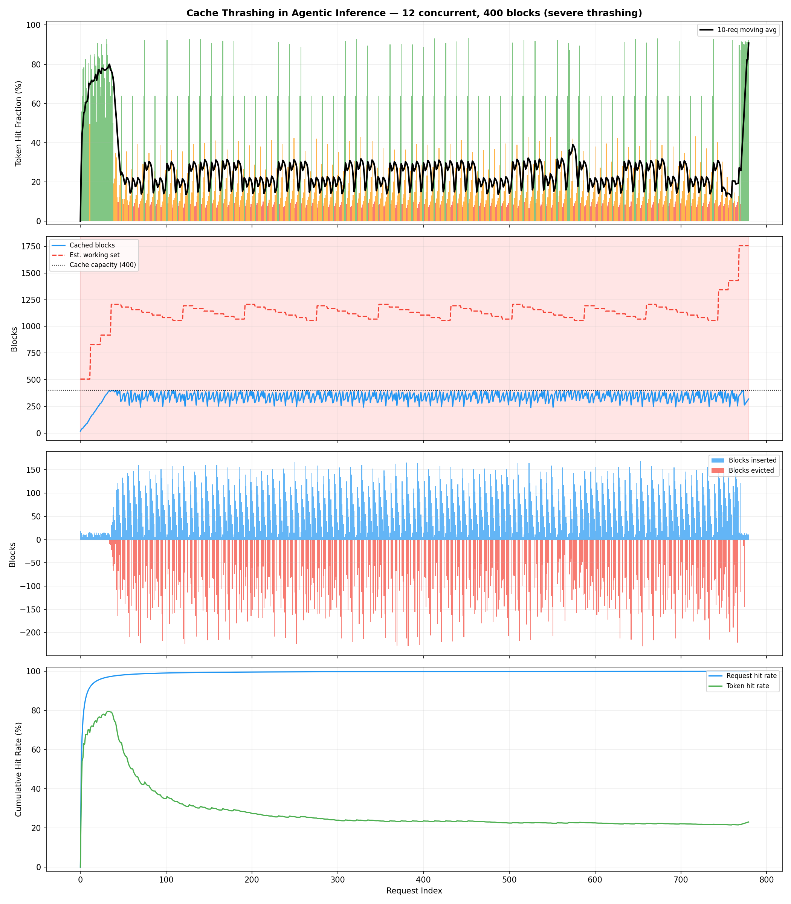

| Config | Phase | Token Hit Rate | Cache Util | Evictions/req |
|--------|-------|:---:|:---:|:---:|
| 12 conc, 400 blk | Sustained thrashing | **~18%** | **~83%** | ~84 |
| 8 conc, 400 blk | Sustained thrashing | **~19%** | **~85%** | ~82 |
| 6 conc, 400 blk | Sustained thrashing | **~26%** | **~87%** | ~75 |
| 12 conc, 800 blk | Sustained thrashing | **~24%** | **~93%** | ~76 |

In every case: high utilization, high eviction rate, low hit rate. The warmup phase is visible at the start (hit rate initially higher as sessions are still loading), followed by sustained thrashing that persists until the drain phase.

### 3.2 No Thrashing (Working Set Fits)

When the working set fits in the cache, the three-phase pattern shows healthy behavior throughout:


| Config | Token Hit Rate | Cache Util | Evictions/req |
|--------|:---:|:---:|:---:|
| 2 conc, 400 blk | ~80% | ~96% | ~11 |
| 2 conc, 800 blk | ~80% | ~94% | ~11 |
| 4 conc, 800 blk | ~80% | ~95% | ~11 |

Hit rate is stable at ~80% across all three phases, evictions are low and steady (just LRU turnover of completed sessions), and there are no phase transitions in cache behavior.

### 3.3 Thrashing Boundary Heatmap

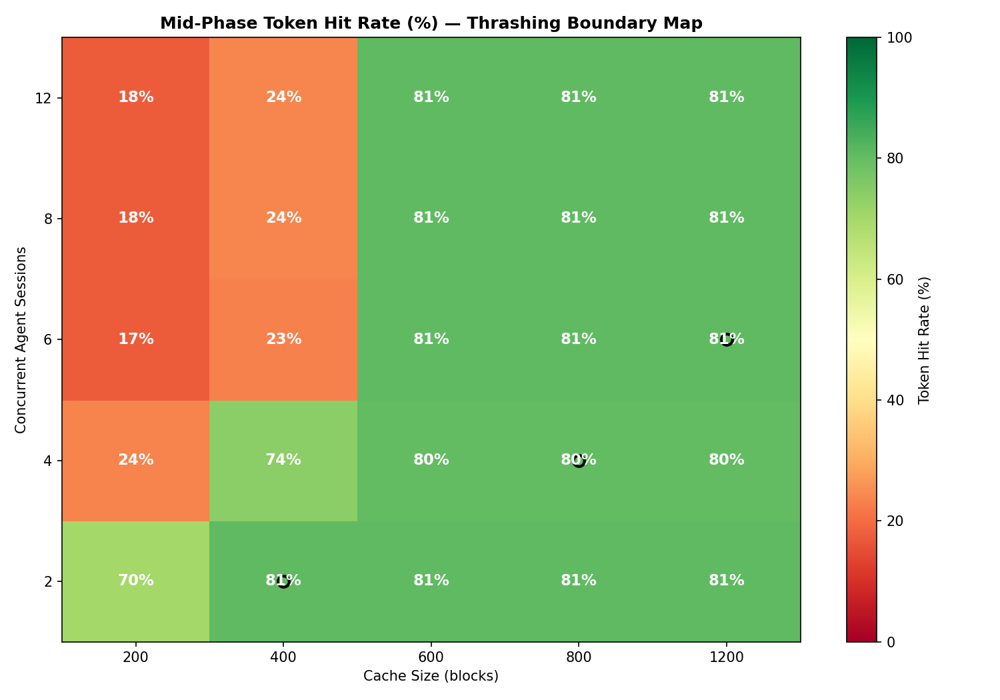

The heatmap maps mid-phase token hit rate across all (concurrent sessions x cache size) configurations. The boundary is sharp and binary: configurations where the working set fits achieve ~80% hit rate, those that don't drop to 17-25%.

| Concurrent Sessions | Working Set (blocks) | Min Cache to Avoid Thrashing |
|:---:|:---:|:---:|
| 2 | 338 | ~400 |
| 4 | 676 | ~800 |
| 6 | 1014 | ~1200 |
| 8 | 1352 | ~1400+ |
| 12 | 2028 | ~2100+ |

### 3.4 Concurrent Sessions Sweep (Fixed Cache = 600 Blocks)

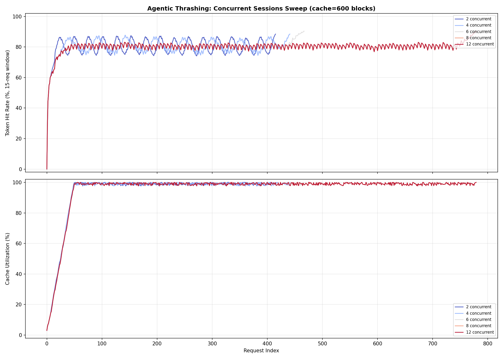

At a fixed 600-block cache:
- **2-4 concurrent:** Stable 80%+ hit rate — working set fits comfortably
- **8 concurrent:** Sustained thrashing at ~20-30%, with brief spikes when sessions complete during the drain phase
- **12 concurrent:** Pinned at ~15-20% for the entire sustained-load phase — unrecoverable thrashing until drain

The bottom panel shows **near-100% cache utilization across all configurations** — confirming that utilization is completely uninformative about whether the cache is actually helping.

### 3.5 The Detailed View

The 6-concurrent / 600-block case (1.7x overcommit) shows the borderline behavior with all three phases visible:

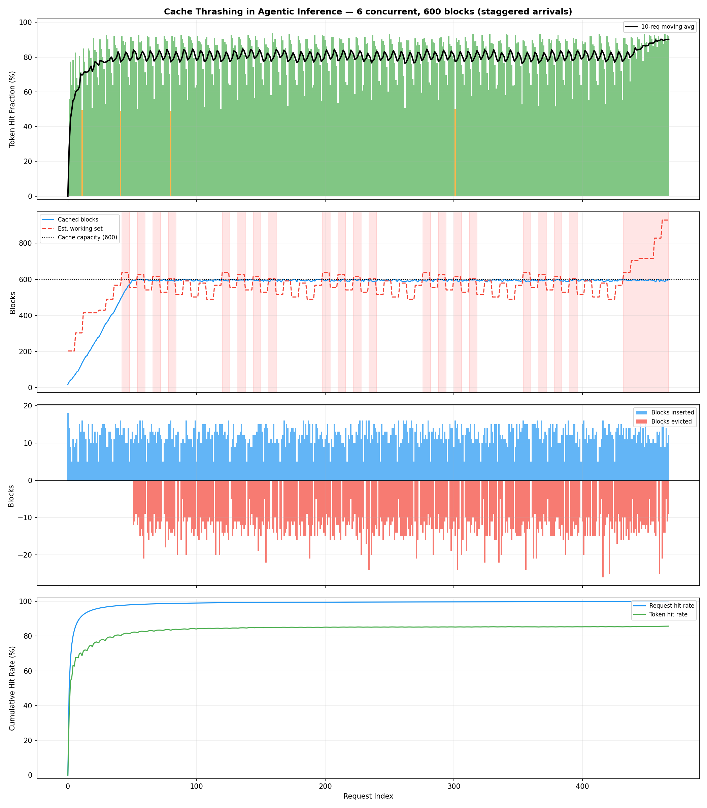

- **Warmup (early requests):** Sessions arrive one by one. Cache fills gradually. Hit rate starts high as early sessions benefit from the shared system prompt.
- **Sustained load (middle):** Pool is full with sessions at different lifecycle stages. Working set exceeds capacity. Hit rate drops and stays low as sessions continuously evict each other's blocks.
- **Drain (late requests):** No replacements. As sessions complete and leave, the working set shrinks below capacity. Evictions slow and hit rate may recover for the final sessions.

---

## 4. Key Findings

### Finding 1: Cache utilization masks thrashing

During severe thrashing (12 concurrent, 400 blocks), cache utilization is **~83%** while token hit rate is **~18%**. A monitoring system that only tracks utilization would report the cache as healthy. The diagnostic triad is: **high utilization + high eviction rate + low hit rate = thrashing**.

### Finding 2: The thrashing boundary is a cliff, not a slope

There is no graceful degradation. Hit rate is either ~80% (working set fits) or ~20% (it doesn't). The transition is nearly binary — a 30% increase in concurrent sessions can cause a 60-point drop in hit rate. This is because LRU eviction under round-robin access is adversarial: the least-recently-used entry is always the one that will be needed next.

### Finding 3: The three-phase lifecycle makes thrashing visible

The warmup-sustained-drain lifecycle creates a clear narrative:
- **Warmup** establishes the baseline — high hit rates as sessions load and the cache fills.
- **Sustained load** reveals the steady-state behavior — if the working set exceeds capacity, thrashing persists indefinitely because completed sessions are immediately replaced.
- **Drain** shows recovery potential — as sessions leave without replacement, the working set shrinks and hit rate can recover.

This is more realistic than purely staggered arrivals (which skip warmup) or synchronized batches (which produce artificial sawtooth recovery patterns).

### Finding 4: Agentic workloads are uniquely vulnerable

Unlike multi-turn chat (short contexts, few concurrent users sharing a conversation), agentic workloads have:
- **Long, growing contexts** (2000+ tokens after 10 steps)
- **High temporal correlation** (each step depends on the previous — no reordering possible)
- **Multiple concurrent sessions** competing for the same cache
- **No natural sharing** between sessions (each task is unique)

This combination creates the worst case for LRU caching: every entry is needed exactly once more, but evicted just before that access.

---

## 5. Implications for System Design

| Strategy | Effect | Tradeoff |
|----------|--------|----------|
| **Increase cache size** | Directly raises thrashing boundary | Memory cost scales linearly with concurrent sessions |
| **Limit concurrent sessions** | Keeps working set within cache | Reduces throughput; may increase queuing latency |
| **Session-aware eviction** | Protect active sessions' blocks from eviction | More complex eviction policy; may starve new sessions |
| **Prefix deduplication** | Share system prompt blocks across sessions | Only helps if sessions share a common prefix (~200/2700 = 7% here) |
| **Context compression** | Reduce per-step token growth | Lossy; may degrade agent accuracy |
| **Priority scheduling** | Complete one session before starting the next | Eliminates inter-session thrashing but serializes execution |

The most actionable finding: for agentic workloads, **cache capacity should be provisioned as `N x max_context_length / block_size`** where N is the target concurrent session count. Under-provisioning by even 30% triggers sharp, sustained performance degradation with no self-recovery.

---

## 6. Heterogeneous Agent Types

Real deployments don't run identical agents. A production inference server might simultaneously host quick lookup agents (3-4 tool calls), standard reasoning agents (10-12 steps), and deep-research agents (20+ steps with large tool outputs). When these agent types share the same KV cache, their working sets differ in size, growth rate, and lifetime — changing the thrashing dynamics in ways that homogeneous experiments cannot capture.

### 6.1 Agent Archetypes

We define four canonical agent types that model the spectrum of production agentic workloads:

| Archetype | Steps | Tokens/step (mean) | CV | Max context | Max blocks |
|-----------|:-----:|:---:|:---:|:---:|:---:|
| **short** — quick lookup (API call, RAG retrieval) | 4 | 80 | 0.2 | 620 | 39 |
| **medium** — standard reasoning (code gen, analysis) | 12 | 200 | 0.3 | 2700 | 169 |
| **long** — deep research (multi-tool chains, iterative code) | 24 | 300 | 0.35 | 7500 | 469 |
| **high_var** — unpredictable outputs (web search, code exec) | 10 | 200 | 0.9 | 2300 | 144 |

The coefficient of variation (CV) controls per-step token variance — a `high_var` agent's tool result might return 50 tokens (short API response) or 500 tokens (full web page), modelling the bursty insertion patterns of real tool use.

Each agent type has its own system prompt (different agent roles), so there is **intra-type prefix sharing but no cross-type sharing**. This is realistic: a coding agent and a search agent have different base contexts.

### 6.2 Simulation Model

The heterogeneous simulation uses a **cold-start pool** model: all `concurrent_sessions` agents begin simultaneously at step 0. As sessions complete, they are replaced from a pool of 120 total sessions (50 replacements during the sustained phase). Agent types are assigned to sessions according to configurable mix fractions.

Six mix configurations are swept across five cache sizes (200, 400, 600, 800, 1200 blocks) with 8 concurrent sessions:

| Mix name | Composition |
|----------|-------------|
| `all_short` | 100% short |
| `all_medium` | 100% medium |
| `all_long` | 100% long |
| `short+long` | 50% short + 50% long |
| `high_var` | 100% high-variance |
| `mixed_3way` | ⅓ short + ⅓ medium + ⅓ long |

### 6.3 Results: Agent Mix × Cache Size Heatmap


The heatmap reveals how dramatically agent composition affects thrashing:

| Mix | 200 blks | 400 blks | 800 blks | 1200 blks |
|-----|:---:|:---:|:---:|:---:|
| all_short | 75% | 75% | 75% | 75% |
| all_medium | 21% | 33% | 56% | 74% |
| all_long | 10% | 14% | 24% | 28% |
| short+long | 9% | 13% | 21% | 26% |
| high_var | 24% | 37% | 62% | 72% |
| mixed_3way | 10% | 15% | 34% | 40% |

**Short agents are cache-friendly.** Their small working set (39 blocks each, 312 total for 8 concurrent) fits comfortably in even 400 blocks. Hit rate is flat at ~75% regardless of cache size.

**Long agents dominate cache pressure.** A single long agent at full context requires 469 blocks — more than the entire 400-block cache. Eight concurrent long agents need ~3752 blocks, creating 4.7x overcommit at 800 blocks and severe thrashing (~24% hit rate).

**Mixing short and long is worse than either alone.** The `short+long` mix achieves only 21% hit rate at 800 blocks — worse than `all_medium` (56%) despite having half the pool as small-footprint agents. Long agents' massive insertions evict short agents' cached prefixes, and short agents' fast turnover provides no stability benefit.

### 6.4 Cross-Type Eviction: The Fairness Problem

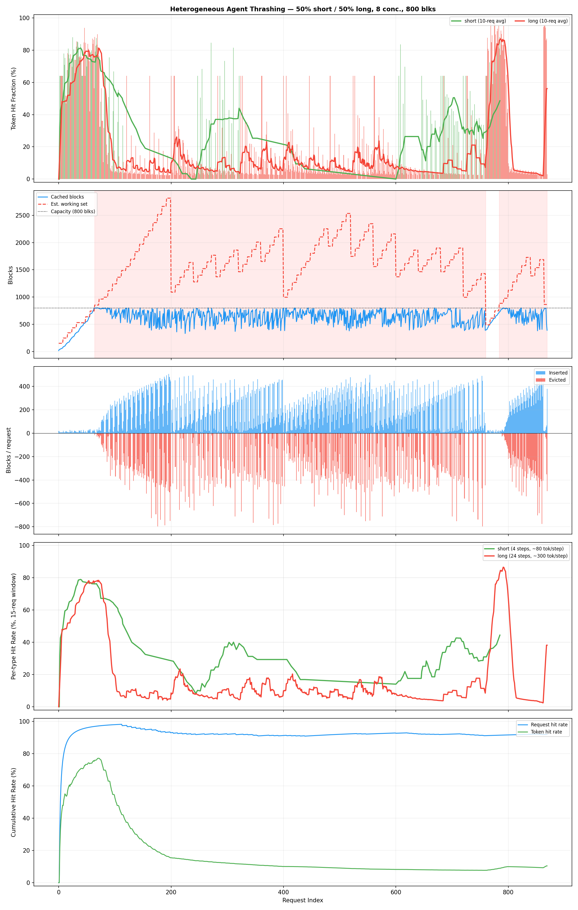

The 50% short / 50% long mix at 800 blocks (detailed 5-panel view above) exposes the cross-type eviction problem:

| Agent Type | Hit Rate (standalone) | Hit Rate (in mix) | Δ |
|------------|:---:|:---:|:---:|
| short | 75.2% | 40.4% | **−34.8 pp** |
| long | 23.6% | 16.6% | −7.0 pp |

Short agents suffer a **35 percentage-point hit rate drop** when sharing the cache with long agents. Long agents barely notice. The mechanism:

1. Long agents insert ~216 blocks per request (at later steps), evicting most of the cache each step
2. Short agents' cached prefixes (only 39 blocks) are collateral damage
3. Short agents' small insertions don't meaningfully evict long agents' entries

This is an **asymmetric fairness failure**: the resource-heavy agent type degrades the resource-light type disproportionately.

### 6.5 Three-Way Mix: Everyone Suffers


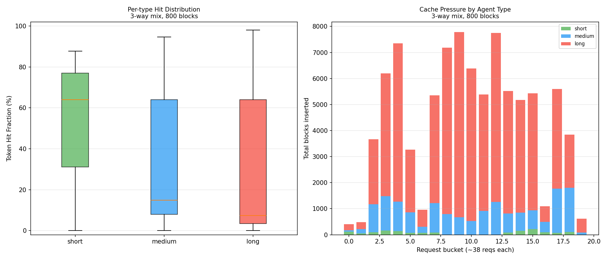

The mixed_3way configuration (⅓ short / ⅓ medium / ⅓ long) at 800 blocks:

| Agent Type | Standalone Hit Rate | In 3-Way Mix | Blocks Inserted/req |
|------------|:---:|:---:|:---:|
| short (4 steps) | 75.2% | 48.9% | 13.2 |
| medium (12 steps) | 55.6% | 32.6% | 65.2 |
| long (24 steps) | 23.6% | 31.0% | 179.5 |

The per-type breakdown (right panel: stacked bar of cache pressure) shows long agents dominating cache insertions throughout the simulation. The box plot (left panel) shows the hit-rate distribution: short agents have the widest spread (some requests hit well, others miss entirely due to eviction), while long agents cluster at low hit rates.

Notably, long agents actually *improve* slightly in the mix (31.0% vs 23.6% standalone) because short agents' fast turnover means less sustained competition for cache space.

### 6.6 High-Variance Token Sizes

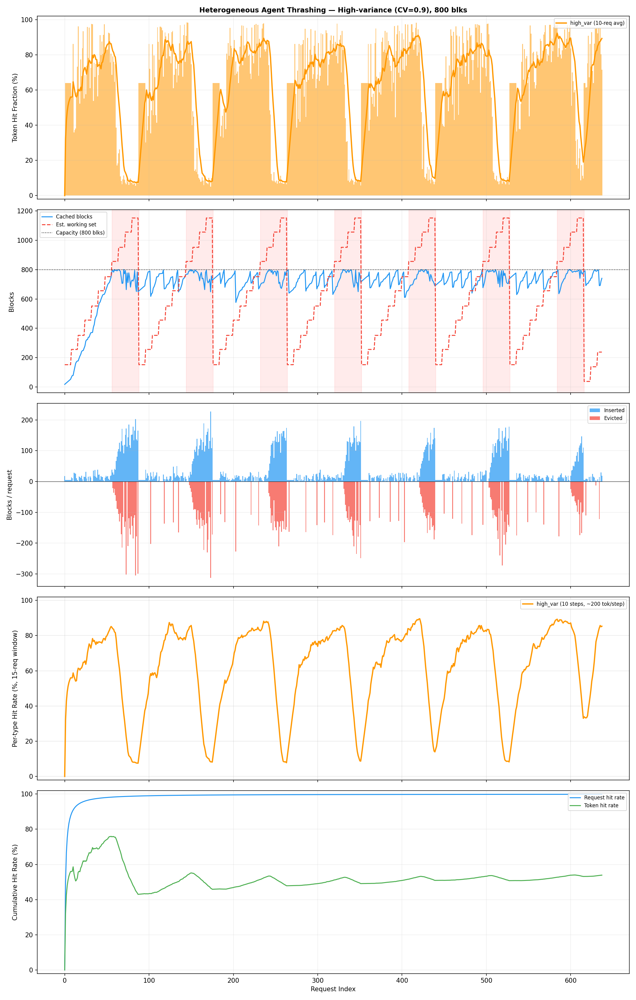

Agents with unpredictable tool result sizes (CV=0.9) show distinctive behaviour at 800 blocks:

- **Overall hit rate: 61.8%** — moderate, comparable to `all_medium`
- **Bursty insertion pattern**: some requests insert 10 blocks (small tool result), others insert 100+ (large result), visible as spikes in the blocks-inserted panel
- **Eviction spikes**: large insertions trigger cascading evictions that temporarily hurt subsequent requests
- **Recovery between bursts**: after a large insertion, if the next few steps are small, the cache stabilises and hit rate recovers

The high variance doesn't cause sustained thrashing (the *mean* working set still fits), but it creates **intermittent thrashing episodes** — brief periods where a burst of large tool results temporarily overcommits the cache.

### 6.7 Step Count and Duration Sweep

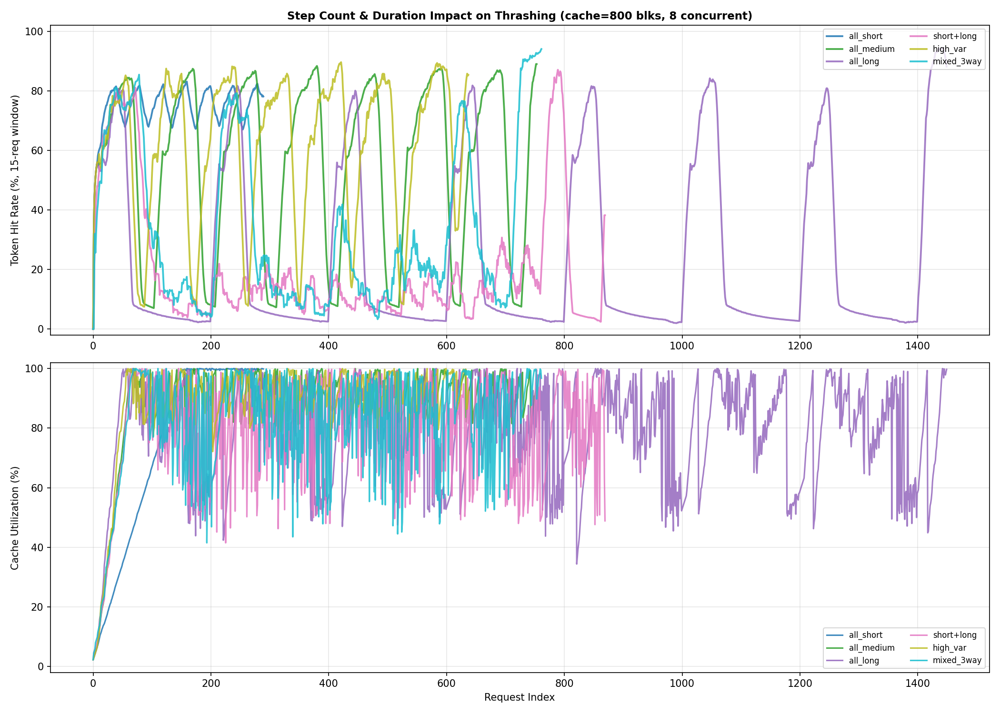

The overlay of all six mixes at 800 blocks (windowed hit rate + utilisation) shows:

- **all_short** maintains 75% hit rate throughout with low utilisation (~74%) — the cache is undercommitted
- **all_medium** and **high_var** track together at 55-62%, approaching full utilisation
- **all_long**, **short+long**, and **mixed_3way** cluster at 14-34%, with full cache utilisation — confirming that long agents' working set (469 blocks × 8 concurrent ≈ 3752 blocks) overwhelms any reasonable cache size
- Utilisation converges to ~80-99% for all mixes — again showing that **utilisation alone cannot distinguish healthy caching from thrashing**

---

## 7. Combined Findings

### Finding 5: Agent heterogeneity creates asymmetric cache interference

When short and long agents share a cache, long agents' massive per-step insertions evict short agents' prefixes, causing a 35 percentage-point hit rate degradation for short agents. Long agents are barely affected. This suggests that **cache partitioning or per-type admission control** could significantly improve fairness.

### Finding 6: Mixed pools can be worse than the worst individual type

The `short+long` mix (21% hit at 800 blocks) performs worse than `all_medium` (56%) despite having half the pool as lightweight agents. The fast turnover of short agents doesn't offset the cache pollution from long agents — it makes it worse by increasing churn without reducing pressure.

### Finding 7: Working-set diversity demands per-type capacity planning

The homogeneous rule of thumb (`cache ≥ N × max_blocks_per_session`) is insufficient for heterogeneous pools. A mixed pool's effective cache requirement is dominated by its largest agent type:

| Mix | Naive capacity (avg) | Actual required (for >50% hit) |
|-----|:---:|:---:|
| all_short | 312 blocks | ~200 blocks |
| all_medium | 1352 blocks | ~800 blocks |
| all_long | 3752 blocks | ~3000+ blocks |
| short+long | 2032 blocks | ~3000+ blocks (dominated by long) |
| mixed_3way | 2256 blocks | ~2500+ blocks |

### Finding 8: High-variance step sizes cause intermittent, not sustained, thrashing

Unlike the steady-state thrashing from working-set overcommit, high CV agents create **bursty eviction episodes** — brief periods of cache churn when large tool results arrive, followed by recovery. This is a different failure mode that might benefit from **burst-aware eviction damping** rather than simple capacity increases.

---

## 8. Extended Implications for System Design

The heterogeneous findings extend the system design recommendations from Section 5:

| Strategy | Effect | When to use |
|----------|--------|-------------|
| **Cache partitioning by agent type** | Prevents cross-type eviction; protects short agents from long agents' cache pressure | Multi-type deployments with known agent profiles |
| **Weighted admission control** | Limit cache blocks per agent type proportional to their working-set contribution | Prevent a single long agent from monopolising cache |
| **Type-aware scheduling** | Batch similar agent types together to reduce working-set heterogeneity | When agent types are known at dispatch time |
| **Dynamic pool sizing** | Adjust concurrent session limits per agent type based on measured hit rates | Production systems with real-time monitoring |
| **Separate cache tiers** | Small fast cache for short agents, large slower cache for long agents | When latency requirements differ by agent type |
| **Burst-absorbing buffers** | Temporary over-provisioning to absorb high-variance insertion spikes without evicting stable entries | High-CV agent workloads |

The most critical finding for capacity planning: **provision cache for the largest agent type's full working set × its concurrent count**, not the average across types. A pool with even 25% long agents behaves as if it were 100% long agents from a cache-pressure perspective.

---

## 9. Reproducing

```bash
python experiments/experiment_thrashing.py   # Parts 1 & 2
python experiments/experiment_unlimited_cache.py  # Part 3
```

Output:
- Console characterisation for homogeneous, heterogeneous, and unlimited experiments
- 5 homogeneous plots in `../example_outputs/experiments/kv_cache/thrashing_*.png`
- 7 heterogeneous plots in `../example_outputs/experiments/kv_cache/hetero_*.png`
- 5 unlimited-cache plots in `../example_outputs/experiments/kv_cache/unlimited_*.png`

---

## 10. Unlimited Cache Experiment — Quantifying the Cost of Thrashing

The previous sections characterise *where* thrashing occurs and *how bad* the hit
rate gets. This section answers the operational question: **how much does thrashing
actually cost in terms of GPU compute?**

We run every configuration twice on the identical request stream — once with the
limited LRU cache and once with an **unlimited oracle cache** (500 000 blocks,
never evicts). The gap between the two measures the exact compute penalty of
operating under capacity constraints.

### 10.1 Measurement Model

Every token not served from cache must be re-computed during prefill. We model
two performance dimensions directly:

```
effective_prefill_i  =  total_prefill_i  −  cached_tokens_i

TTFT multiplier_i    =  eff_prefill_limited_i  /  eff_prefill_unlimited_i

compute_overhead     =  Σ eff_limited  /  Σ eff_unlimited   (aggregate ratio)

throughput_ratio     =  1 / compute_overhead               (fraction of unlimited tput)
```

A `compute_overhead` of 5× means the server computes five times as many prefill
tokens as it would with an unlimited cache. A `throughput_ratio` of 19% means
only one-fifth of the requests-per-second capacity of the unlimited case is
delivered.

### 10.2 Homogeneous Results: The Binary Cliff

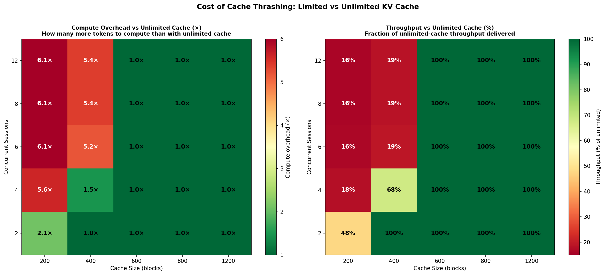

The heatmap reveals the same binary transition seen in the hit-rate analysis, now
expressed as concrete compute cost:

| Config | WS/Cache | Compute overhead | Throughput | TTFT p95 | Compute wasted |
|--------|:--------:|:----------------:|:----------:|:--------:|:--------------:|
| 2 conc, 400 blks | 0.8× | **1.00×** | 100% | 1.0× | 0% |
| 4 conc, 400 blks | 1.7× | **1.48×** | 68% | 4.9× | 32% |
| 6 conc, 400 blks | 2.5× | **5.19×** | 19% | 11.5× | 81% |
| 8 conc, 400 blks | 3.4× | **5.38×** | 19% | 11.6× | 81% |
| 12 conc, 400 blks | 5.1× | **5.38×** | 19% | 11.6× | 81% |
| 8 conc, 600 blks | 2.3× | **1.00×** | 100% | 1.0× | 0% |

There is no gradual degradation. As soon as the working set exceeds cache capacity
the system enters a regime where **81-84% of prefill compute is wasted** — tokens
that could have been served from cache but were evicted and must be fully
recomputed. Adding more concurrent sessions beyond the thrashing threshold changes
nothing: the penalty is already maxed out at ~5.4× overhead.

### 10.3 Per-Request View: TTFT Inflation

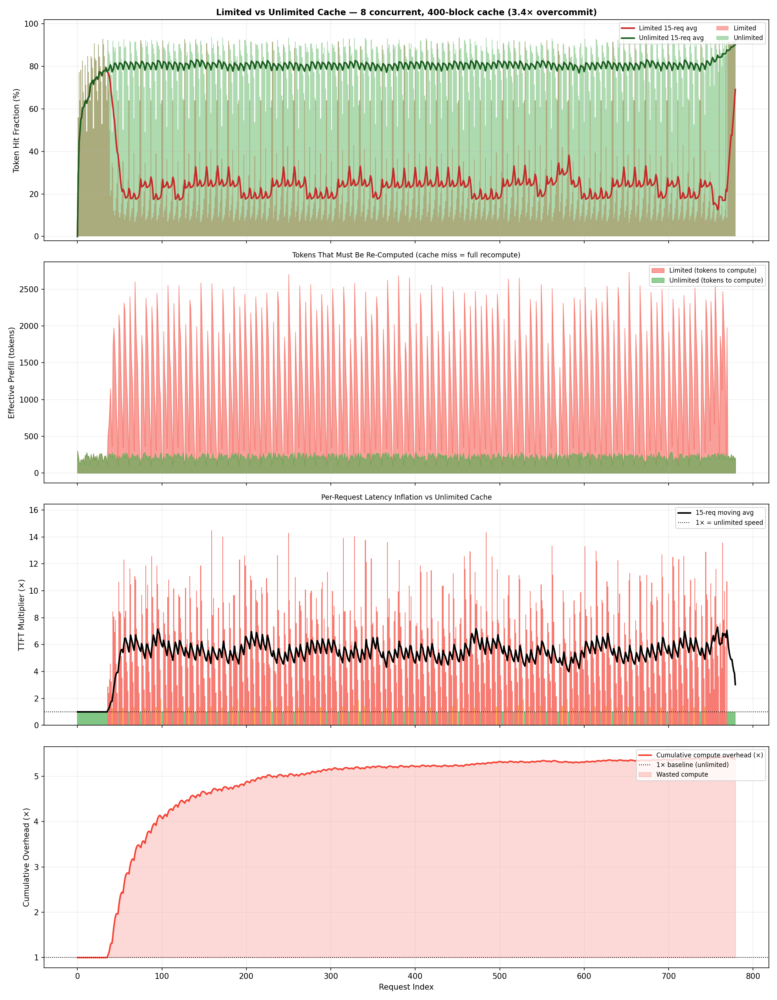

The 4-panel view (8 concurrent, 400 blocks) shows the per-request picture:

- **Top**: hit fraction collapses from the unlimited baseline (~86%) to ~25% during
  sustained thrashing.
- **Second**: effective prefill tokens are 4-5× higher in the limited case — the
  server re-computes almost the full context for every step.
- **Third**: individual request TTFT multipliers. During thrashing, the median
  request takes **5× longer** on prefill than it would with unlimited cache. Tail
  requests (p95) take **11.6×** longer.
- **Bottom**: cumulative compute overhead converges to ~5.4× and stays there for
  the duration of sustained load.

### 10.4 TTFT Distribution

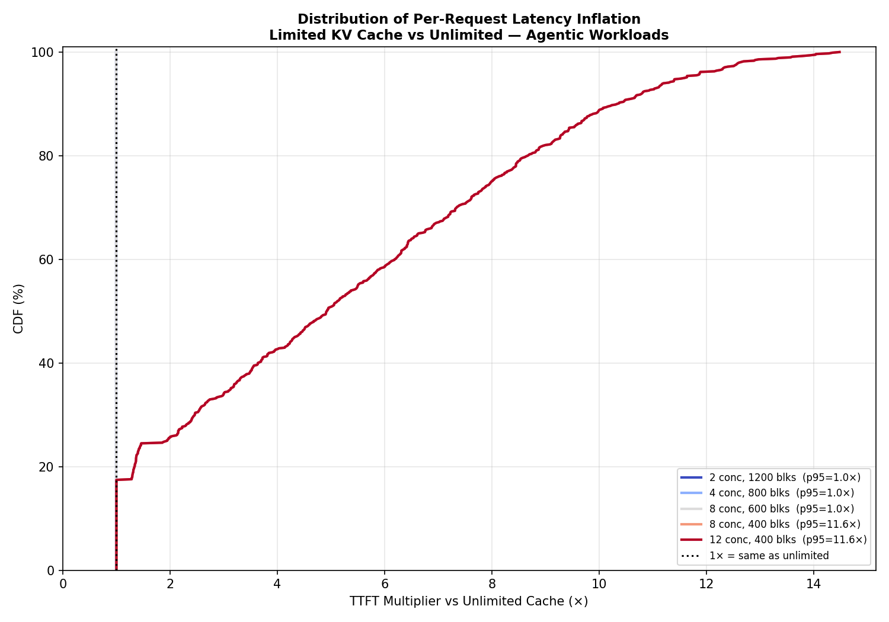

The CDF of per-request TTFT multipliers across five representative configurations:

| Config | TTFT p50 | TTFT p95 | Interpretation |
|--------|:--------:|:--------:|----------------|
| 2 conc, 1200 blks | 1.0× | 1.0× | No overhead at all — cache always has everything |
| 4 conc, 800 blks | 1.0× | 1.0× | No overhead — working set fits |
| 8 conc, 600 blks | 1.0× | 1.0× | No overhead — working set fits |
| 8 conc, 400 blks | 4.9× | 11.6× | Severe thrashing — most requests 5× slower |
| 12 conc, 400 blks | 4.9× | 11.6× | Same pattern — adding sessions doesn't change it |

The CDF for thrashing configurations is heavy-tailed: a large fraction of requests
cluster at 5-6× overhead, with a tail reaching 12×. These are the later steps of
agentic sessions, where the context is longest and the cache benefit should be
greatest — but the blocks have already been evicted.

### 10.5 The Thrashing Cliff

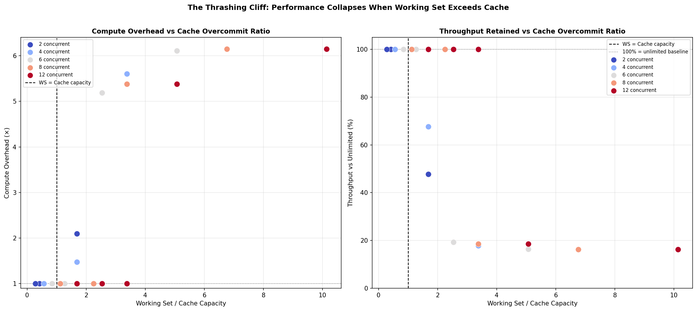

Plotting compute overhead against the working-set/cache ratio makes the threshold
structure explicit. The transition is sharp: below ws/cache ≈ 1, overhead is 1×
(no penalty). Above it, overhead jumps immediately to 5-6× for medium agents and
stays there regardless of how much more the working set grows. This is the
**thrashing cliff** — a phase boundary in the system's behaviour.

### 10.6 Heterogeneous Agent Results

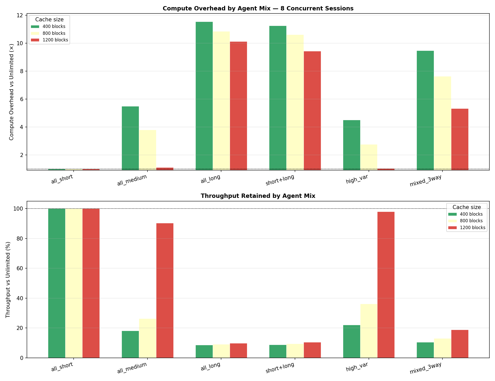

The unlimited-cache comparison makes the heterogeneous cost structure stark:

| Mix | Cache | Overhead | Tput | TTFT p95 | Wasted compute |
|-----|:-----:|:--------:|:----:|:--------:|:--------------:|
| all_short | any | **1.00×** | 100% | 1.0× | 0% |
| all_medium | 400 blks | 5.48× | 18% | 14.1× | 82% |
| all_medium | 800 blks | 3.79× | 26% | 13.8× | 74% |
| all_long | 400 blks | **11.55×** | 9% | 30.2× | 91% |
| all_long | 800 blks | **10.85×** | 9% | 29.9× | 91% |
| all_long | 1200 blks | **10.13×** | 10% | 29.9× | 90% |
| short+long | 800 blks | **10.63×** | 9% | 28.3× | 91% |
| high_var | 800 blks | 2.76× | 36% | 16.5× | 64% |
| mixed_3way | 800 blks | 7.64× | 13% | 23.8× | 87% |

**Long agents never recover.** Even at 1200 blocks, `all_long` wastes 90% of
prefill compute. Their maximum context (469 blocks per session × 8 concurrent =
3752 blocks needed) exceeds all tested cache sizes. Every step re-triggers massive
evictions, and the unlimited-cache baseline — where each step only needs to compute
~300 new tokens rather than 7500 accumulated tokens — is completely unachievable
with any practical cache size short of full working set.

**Short agents pay nothing.** Their maximum context (39 blocks per session × 8 =
312 blocks) fits comfortably within 400 blocks. Compute overhead is exactly 1.00×
at all tested cache sizes, TTFT multiplier is 1.0× throughout. Short agents are
the ideal cache-friendly workload.

**High-variance agents pay a moderate price.** At 800 blocks: 2.76× overhead, 36%
throughput. Their mean context is similar to medium agents, but the bursty
insertions mean some steps blow past the cache capacity, triggering cascade
evictions. At 1200 blocks they nearly recover (1.02× overhead), confirming that
the cost is capacity-driven, not inherent to variance.

**The short+long mix is dominated by long agents.** The mix achieves 10.63×
overhead at 800 blocks — nearly identical to all_long — because long agents'
3752-block working set completely governs cache pressure. The short agents'
small footprint provides no relief; their cached tokens are collateral eviction
damage from long agents' insertions.

### 10.7 Findings Summary

**Finding 9: Thrashing wastes 81–84% of prefill compute in the homogeneous case**

When the working set exceeds cache capacity for medium agents (12 steps, 2700 token
max context), 81–84% of all prefill computation is redundant — tokens that should
have been served from cache but were evicted and must be recomputed. The GPU
delivers only 16–19% of the throughput it could achieve with an unlimited cache.

**Finding 10: The overhead is capped at ~5–6× for medium agents; long agents reach ~11×**

For medium-length agents, the maximum overhead is ~5.4× because even with zero
cache hits, the full context length is bounded. Long agents (24 steps, up to
7500 tokens) reach 10–12× overhead because the unlimited-cache baseline is
extremely efficient (only ~300 new tokens per step vs 7500 recomputed), while the
limited cache provides almost no benefit at any tested size.

**Finding 11: The thrashing cliff is a hard phase boundary, not a gradient**

Overhead is either 1.0× (working set fits) or 5× (it doesn't). There is no
intermediate regime. This means that **incremental cache increases only help if
they push the system below the thrashing threshold** — partial increases within the
thrashing regime provide zero benefit.

**Finding 12: The cost of thrashing dwarfs the cost of the cache miss itself**

In the thrashing regime, the problem isn't that individual requests miss the cache —
it's that the *sequence* of misses and evictions means every step of every session
re-computes its full context. For a 12-step session, this means steps 10, 11, 12
compute ~2700, ~2900, ~3100 tokens respectively instead of ~200 tokens each. The
waste is concentrated at the later, longer steps.

---

## 11. Capacity Planning: Break-Even Cache Sizes

Combining Findings 2 (binary threshold) and 11 (phase boundary), the optimal
capacity rule is strict:

```
Required cache blocks  ≥  N_concurrent  ×  max_blocks_per_session_type
```

| Agent type | Max blocks/session | 8 concurrent requires | Safe cache size |
|------------|:-----------------:|:---------------------:|:---------------:|
| short | 39 | 312 blocks | **400 blocks** |
| medium | 169 | 1352 blocks | **1400 blocks** |
| long | 469 | 3752 blocks | **4000 blocks** |
| high_var | ~200 (mean) | ~1600 blocks | **2000 blocks** |

For mixed pools, dimension against the **largest agent type** present, not the
average. A pool with 25% long agents requires the same cache as 100% long agents
(Finding 7, Finding 12).

Under-sizing by even one session worth of blocks pushes the system over the cliff
into the 81–91% compute-waste regime with no intermediate penalty level.

---

## 12. Escaping the Cliff with a Tiered Cache: PCIe KV Reloading

Sections 1–11 took HBM as the only place where KV state can live. Once an
entry is evicted from HBM, the request has to **recompute** it from scratch
via prefill — and that recomputation is exactly what makes the thrashing
cliff so brutal (Finding 12).

But HBM isn't the only fast memory on the node. A typical inference server has
hundreds of GB of host DRAM sitting idle behind the PCIe bus. If we treat it
as a **second-tier KV cache**, an HBM eviction becomes recoverable: on the
next use we copy the blocks back over PCIe instead of recomputing them.

The new experiment (`experiments/experiment_pcie_kv_reload.py`) models exactly
that. Over the same agentic workload as Sections 1–11, each prefix lookup now
has three possible outcomes:

| Outcome              | Path                          | Cost / token (A100 + 7B)              |
|----------------------|-------------------------------|---------------------------------------|
| HBM hit              | already on GPU                | 0                                     |
| HBM miss, DRAM hit   | host DRAM → HBM over PCIe     | 512 KB / 25.2 GB/s ≈ **0.021 ms**     |
| Full miss            | run prefill                   | 14 GFLOPs / 175 TFLOPS ≈ **0.080 ms** |

PCIe reload is **3.8× cheaper per token than recomputing** on A100, and up to
**61× cheaper on 70B** (where prefill is dominated by heavy matmul). Every
token that had been wasted on re-prefill in Sections 1–11 becomes a candidate
for reloading.

### 12.1 The tiered model

We run two `PrefixCacheManager`s in parallel over the same request stream:

- `hbm_cache`  — same capacity as the thrashing experiment (200 / 400 / 600 / 800 / 1200 blocks)
- `dram_cache` — 10× the HBM capacity (host DRAM backing store)

Both see the same inserts, so DRAM is a strict superset of HBM until its own
LRU kicks in (in practice the DRAM tier is rarely the bottleneck — see
Finding 15). On each request:

```
hbm_tokens  = hbm_cache.match_prefix(token_ids)
dram_tokens = dram_cache.match_prefix(token_ids)
pcie_tokens = max(hbm_tokens, dram_tokens) - hbm_tokens   # reload over PCIe
miss_tokens = total_tokens - max(hbm_tokens, dram_tokens) # real prefill

baseline_cost = (total_tokens - hbm_tokens)      * prefill_ms_per_token
tiered_cost   = pcie_tokens * pcie_ms_per_token  + miss_tokens * prefill_ms_per_token
```

We compare the two costs request-by-request across the same sweep
(`concurrent_sessions × cache_size`) as Sections 1–11.

### 12.2 Deep-dive: 8 concurrent, 400-block HBM (severe thrashing)

This is the same configuration that collapsed to ~18% token hit rate and 82
evictions per request in Section 5. With a 4000-block DRAM tier added:

| Metric                 | Baseline (HBM only) | Tiered (HBM + DRAM PCIe) |
|------------------------|---------------------|--------------------------|
| Requests               | 780                 | 780                      |
| HBM hits               | 23.1 % of tokens    | 23.1 % of tokens         |
| PCIe reloads           | —                   | **62.6 % of tokens**     |
| Full recomputes        | 76.9 % of tokens    | **14.3 % of tokens**     |
| Total prefill compute  | 71.9 s              | **28.6 s**               |
| Avg cost per request   | 92.2 ms             | **36.7 ms**              |
| **Compute time saved** | —                   | **43.3 s  (60.2 %)**     |

In the worst-thrashing configuration we tested (8 concurrent × 200-block HBM),
savings reach **62 % and 50.9 s of avoided prefill** over 547 requests — a
direct recovery of most of the compute that the thrashing cliff destroyed.

See `report_figures/kv_cache/pcie_reload_detail.png` for the 5-panel
request-level breakdown (token disposition, per-request cost, cumulative
cost, working-set vs capacity, cumulative savings).

**Finding 13: PCIe reload turns a thrashing miss into a ~4× cheaper reload.**

### 12.3 Savings map across the full sweep

Re-running the Section 3 sweep with the tiered cache produces this savings map
(`pcie_reload_savings_heatmap.png`, values = % prefill compute saved):

| Concurrent ↓ / HBM → | 200   | 400   | 600   | 800   | 1200  |
|----------------------|:-----:|:-----:|:-----:|:-----:|:-----:|
| 2                    | 39 %  |  0 %  |  0 %  |  0 %  |  0 %  |
| 4                    | 61 %  | 24 %  |  0 %  |  0 %  |  0 %  |
| 6                    | 62 %  | 60 %  |  0 %  |  0 %  |  0 %  |
| 8                    | 62 %  | **60 %** |  0 %  |  0 %  |  0 %  |
| 12                   | 62 %  | 60 %  |  0 %  |  0 %  |  0 %  |

Two phase boundaries are visible:

1. The **thrashing cliff** itself (same as Section 3) — any cell with non-zero
   savings is a cell where the baseline was thrashing.
2. A **savings plateau** at 60–62 % for every thrashing configuration. Once
   the working set exceeds HBM, the *proportion* of tokens reloadable from
   DRAM is roughly constant (~63 %) and the per-token speedup is constant
   (3.8×), so the savings percentage flattens out regardless of how hard the
   system is thrashing.

The zeros in the table are not a weakness — they simply mean the baseline was
already not thrashing, so there was nothing to reload. The tiered cache pays
only for what it recovers.

**Finding 14: PCIe reload erases ~60 % of thrashing compute waste across the
entire cliff region, without affecting configurations that weren't thrashing
to begin with.**

### 12.4 DRAM tier sizing

We varied the DRAM tier from 2× to 50× HBM:

| DRAM multiplier | Savings | PCIe-reload token share |
|:---------------:|:-------:|:-----------------------:|
| 2× HBM          | 60.2 %  | 62.6 %                  |
| 5× HBM          | 60.2 %  | 62.6 %                  |
| 10× HBM         | 60.2 %  | 62.6 %                  |
| 50× HBM         | 60.2 %  | 62.6 %                  |

Diminishing returns are absolute, not gradual. Once the DRAM tier is large
enough to hold the blocks HBM just evicted (roughly 2× HBM is already enough
for our workload), adding more DRAM does nothing — the LRU-eviction horizon
matches the block-reuse horizon. Capacity planning for the DRAM tier is
therefore almost trivial: **2–3× HBM is sufficient** to absorb all thrashing
spill for this class of agent.

**Finding 15: The DRAM tier needs only ~2× HBM capacity. Beyond that, more
host memory is wasted on KV state.**

### 12.5 Tier-2 bandwidth: where the disk tier breaks down

Varying the tier-2 bandwidth from slow NVMe to future CXL fabrics
(`pcie_reload_bandwidth_sweep.png`):

| Tier-2 backing        | BW (GB/s) | ms/tok | Ratio vs recompute  | Savings   |
|-----------------------|:---------:|:------:|:-------------------:|:---------:|
| NVMe SSD              | 7         | 0.094  | **0.9× (slower!)**  | **−14 %** |
| PCIe Gen3 x16         | 16        | 0.041  | 2.0×                | 40 %      |
| PCIe Gen4 x16 (A100)  | 31.5      | 0.021  | 3.8×                | **60 %**  |
| PCIe Gen5 x16 (H100)  | 64        | 0.010  | 7.8×                | 71 %      |
| CXL-class             | 128       | 0.005  | 15.6×               | 76 %      |

**Finding 16: Disk (NVMe) is too slow to reload KV on 7B — it makes things
worse.**  At 7 GB/s a disk reload (0.094 ms/tok) costs *more* than a fresh
prefill (0.080 ms/tok). The tiered cache is strictly worse if the only
backing store is SSD. PCIe Gen3 is the minimum bar that beats recompute
(2.0×), Gen4 is the first that provides the full ~60 % win, and Gen5 / CXL
continue to scale into the 70 %+ regime.

For larger models the cost balance shifts drastically. A 70B model takes
~0.8 ms/token to prefill, so even NVMe (0.094 ms/tok) would be an 8.5×
improvement. **Disk-tier KV reload only makes sense above some model-size
threshold** determined by `prefill_ms_per_token / nvme_ms_per_token > 1`.

### 12.6 Hardware-dependent savings

The same workload under three hardware configurations:

| Config                    | prefill ms/tok | PCIe ms/tok | Speedup | Savings | Baseline compute | Tiered compute |
|---------------------------|:--------------:|:-----------:|:-------:|:-------:|:----------------:|:--------------:|
| A100 + Llama-2-7B         | 0.080          | 0.021       | 3.8×    | **60 %** | 71.9 s           | 28.6 s         |
| H100 + Llama-2-7B         | 0.028          | 0.010       | 2.7×    | 52 %    | 25.2 s           | 12.2 s         |
| A100 + Llama-2-70B (GQA)  | 0.800          | 0.013       | 61.5×   | **80 %** | 719.1 s          | 143.3 s        |

Two effects fight each other:
- **H100 helps recompute more than it helps reload.** FP16 compute scales
  faster than PCIe Gen5 bandwidth, so the speedup ratio drops from 3.8× to
  2.7×. Savings dip to 52 %.
- **Larger models dramatically increase prefill cost** without proportionally
  increasing KV bytes (thanks to GQA: 70B has 8:1 GQA so its KV-per-token is
  actually *smaller* than 7B, only 320 KB vs 512 KB). This produces a 61× cost
  ratio and 80 % savings.

**Finding 17: PCIe KV reload is most valuable on big models with GQA, least
valuable on small dense models on top-tier hardware.** The technique follows
the same scaling trend as the FLOPs/byte ratio — the more compute-bound a
model is, the bigger the win.

### 12.7 Takeaways for system design

1. **HBM thrashing is no longer terminal.** Adding a tier-2 cache over PCIe
   converts 60 % of the thrashing penalty back into throughput. The cliff
   doesn't disappear — it just gets shallower by a factor of the recompute /
   reload cost ratio.

2. **The tier-2 store should be DRAM, not disk**, for 7B-class models. NVMe
   only beats recompute at ~70B+.

3. **DRAM is cheap to over-provision but pointless to over-provision.** 2×
   HBM is already enough; every additional GB of host memory beyond that is
   unused.

4. **PCIe bandwidth, not disk or CPU, is the limiting factor.** Savings scale
   almost linearly with PCIe generation: Gen3 → 40 %, Gen4 → 60 %, Gen5 →
   71 %, CXL → 76 %. Hardware upgrades translate directly to reclaimed
   compute.

5. **Capacity planning becomes softer.** With a DRAM tier the block-sizing
   rule from Section 11 is no longer a hard cliff; it becomes the threshold
   below which you *start paying for PCIe traffic instead of HBM hits*.
   Systems can deliberately under-provision HBM and lean on the tier-2 cache
   — trading a small per-request latency increase (0.021 ms/tok) for a large
   reduction in HBM pressure.

All results for Section 12 are captured in
`experiments/experiment_pcie_kv_reload_results.json`. The figures live in
`report_figures/kv_cache/`:

- `pcie_reload_detail.png` — 5-panel breakdown of the 8×400 config
- `pcie_reload_savings_heatmap.png` — savings across the full sweep
- `pcie_reload_concurrent_sweep.png` — cumulative savings per concurrency level
- `pcie_reload_dram_sweep.png` — DRAM tier size diminishing returns
- `pcie_reload_bandwidth_sweep.png` — bandwidth / disk-vs-DRAM comparison
- `pcie_reload_hardware_comparison.png` — cross-hardware savings
